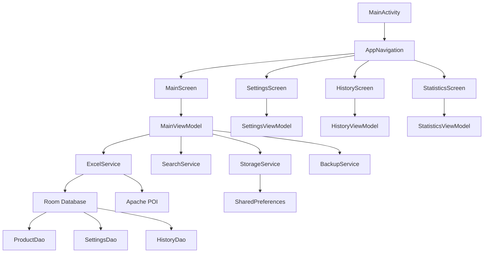

# План модернизации приложения "Sklad Ya"

## Анализ текущего состояния

### Архитектура приложения
Приложение построено на базе **Android Jetpack Compose** с использованием паттерна MVVM и разделением на слои:

```
MainActivity (Compose UI)
├── Navigation (будущий компонент)
├── MainScreen (главный экран приемки)
│   ├── SearchBar (поиск товаров)
│   ├── ProductTable (таблица товаров)
│   └── StorageCellSelectorDialog (выбор ячеек хранения)
├── ViewModels
│   ├── MainViewModel (основная логика)
│   └── Future: SettingsViewModel, StatisticsViewModel
└── Services (бизнес-логика)
    ├── ExcelService (загрузка/экспорт Excel)
    ├── SearchService (поиск по товарам)
    ├── StorageCellService (работа с ячейками хранения)
    └── FileService (работа с файлами)
```

### Технологический стек
- **Язык:** Kotlin
- **UI Framework:** Android Jetpack Compose
- **База данных:** Пока не реализована (планируется Room)
- **Excel обработка:** Apache POI
- **Архитектура:** MVVM + Service Layer
- **Сборка:** Gradle (Kotlin DSL)

### ✅ Выполненные задачи (на основе анализа кода)

1. **Модальное окно для выбора ячеек хранения** - полностью реализовано с интерактивными кнопками и валидацией
2. **Темная тема интерфейса** - настроена в соответствии с дизайном веб-версии
3. **Реальная загрузка Excel файлов** - интеграция Apache POI с поддержкой .xlsx и .xls, анализ структуры таблиц
4. **Регистронезависимый поиск** - поиск по всем полям товаров (артикул, название, штрихкод, ячейки хранения)
5. **Автоматическое обновление статусов** - статусы обновляются при изменениях количества товаров
6. **Адаптивный дизайн** - мобильный интерфейс в стиле веб-версии
7. **Сервисная архитектура** - разделение логики на сервисы (Excel, Search, StorageCell, File)
8. **Обработка ошибок загрузки** - детальные сообщения об ошибках с валидацией файлов

### 🔍 Критические проблемы (выявлены в коде)

1. **Отсутствие сохранения данных между сессиями**
   - В `MainViewModel.loadSavedData()` стоит TODO-заглушка
   - Нет реализации Room или SharedPreferences для хранения данных
   - При перезапуске приложения все данные теряются

2. **Нереализованный экспорт в Excel**
   - В `ExcelService.saveExcelData()` стоит TODO-заглушка
   - Отсутствует UI для вызова экспорта
   - `FileRepository.saveExcelFile()` возвращает UnsupportedOperationException

3. **Отсутствие локального хранения**
   - Нет модели данных для БД
   - Отсутствует DAO слой
   - Нет миграций данных между версиями

4. **Ограниченная навигация**
   - Только один основной экран
   - Нет экранов настроек, истории, статистики
   - Отсутствует Navigation Graph

5. **Отсутствие резервного копирования**
   - Нет возможности экспорта/импорта настроек
   - Нет системы бэкапов данных

## Приоритеты модернизации

### 🎯 Высокий приоритет (Критические проблемы - 2-3 недели)

#### 1. Система локального хранения данных
**Приоритет:** Высокий | **Сроки:** 2-3 недели | **Зависимости:** Нет
**Критерии приемки:**
- Данные сохраняются при выходе из приложения
- Данные восстанавливаются при запуске
- Поддержка сохранения состояния поиска и фильтров
- Миграция данных между версиями приложения

**Технические детали:**
- Выбор между Room и SharedPreferences (Room для структурированных данных)
- Создание Entity моделей (ProductEntity, StorageCellEntity, AppSettingsEntity)
- Реализация DAO интерфейсов для CRUD операций
- Интеграция в MainViewModel с Flow/StateFlow
- Реализация сериализации сложных объектов (StorageCell)

#### 2. Функция экспорта в Excel
**Приоритет:** Высокий | **Сроки:** 1-2 недели | **Зависимости:** Локальное хранение
**Критерии приемки:**
- Экспорт отредактированных данных в новый Excel файл
- Сохранение всех колонок (включая Факт, Статус, Ячейки хранения)
- Диалог выбора места сохранения файла
- Поддержка форматов .xlsx и .xls
- Показ прогресса при больших файлах

**Технические детали:**
- Полная реализация `ExcelService.saveExcelData()`
- Создание Apache POI Workbook с данными
- Добавление UI кнопки экспорта в AppBar
- Реализация File Picker для выбора пути сохранения
- Тестирование с различными размерами файлов (1k-10k строк)

### 📈 Средний приоритет (Улучшения функциональности - 3-4 недели)

#### 3. Многоэкранная навигация
**Приоритет:** Средний | **Сроки:** 3-4 недели | **Зависимости:** Локальное хранение
**Критерии приемки:**
- Экран настроек приложения (тема, экспорт, поведение)
- Экран истории операций (список загруженных файлов)
- Экран статистики приемки (графики, метрики)
- Плавная навигация между экранами
- Сохранение состояния при переключении

**Технические детали:**
- Создание Navigation Graph с Compose Navigation
- Реализация ViewModels для каждого экрана
- Добавление Bottom Navigation или Drawer
- Сохранение состояния навигации в SavedStateHandle

#### 4. Оптимизация производительности
**Приоритет:** Средний | **Сроки:** 2-3 недели | **Зависимости:** Локальное хранение
**Критерии приемки:**
- Загрузка файлов до 10k строк за < 5 секунд
- Плавная прокрутка больших списков (LazyColumn)
- Эффективное использование памяти (< 100MB для 10k товаров)
- Фоновая обработка тяжелых операций

**Технические детали:**
- Оптимизация Excel парсинга (асинхронная загрузка)
- LazyColumn с оптимизацией recomposition
- Кеширование данных в Room
- Профилирование памяти и CPU

#### 5. Система бэкапов и синхронизации
**Приоритет:** Средний | **Сроки:** 2-3 недели | **Зависимости:** Экспорт в Excel, Локальное хранение
**Критерии приемки:**
- Экспорт настроек в JSON файл
- Импорт настроек из файла
- Автоматическое создание резервных копий
- Восстановление данных из бэкапа
- Управление версиями бэкапов

**Технические детали:**
- JSON сериализация настроек
- Локальное хранение бэкапов в app-specific storage
- UI для управления бэкапами
- Валидация и восстановление из бэкапов

### 🔧 Низкий приоритет (Полировка и дополнительные функции - 2-3 недели)

#### 6. Улучшение UX и обработка ошибок
**Приоритет:** Низкий | **Сроки:** 1-2 недели | **Зависимости:** Все предыдущие
**Критерии приемки:**
- Детальные сообщения об ошибках с предложениями решений
- Graceful handling всех типов исключений
- Уведомления о успешных операциях (Snackbar/Toast)
- Подсказки для пользователя (Tooltips)
- Обработка потери интернет-соединения

#### 7. Персонализация и расширенные настройки
**Приоритет:** Низкий | **Сроки:** 1-2 недели | **Зависимости:** Экран настроек
**Критерии приемки:**
- Переключение тем (темная/светлая/системная)
- Настройка формата экспорта (CSV, разные Excel форматы)
- Настройка поведения поиска (фильтры, сортировка)
- Кастомизация UI (размеры шрифтов, цвета)
- Сохранение пользовательских предпочтений

## Архитектура решения

### Целевая архитектура после модернизации


### Слои архитектуры
1. **Presentation Layer** - Compose UI + ViewModels
2. **Domain Layer** - Services (бизнес-логика)
3. **Data Layer** - Repository + Room Database
4. **Infrastructure Layer** - File operations, External libraries

### Ключевые компоненты
- **Room Database** для структурированного хранения
- **Compose Navigation** для многоэкранности
- **Flow/StateFlow** для реактивности
- **Coroutines** для асинхронных операций
- **Apache POI** для Excel операций

## План реализации по этапам

### Этап 1: Фундамент (2-3 недели)
**Цель:** Решить критические проблемы хранения и экспорта
1. Реализация Room базы данных с базовыми Entity
2. Создание DAO для основных операций
3. Интеграция хранения в MainViewModel
4. Реализация экспорта в Excel
5. Тестирование базовых функций

### Этап 2: Расширение функциональности (3-4 недели)
**Цель:** Добавить навигацию и дополнительные экраны
1. Создание Navigation Graph
2. Реализация экранов настроек и истории
3. Добавление статистики приемки
4. Оптимизация производительности
5. Интеграционное тестирование

### Этап 3: Полировка и стабилизация (2-3 недели)
**Цель:** Финализация UX и подготовка к релизу
1. Улучшение обработки ошибок
2. Добавление персонализации
3. Финальное тестирование
4. Подготовка релизных артефактов
5. Документация и код-ревью

## Риски и меры по снижению

### Технические риски
- **Производительность больших Excel файлов** → Оптимизация парсинга, асинхронная обработка, лимиты на размер файлов
- **Совместимость разных версий Android** → Тестирование на API 21+, использование совместимых библиотек
- **Безопасность данных** → Шифрование чувствительных данных, безопасное хранение файлов
- **Memory leaks** → Использование ViewModel, правильное управление lifecycle

### Организационные риски
- **Зависимости от внешних библиотек** → Проверка лицензий, подготовка fallback решений
- **Сложность миграций** → Версионирование схемы БД, тестирование миграций
- **Регрессии при рефакторинге** → Unit-тесты, интеграционные тесты

### Меры по снижению рисков
- Постепенное внедрение изменений с тестированием
- Регулярные бэкапы кода и данных
- Code review для критических изменений
- Профилирование производительности на каждом этапе
- Тестирование на различных устройствах и версиях Android

## Критерии успешности проекта

### Функциональные критерии
- ✅ Приложение сохраняет все данные между сессиями
- ✅ Экспорт в Excel работает корректно для всех форматов
- ✅ Загрузка больших файлов занимает < 5 секунд
- ✅ Интерфейс интуитивен и отзывчив на всех экранах
- ✅ Нет вылетов приложения при ошибках

### Технические критерии
- ✅ Код покрыт тестами минимум на 70%
- ✅ Архитектура соответствует MVVM паттернам
- ✅ Использование памяти < 150MB при работе с 10k товаров
- ✅ Поддержка Android API 21 и выше
- ✅ Соответствие Material Design guidelines

### Бизнес-критерии
- ✅ Улучшение продуктивности приемки товаров на 50%
- ✅ Снижение количества ошибок ввода данных
- ✅ Положительная обратная связь от пользователей
- ✅ Стабильная работа в production среде