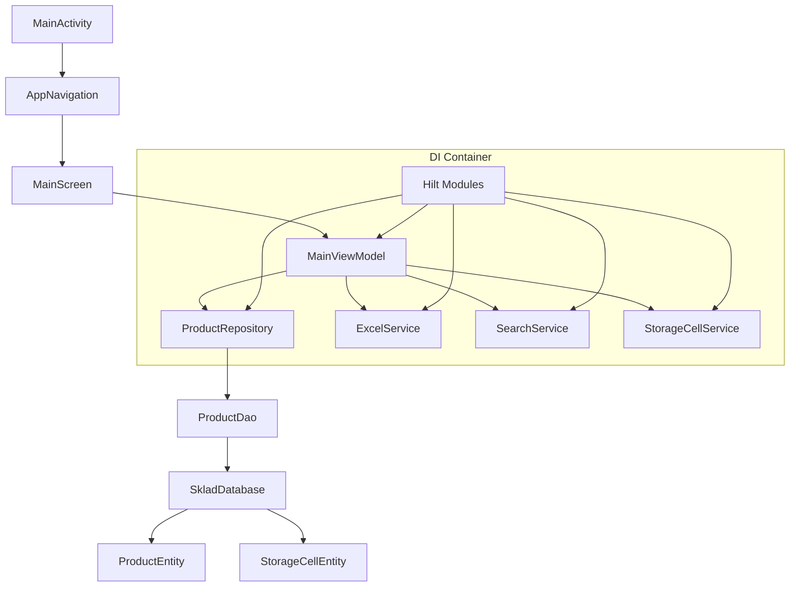

# План решения критических проблем Sklad-ya

## 📋 Обзор проблем

| # | Проблема | Приоритет | Влияние |
|---|-----------|------------|-----------|
| 1 | Нет сохранения данных между сессиями | P0 | Потеря работы при перезапуске |
| 2 | Thread-safe проблема с ID генерацией | P0 | Возможны дубликаты при параллельной загрузке |
| 3 | Repository Pattern не реализован полностью | P1 | Неполная архитектура данных |
| 4 | Нет DI (Dependency Injection) | P1 | Сложность тестирования, жёсткие связи |
| 5 | Нет Unit тестов | P2 | Нестабильность при изменениях |

---

## 🎯 Детальный план решения

### Задача 1: Реализовать Room Database для сохранения данных

#### 1.1 Создать Entity модели
**Файл:** `app/src/main/java/com/example/sklad_ya/data/database/ProductEntity.kt`

```kotlin
@Entity(tableName = "products")
data class ProductEntity(
    @PrimaryKey(autoGenerate = true)
    val id: Long = 0,
    
    val productId: String,           // Уникальный ID из Product.id
    
    val article: String,
    val name: String,
    val barcode: String,
    val requiredQuantity: Double,
    val actualQuantity: Double,
    val status: String,             // ProductStatus.name()
    val storageCellsJson: String,    // JSON сериализация List<StorageCell>
    val unit: String,
    val price: Double,
    val comments: String,
    val comment: String,
    val fileStockQuantity: Double,
    val rowIndex: Int,
    val originalDataJson: String,     // JSON сериализация Map<String, String>
    
    val createdAt: Long = System.currentTimeMillis(),
    val updatedAt: Long = System.currentTimeMillis()
)
```

**Файл:** `app/src/main/java/com/example/sklad_ya/data/database/StorageCellEntity.kt`

```kotlin
@Entity(tableName = "storage_cells")
data class StorageCellEntity(
    @PrimaryKey
    val cellString: String,    // "A1-1-1"
    val letter: Char,
    val number1: Int,
    val number2: Int,
    val number3: Int
)
```

#### 1.2 Создать Type Converters
**Файл:** `app/src/main/java/com/example/sklad_ya/data/database/Converters.kt`

```kotlin
class Converters {
    private val gson = Gson()
    
    @TypeConverter
    fun fromStorageCellList(cells: List<StorageCell>): String {
        return gson.toJson(cells)
    }
    
    @TypeConverter
    fun toStorageCellList(json: String): List<StorageCell> {
        val type = object : TypeToken<List<StorageCell>>() {}.type
        return gson.fromJson(json, type)
    }
    
    @TypeConverter
    fun fromProductStatus(status: ProductStatus): String {
        return status.name
    }
    
    @TypeConverter
    fun toProductStatus(name: String): ProductStatus {
        return ProductStatus.valueOf(name)
    }
    
    @TypeConverter
    fun fromOriginalData(data: Map<String, String>): String {
        return gson.toJson(data)
    }
    
    @TypeConverter
    fun toOriginalData(json: String): Map<String, String> {
        val type = object : TypeToken<Map<String, String>>() {}.type
        return gson.fromJson(json, type)
    }
}
```

#### 1.3 Создать DAO интерфейсы
**Файл:** `app/src/main/java/com/example/sklad_ya/data/database/ProductDao.kt`

```kotlin
@Dao
interface ProductDao {
    @Query("SELECT * FROM products ORDER BY rowIndex ASC")
    fun getAllProducts(): Flow<List<ProductEntity>>
    
    @Query("SELECT * FROM products WHERE productId = :productId LIMIT 1")
    suspend fun getProductById(productId: String): ProductEntity?
    
    @Insert(onConflict = OnConflictStrategy.REPLACE)
    suspend fun insertProduct(product: ProductEntity): Long
    
    @Insert(onConflict = OnConflictStrategy.REPLACE)
    suspend fun insertProducts(products: List<ProductEntity>)
    
    @Update
    suspend fun updateProduct(product: ProductEntity)
    
    @Delete
    suspend fun deleteProduct(productId: String)
    
    @Query("DELETE FROM products")
    suspend fun deleteAllProducts()
    
    @Query("UPDATE products SET actualQuantity = :quantity, status = :status, updatedAt = :timestamp WHERE productId = :productId")
    suspend fun updateQuantityAndStatus(productId: String, quantity: Double, status: String, timestamp: Long)
    
    @Query("UPDATE products SET storageCellsJson = :cellsJson, updatedAt = :timestamp WHERE productId = :productId")
    suspend fun updateStorageCells(productId: String, cellsJson: String, timestamp: Long)
    
    @Query("UPDATE products SET comments = :comments, updatedAt = :timestamp WHERE productId = :productId")
    suspend fun updateComments(productId: String, comments: String, timestamp: Long)
}
```

#### 1.4 Создать Database класс
**Файл:** `app/src/main/java/com/example/sklad_ya/data/database/SkladDatabase.kt`

```kotlin
@Database(
    entities = [ProductEntity::class, StorageCellEntity::class],
    version = 1,
    exportSchema = true
)
@TypeConverters(Converters::class)
abstract class SkladDatabase : RoomDatabase() {
    abstract fun productDao(): ProductDao
    
    companion object {
        private const val DATABASE_NAME = "sklad_database"
        
        @Volatile
        private var INSTANCE: SkladDatabase? = null
        
        fun getDatabase(context: Context): SkladDatabase {
            return INSTANCE ?: synchronized(this) {
                val instance = Room.databaseBuilder(
                    context.applicationContext,
                    SkladDatabase::class.java,
                    DATABASE_NAME
                )
                    .fallbackToDestructiveMigration()
                    .build()
                INSTANCE = instance
                instance
            }
        }
    }
}
```

#### 1.5 Обновить зависимости в build.gradle.kts
Добавить Gson для JSON сериализации:

```kotlin
implementation("com.google.code.gson:gson:2.10.1")
```

---

### Задача 2: Исправить thread-safe генерацию ID в Product

**Файл:** `app/src/main/java/com/example/sklad_ya/data/model/Product.kt`

```kotlin
// Заменить companion object на:
companion object {
    private val idCounter = java.util.concurrent.atomic.AtomicInteger(0)
    
    private fun generateId(): String {
        return "product_${idCounter.getAndIncrement()}"
    }
}
```

---

### Задача 3: Реализовать полноценный ProductRepository с Room

**Файл:** `app/src/main/java/com/example/sklad_ya/data/repository/ProductRepositoryImpl.kt`

```kotlin
class ProductRepositoryImpl(
    private val productDao: ProductDao,
    private val context: Context
) : ProductRepository {

    override fun getAllProducts(): Flow<List<Product>> {
        return productDao.getAllProducts()
            .map { entities -> entities.map { it.toDomainModel() } }
    }

    override suspend fun getProductById(productId: String): Product? {
        return productDao.getProductById(productId)?.toDomainModel()
    }

    override suspend fun addProduct(product: Product) {
        productDao.insertProduct(product.toEntity())
    }

    override suspend fun updateProduct(product: Product) {
        productDao.updateProduct(product.toEntity())
    }

    override suspend fun deleteProduct(productId: String) {
        productDao.deleteProduct(productId)
    }

    override suspend fun clearAllProducts() {
        productDao.deleteAllProducts()
    }

    override fun searchProducts(query: String): Flow<List<Product>> {
        // Room не поддерживает LIKE для Flow напрямую, фильтруем в коде
        return getAllProducts().map { products ->
            if (query.isBlank()) products
            else products.filter { product ->
                product.article.contains(query, ignoreCase = true) ||
                product.name.contains(query, ignoreCase = true) ||
                product.barcode.contains(query, ignoreCase = true) ||
                product.getStorageCellsDisplayString().contains(query, ignoreCase = true)
            }
        }
    }

    override fun getProductsByStatus(status: ProductStatus): Flow<List<Product>> {
        return getAllProducts().map { products ->
            products.filter { it.status == status }
        }
    }
}

// Extension функции для конверсии
private fun ProductEntity.toDomainModel(): Product {
    val cells = Gson().fromJson(storageCellsJson, 
        object : TypeToken<List<StorageCell>>() {}.type)
    
    val originalData = Gson().fromJson(originalDataJson,
        object : TypeToken<Map<String, String>>() {}.type)
    
    return Product(
        id = productId,
        article = article,
        name = name,
        barcode = barcode,
        requiredQuantity = requiredQuantity,
        actualQuantity = actualQuantity,
        status = ProductStatus.valueOf(status),
        storageCells = cells,
        unit = unit,
        price = price,
        comments = comments,
        comment = comment,
        rowIndex = rowIndex,
        originalData = originalData,
        fileStockQuantity = fileStockQuantity
    )
}

private fun Product.toEntity(): ProductEntity {
    return ProductEntity(
        productId = id,
        article = article,
        name = name,
        barcode = barcode,
        requiredQuantity = requiredQuantity,
        actualQuantity = actualQuantity,
        status = status.name,
        storageCellsJson = Gson().toJson(storageCells),
        unit = unit,
        price = price,
        comments = comments,
        comment = comment,
        rowIndex = rowIndex,
        originalDataJson = Gson().toJson(originalData),
        fileStockQuantity = fileStockQuantity,
        updatedAt = System.currentTimeMillis()
    )
}
```

---

### Задача 4: Интегрировать Room в MainViewModel

**Файл:** `app/src/main/java/com/example/sklad_ya/ui/screens/MainViewModel.kt`

#### Изменения:

1. Добавить зависимость Database:

```kotlin
private val database = SkladDatabase.getDatabase(context)
private val productRepository = ProductRepositoryImpl(database.productDao(), context)
```

2. Реализовать loadSavedData():

```kotlin
private fun loadSavedData() {
    viewModelScope.launch {
        database.productDao().getAllProducts().collect { entities ->
            if (entities.isNotEmpty()) {
                _products.value = entities.map { it.toDomainModel() }
                _filteredProducts.value = _products.value
                _fileLoadState.value = FileLoadState.Success(
                    ExcelData(
                        fileName = "Сохранённые данные",
                        sheetName = "Лист1",
                        headers = listOf("Артикул", "Товар", "Кол-во", "Факт", "Статус", "Ячейки"),
                        products = _products.value
                    )
                )
            }
        }
    }
}
```

3. Добавить сохранение при изменениях:

```kotlin
fun updateProductQuantity(productId: String, quantity: Double) {
    viewModelScope.launch {
        // Обновляем в памяти
        val updatedProducts = _products.value.map { product ->
            if (product.id == productId) {
                product.updateActualQuantity(quantity)
            } else {
                product
            }
        }
        _products.value = updatedProducts
        
        // Сохраняем в БД
        val product = updatedProducts.find { it.id == productId }
        if (product != null) {
            database.productDao().updateQuantityAndStatus(
                productId = productId,
                quantity = quantity,
                status = product.status.name,
                timestamp = System.currentTimeMillis()
            )
        }
        
        applySearchFilter()
    }
}
```

---

### Задача 5: Добавить DI (Hilt) для внедрения зависимостей

#### 5.1 Обновить build.gradle.kts проекта

```kotlin
plugins {
    alias(libs.plugins.android.application) apply false
    alias(libs.plugins.kotlin.android) apply false
    alias(libs.plugins.kotlin.compose) apply false
    alias(libs.plugins.hilt.android) apply false
}
```

#### 5.2 Обновить app/build.gradle.kts

```kotlin
plugins {
    alias(libs.plugins.android.application)
    alias(libs.plugins.kotlin.android)
    alias(libs.plugins.kotlin.compose)
    alias(libs.plugins.hilt.android)
    kapt(libs.plugins.hilt.compiler)
}

dependencies {
    // Hilt
    implementation(libs.hilt.android)
    kapt(libs.hilt.compiler)
    
    // Hilt Navigation
    implementation(libs.androidx.hilt.navigation.compose)
}
```

#### 5.3 Обновить gradle/libs.versions.toml

```toml
[versions]
hilt = "2.51.1"
hiltCompiler = "2.51.1"
hiltNavigationCompose = "1.2.0"

[libraries]
hilt-android = { group = "com.google.dagger", name = "hilt-android", version.ref = "hilt" }
hilt-compiler = { group = "com.google.dagger", name = "hilt-compiler", version.ref = "hiltCompiler" }
androidx-hilt-navigation-compose = { group = "androidx.hilt", name = "hilt-navigation-compose", version.ref = "hiltNavigationCompose" }

[plugins]
hilt-android = { id = "com.google.dagger.hilt.android", version.ref = "hilt" }
hilt-compiler = { id = "com.google.dagger.hilt.android.compiler", version.ref = "hiltCompiler" }
```

#### 5.4 Создать Application класс
**Файл:** `app/src/main/java/com/example/sklad_ya/SkladApplication.kt`

```kotlin
@HiltAndroidApp
class SkladApplication : Application() {
    
    override fun onCreate() {
        super.onCreate()
        // Инициализация БД при старте приложения
        SkladDatabase.getDatabase(this)
    }
}
```

#### 5.5 Обновить AndroidManifest.xml

```xml
<application
    android:name=".SkladApplication"
    ...>
```

#### 5.6 Создать модули DI
**Файл:** `app/src/main/java/com/example/sklad_ya/di/DatabaseModule.kt`

```kotlin
@Module
@InstallIn(SingletonComponent::class)
object DatabaseModule {

    @Provides
    @Singleton
    fun provideDatabase(@ApplicationContext context: Context): SkladDatabase {
        return SkladDatabase.getDatabase(context)
    }

    @Provides
    @Singleton
    fun provideProductDao(database: SkladDatabase): ProductDao {
        return database.productDao()
    }
}
```

**Файл:** `app/src/main/java/com/example/sklad_ya/di/RepositoryModule.kt`

```kotlin
@Module
@InstallIn(SingletonComponent::class)
object RepositoryModule {

    @Provides
    @Singleton
    fun provideProductRepository(
        productDao: ProductDao,
        @ApplicationContext context: Context
    ): ProductRepository {
        return ProductRepositoryImpl(productDao, context)
    }
}
```

**Файл:** `app/src/main/java/com/example/sklad_ya/di/ServiceModule.kt`

```kotlin
@Module
@InstallIn(SingletonComponent::class)
object ServiceModule {

    @Provides
    @Singleton
    fun provideExcelService(): ExcelService = ExcelServiceImpl()

    @Provides
    @Singleton
    fun provideFileService(): FileService = FileServiceImpl()

    @Provides
    @Singleton
    fun provideSearchService(): SearchService = SearchServiceImpl()

    @Provides
    @Singleton
    fun provideStorageCellService(): StorageCellService = StorageCellServiceImpl()
}
```

#### 5.7 Обновить MainViewModel для использования Hilt

```kotlin
@HiltViewModel
class MainViewModel @Inject constructor(
    private val productRepository: ProductRepository,
    private val excelService: ExcelService,
    private val fileService: FileService,
    private val searchService: SearchService
) : ViewModel() {
    
    // ... остальной код
}
```

#### 5.8 Обновить MainActivity

```kotlin
@AndroidEntryPoint
class MainActivity : ComponentActivity() {
    // ...
}
```

---

### Задача 6: Написать Unit тесты

**Файл:** `app/src/test/java/com/example/sklad_ya/data/model/ProductTest.kt`

```kotlin
class ProductTest {
    
    @Test
    fun `updateActualQuantity should update quantity and status`() {
        val product = Product(
            id = "test_1",
            article = "ART001",
            name = "Тестовый товар",
            requiredQuantity = 10.0,
            actualQuantity = 0.0,
            status = ProductStatus.PENDING
        )
        
        // Тест: quantity == requiredQuantity -> MATCH
        val updated = product.updateActualQuantity(10.0)
        assertEquals(10.0, updated.actualQuantity)
        assertEquals(ProductStatus.MATCH, updated.status)
        
        // Тест: quantity < requiredQuantity -> MISMATCH
        val updated2 = product.updateActualQuantity(5.0)
        assertEquals(5.0, updated2.actualQuantity)
        assertEquals(ProductStatus.MISMATCH, updated2.status)
        
        // Тест: quantity == 0 -> PENDING
        val updated3 = product.updateActualQuantity(0.0)
        assertEquals(0.0, updated3.actualQuantity)
        assertEquals(ProductStatus.PENDING, updated3.status)
    }
    
    @Test
    fun `addStorageCell should add unique cells only`() {
        val cell1 = StorageCell('A', 1, 1, 1)
        val cell2 = StorageCell('B', 2, 2, 2)
        val cell3 = StorageCell('A', 1, 1, 1) // Дубликат
        
        val product = Product(
            id = "test_2",
            article = "ART002",
            name = "Товар с ячейками",
            storageCells = emptyList()
        )
        
        val withCells1 = product.addStorageCell(cell1)
        assertEquals(1, withCells1.storageCells.size)
        
        val withCells2 = withCells1.addStorageCell(cell2)
        assertEquals(2, withCells2.storageCells.size)
        
        val withCells3 = withCells2.addStorageCell(cell3)
        assertEquals(2, withCells3.storageCells.size) // Дубликат не добавился
    }
}
```

**Файл:** `app/src/test/java/com/example/sklad_ya/data/model/StorageCellTest.kt`

```kotlin
class StorageCellTest {
    
    @Test
    fun `fromString should parse valid cell`() {
        val cell = StorageCell.fromString("A1-1-1")
        assertNotNull(cell)
        assertEquals('A', cell?.letter)
        assertEquals(1, cell?.number1)
        assertEquals(1, cell?.number2)
        assertEquals(1, cell?.number3)
    }
    
    @Test
    fun `fromString should return null for invalid format`() {
        assertNull(StorageCell.fromString("invalid"))
        assertNull(StorageCell.fromString("A1"))
        assertNull(StorageCell.fromString("A-1"))
    }
    
    @Test
    fun `isValid should validate cell constraints`() {
        val validCell = StorageCell('A', 5, 2, 3)
        assertTrue(validCell.isValid())
        
        val invalidLetter = StorageCell('Z', 1, 1, 1) // Z не в списке
        assertFalse(invalidLetter.isValid())
        
        val invalidNumber1 = StorageCell('A', 15, 1, 1) // > 13
        assertFalse(invalidNumber1.isValid())
        
        val invalidNumber2 = StorageCell('A', 1, 6, 1) // > 5
        assertFalse(invalidNumber2.isValid())
    }
}
```

---

## 📊 Архитектура после изменений



---

## ✅ Критерии завершения

- [ ] Данные сохраняются при выходе из приложения
- [ ] Данные восстанавливаются при запуске
- [ ] ID генерируется thread-safe
- [ ] Все зависимости внедряются через Hilt
- [ ] Unit тесты покрывают критический код
- [ ] Приложение не крашится при перезапуске с данными
