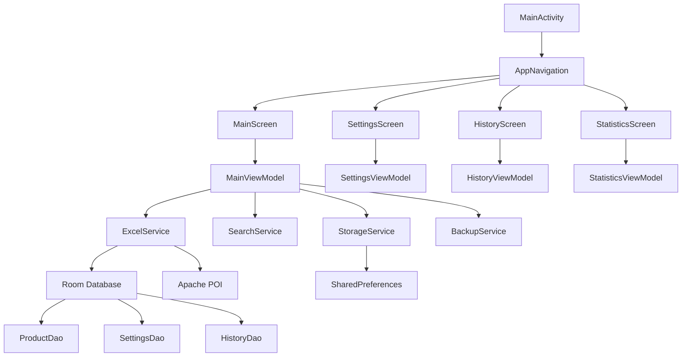
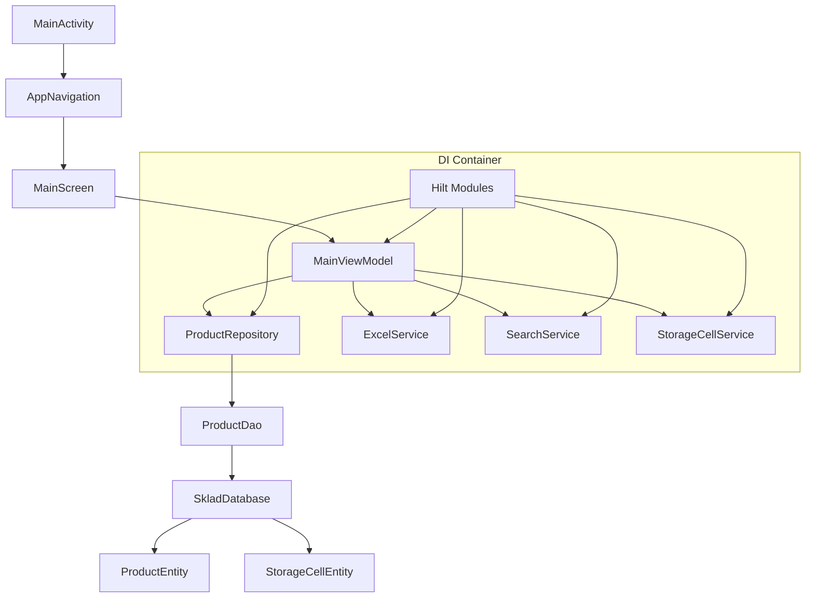

# 📦 Экспорт проекта

**Корневая директория:** `C:\Users\Vladimir\Documents\SkladPriem\sklad-ya`

**Дата экспорта:** 2026-01-29 15:39:44

---

# 📁 Структура проекта
```
├── $HOME
│   └── .ssh
├── -p
├── .cursor
│   └── index.mdc
├── .kotlin
│   └── sessions
├── app
│   ├── src
│   │   ├── androidTest
│   │   │   └── java
│   │   │       └── com
│   │   │           └── example
│   │   │               └── sklad_ya
│   │   │                   └── ExampleInstrumentedTest.kt
│   │   ├── main
│   │   │   ├── java
│   │   │   │   └── com
│   │   │   │       └── example
│   │   │   │           └── sklad_ya
│   │   │   │               ├── data
│   │   │   │               │   ├── database
│   │   │   │               │   │   ├── Converters.kt
│   │   │   │               │   │   ├── ProductDao.kt
│   │   │   │               │   │   ├── ProductEntity.kt
│   │   │   │               │   │   ├── ProductExtensions.kt
│   │   │   │               │   │   ├── SkladDatabase.kt
│   │   │   │               │   │   └── StorageCellEntity.kt
│   │   │   │               │   ├── model
│   │   │   │               │   │   ├── ExcelData.kt
│   │   │   │               │   │   ├── Product.kt
│   │   │   │               │   │   ├── ProductStatus.kt
│   │   │   │               │   │   └── StorageCell.kt
│   │   │   │               │   ├── repository
│   │   │   │               │   │   ├── FileRepository.kt
│   │   │   │               │   │   ├── ProductRepository.kt
│   │   │   │               │   │   └── ProductRepositoryImpl.kt
│   │   │   │               │   └── service
│   │   │   │               │       ├── ExcelService.kt
│   │   │   │               │       ├── FileService.kt
│   │   │   │               │       ├── SearchService.kt
│   │   │   │               │       └── StorageCellService.kt
│   │   │   │               ├── di
│   │   │   │               │   ├── DatabaseModule.kt
│   │   │   │               │   ├── RepositoryModule.kt
│   │   │   │               │   └── ServiceModule.kt
│   │   │   │               ├── ui
│   │   │   │               │   ├── components
│   │   │   │               │   │   ├── ProductTable.kt
│   │   │   │               │   │   ├── SearchBar.kt
│   │   │   │               │   │   ├── StatusMessage.kt
│   │   │   │               │   │   └── StorageCellSelectorDialog.kt
│   │   │   │               │   ├── navigation
│   │   │   │               │   │   └── Navigation.kt
│   │   │   │               │   ├── screens
│   │   │   │               │   │   ├── MainScreen.kt
│   │   │   │               │   │   └── MainViewModel.kt
│   │   │   │               │   └── theme
│   │   │   │               │       ├── Color.kt
│   │   │   │               │       ├── Theme.kt
│   │   │   │               │       └── Type.kt
│   │   │   │               ├── MainActivity.kt
│   │   │   │               └── SkladApplication.kt
│   │   │   ├── res
│   │   │   │   ├── drawable
│   │   │   │   │   ├── ic_launcher_background.xml
│   │   │   │   │   ├── ic_launcher_complete.xml
│   │   │   │   │   ├── ic_launcher_foreground.xml
│   │   │   │   │   └── ic_sklad_text.xml
│   │   │   │   ├── drawable-v24
│   │   │   │   │   └── ic_launcher_foreground.xml
│   │   │   │   ├── mipmap-anydpi-v26
│   │   │   │   │   ├── ic_launcher.xml
│   │   │   │   │   └── ic_launcher_round.xml
│   │   │   │   ├── mipmap-hdpi
│   │   │   │   ├── mipmap-mdpi
│   │   │   │   ├── mipmap-xhdpi
│   │   │   │   ├── mipmap-xxhdpi
│   │   │   │   ├── mipmap-xxxhdpi
│   │   │   │   ├── values
│   │   │   │   │   ├── colors.xml
│   │   │   │   │   ├── strings.xml
│   │   │   │   │   └── themes.xml
│   │   │   │   └── xml
│   │   │   │       ├── backup_rules.xml
│   │   │   │       └── data_extraction_rules.xml
│   │   │   └── AndroidManifest.xml
│   │   └── test
│   │       └── java
│   │           └── com
│   │               └── example
│   │                   └── sklad_ya
│   │                       └── ExampleUnitTest.kt
│   ├── .gitignore
│   ├── build.gradle.kts
│   └── proguard-rules.pro
├── gradle
│   ├── wrapper
│   │   ├── gradle-wrapper.jar
│   │   └── gradle-wrapper.properties
│   └── libs.versions.toml
├── plans
│   └── critical_issues_fix_plan.md
├── .gitignore
├── build.gradle.kts
├── data_structure.md
├── export_project_improved.py
├── gradle.properties
├── gradlew
├── gradlew.bat
├── instructions.md
├── local.properties
├── plan.md
├── settings.gradle.kts
└── SKLAD_YA-1.html
```
---

# 📄 Содержимое файлов

## 📄 `.cursor\index.mdc`

```text
---
alwaysApply: true
---
Проект: Sklad-ya (приемка товара по ячейкам)
Цель: переход с бумажной версии на цифровой формат
Философия: минимализм и скорость работы

Моя роль: Senior Developer + CPO
Принципы: обсуждение > гипотеза, декомпозиция, хирургическая точность

Никогда не анализируй файлы из папок:
- app/build/
- .gradle/
- node_modules/


```

## 📄 `.gitignore`

```text
*.iml
.gradle
/local.properties
/.idea/caches
/.idea/libraries
/.idea/modules.xml
/.idea/workspace.xml
/.idea/navEditor.xml
/.idea/assetWizardSettings.xml
.DS_Store
/build
/captures
.externalNativeBuild
.cxx
local.properties

```

## 📄 `app\.gitignore`

```text
/build
```

## 📄 `app\build.gradle.kts`

```kotlin
plugins {
    alias(libs.plugins.android.application)
    alias(libs.plugins.kotlin.android)
    alias(libs.plugins.kotlin.compose)
    alias(libs.plugins.ksp)
    alias(libs.plugins.hilt.android)
}

android {
    namespace = "com.example.sklad_ya"
    compileSdk = 35

    defaultConfig {
        applicationId = "com.example.sklad_ya"
        minSdk = 26
        targetSdk = 35
        versionCode = 1
        versionName = "1.0"

        testInstrumentationRunner = "androidx.test.runner.AndroidJUnitRunner"
    }

    buildTypes {
        release {
            isMinifyEnabled = false
            proguardFiles(
                getDefaultProguardFile("proguard-android-optimize.txt"),
                "proguard-rules.pro"
            )
        }
    }
    compileOptions {
        sourceCompatibility = JavaVersion.VERSION_11
        targetCompatibility = JavaVersion.VERSION_11
    }
    kotlinOptions {
        jvmTarget = "11"
    }
    buildFeatures {
        compose = true
    }
}

dependencies {
   
    implementation(libs.gson)
    
    implementation(libs.androidx.core.ktx)
    implementation(libs.androidx.lifecycle.runtime.ktx)
    implementation(libs.androidx.lifecycle.viewmodel.ktx)
    implementation(libs.androidx.lifecycle.viewmodel.compose)
    
    // Material Icons Extended для дополнительных иконок
    implementation(libs.androidx.material.icons.extended)
    implementation(libs.androidx.activity.compose)
    implementation(libs.androidx.navigation.compose)
    
    // Room для базы данных
    implementation(libs.androidx.room.runtime)
    implementation(libs.androidx.room.ktx)
    ksp(libs.androidx.room.compiler)
    
    // Hilt для внедрения зависимостей
    implementation(libs.hilt.android)
    ksp(libs.hilt.compiler)
    
    // Hilt Navigation Compose
    implementation(libs.androidx.hilt.navigation.compose)

    // Apache POI для работы с Excel
    implementation("org.apache.poi:poi:5.2.5")
    implementation("org.apache.poi:poi-ooxml:5.2.5")
    implementation("org.apache.poi:poi-ooxml-lite:5.2.5")

    // Дополнительные UI компоненты
    implementation(platform(libs.androidx.compose.bom))
    implementation(libs.androidx.ui)
    implementation(libs.androidx.ui.graphics)
    implementation(libs.androidx.ui.tooling.preview)
    implementation(libs.androidx.material3)
    implementation(libs.androidx.material.icons.extended)

    // Работа с файлами
    implementation(libs.androidx.documentfile)

    testImplementation(libs.junit)
    androidTestImplementation(libs.androidx.junit)
    androidTestImplementation(libs.androidx.espresso.core)
    androidTestImplementation(platform(libs.androidx.compose.bom))
    androidTestImplementation(libs.androidx.ui.test.junit4)
    debugImplementation(libs.androidx.ui.tooling)
    debugImplementation(libs.androidx.ui.test.manifest)
}
```

## 📄 `app\proguard-rules.pro`

```prolog
# Add project specific ProGuard rules here.
# You can control the set of applied configuration files using the
# proguardFiles setting in build.gradle.
#
# For more details, see
#   http://developer.android.com/guide/developing/tools/proguard.html

# If your project uses WebView with JS, uncomment the following
# and specify the fully qualified class name to the JavaScript interface
# class:
#-keepclassmembers class fqcn.of.javascript.interface.for.webview {
#   public *;
#}

# Uncomment this to preserve the line number information for
# debugging stack traces.
#-keepattributes SourceFile,LineNumberTable

# If you keep the line number information, uncomment this to
# hide the original source file name.
#-renamesourcefileattribute SourceFile
```

## 📄 `app\src\androidTest\java\com\example\sklad_ya\ExampleInstrumentedTest.kt`

```kotlin
package com.example.sklad_ya

import androidx.test.platform.app.InstrumentationRegistry
import androidx.test.ext.junit.runners.AndroidJUnit4

import org.junit.Test
import org.junit.runner.RunWith

import org.junit.Assert.*

/**
 * Instrumented test, which will execute on an Android device.
 *
 * See [testing documentation](http://d.android.com/tools/testing).
 */
@RunWith(AndroidJUnit4::class)
class ExampleInstrumentedTest {
    @Test
    fun useAppContext() {
        // Context of the app under test.
        val appContext = InstrumentationRegistry.getInstrumentation().targetContext
        assertEquals("com.example.sklad_ya", appContext.packageName)
    }
}
```

## 📄 `app\src\main\AndroidManifest.xml`

```xml
<?xml version="1.0" encoding="utf-8"?>
<manifest xmlns:android="http://schemas.android.com/apk/res/android"
    xmlns:tools="http://schemas.android.com/tools">

    <uses-permission android:name="android.permission.WRITE_EXTERNAL_STORAGE" />
    <uses-permission android:name="android.permission.READ_EXTERNAL_STORAGE" />

    <application
        android:name=".SkladApplication"
        android:allowBackup="true"
        android:dataExtractionRules="@xml/data_extraction_rules"
        android:fullBackupContent="@xml/backup_rules"
        android:icon="@mipmap/ic_launcher"
        android:label="@string/app_name"
        android:roundIcon="@mipmap/ic_launcher_round"
        android:supportsRtl="true"
        android:theme="@style/Theme.Sklad_ya"
        tools:targetApi="31">
        <activity
            android:name=".MainActivity"
            android:exported="true"
            android:label="@string/app_name"
            android:theme="@style/Theme.Sklad_ya">
            <intent-filter>
                <action android:name="android.intent.action.MAIN" />

                <category android:name="android.intent.category.LAUNCHER" />
            </intent-filter>
        </activity>
    </application>

</manifest>
```

## 📄 `app\src\main\java\com\example\sklad_ya\data\database\Converters.kt`

```kotlin
package com.example.sklad_ya.data.database

import androidx.room.TypeConverter
import com.example.sklad_ya.data.model.ProductStatus
import com.example.sklad_ya.data.model.StorageCell
import com.google.gson.Gson
import com.google.gson.reflect.TypeToken

/**
 * Type Converters для Room Database
 * Использует Gson для сериализации/десериализации сложных объектов
 */
class Converters {
    private val gson = Gson()
    
    /**
     * Конвертирует List<StorageCell> в JSON строку
     */
    @TypeConverter
    fun fromStorageCellList(cells: List<StorageCell>): String {
        return gson.toJson(cells)
    }
    
    /**
     * Конвертирует JSON строку в List<StorageCell>
     */
    @TypeConverter
    fun toStorageCellList(json: String): List<StorageCell> {
        val type = object : TypeToken<List<StorageCell>>() {}.type
        return gson.fromJson(json, type)
    }
    
    /**
     * Конвертирует ProductStatus в строку (имя enum)
     */
    @TypeConverter
    fun fromProductStatus(status: ProductStatus): String {
        return status.name
    }
    
    /**
     * Конвертирует строку в ProductStatus
     */
    @TypeConverter
    fun toProductStatus(name: String): ProductStatus {
        return try {
            ProductStatus.valueOf(name)
        } catch (e: IllegalArgumentException) {
            ProductStatus.PENDING // Значение по умолчанию при ошибке
        }
    }
    
    /**
     * Конвертирует Map<String, String> в JSON строку
     * Используется для originalData
     */
    @TypeConverter
    fun fromOriginalData(data: Map<String, String>): String {
        return gson.toJson(data)
    }
    
    /**
     * Конвертирует JSON строку в Map<String, String>
     */
    @TypeConverter
    fun toOriginalData(json: String): Map<String, String> {
        val type = object : TypeToken<Map<String, String>>() {}.type
        return gson.fromJson(json, type)
    }
}

```

## 📄 `app\src\main\java\com\example\sklad_ya\data\database\ProductDao.kt`

```kotlin
package com.example.sklad_ya.data.database

import androidx.room.Dao
import androidx.room.Insert
import androidx.room.OnConflictStrategy
import androidx.room.Query
import androidx.room.Update
import androidx.room.Delete
import kotlinx.coroutines.flow.Flow

/**
 * DAO для работы с товарами в базе данных
 */
@Dao
interface ProductDao {
    /**
     * Получить все товары, отсортированные по индексу строки
     */
    @Query("SELECT * FROM products ORDER BY rowIndex ASC")
    fun getAllProducts(): Flow<List<ProductEntity>>
    
    /**
     * Получить товар по productId
     */
    @Query("SELECT * FROM products WHERE productId = :productId LIMIT 1")
    suspend fun getProductById(productId: String): ProductEntity?
    
    /**
     * Вставить один товар
     */
    @Insert(onConflict = OnConflictStrategy.REPLACE)
    suspend fun insertProduct(product: ProductEntity): Long
    
    /**
     * Вставить список товаров (для массовой загрузки)
     */
    @Insert(onConflict = OnConflictStrategy.REPLACE)
    suspend fun insertProducts(products: List<ProductEntity>)
    
    /**
     * Обновить товар
     */
    @Update
    suspend fun updateProduct(product: ProductEntity)
    
    /**
     * Удалить товар по productId
     */
    @Query("DELETE FROM products WHERE productId = :productId")
    suspend fun deleteProduct(productId: String)
    
    /**
     * Удалить все товары
     */
    @Query("DELETE FROM products")
    suspend fun deleteAllProducts()
    
    /**
     * Обновить количество и статус товара
     */
    @Query("UPDATE products SET actualQuantity = :quantity, status = :status, updatedAt = :timestamp WHERE productId = :productId")
    suspend fun updateQuantityAndStatus(
        productId: String,
        quantity: Double,
        status: String,
        timestamp: Long
    )
    
    /**
     * Обновить ячейки хранения товара
     */
    @Query("UPDATE products SET storageCellsJson = :cellsJson, updatedAt = :timestamp WHERE productId = :productId")
    suspend fun updateStorageCells(
        productId: String,
        cellsJson: String,
        timestamp: Long
    )
    
    /**
     * Обновить комментарии товара
     */
    @Query("UPDATE products SET comments = :comments, updatedAt = :timestamp WHERE productId = :productId")
    suspend fun updateComments(
        productId: String,
        comments: String,
        timestamp: Long
    )
    
    /**
     * Получить товары по статусу
     */
    @Query("SELECT * FROM products WHERE status = :status ORDER BY rowIndex ASC")
    fun getProductsByStatus(status: String): Flow<List<ProductEntity>>
    
    /**
     * Получить количество товаров по статусу
     */
    @Query("SELECT COUNT(*) FROM products WHERE status = :status")
    suspend fun getCountByStatus(status: String): Int
}

```

## 📄 `app\src\main\java\com\example\sklad_ya\data\database\ProductEntity.kt`

```kotlin
package com.example.sklad_ya.data.database

import androidx.room.Entity
import androidx.room.PrimaryKey

/**
 * Entity для хранения товаров в локальной базе данных
 */
@Entity(tableName = "products")
data class ProductEntity(
    @PrimaryKey(autoGenerate = true)
    val id: Long = 0,
    
    val productId: String,           // Уникальный ID из Product.id
    
    val article: String,
    val name: String,
    val barcode: String,
    val requiredQuantity: Double,
    val actualQuantity: Double,
    val status: String,             // ProductStatus.name()
    val storageCellsJson: String,    // JSON сериализация List<StorageCell>
    val unit: String,
    val price: Double,
    val comments: String,
    val comment: String,
    val fileStockQuantity: Double,
    val rowIndex: Int,
    val originalDataJson: String,     // JSON сериализация Map<String, String>
    
    val createdAt: Long = System.currentTimeMillis(),
    val updatedAt: Long = System.currentTimeMillis()
)

```

## 📄 `app\src\main\java\com\example\sklad_ya\data\database\ProductExtensions.kt`

```kotlin
package com.example.sklad_ya.data.database

import com.example.sklad_ya.data.model.Product
import com.example.sklad_ya.data.model.StorageCell
import com.example.sklad_ya.data.model.ProductStatus
import com.google.gson.Gson
import com.google.gson.reflect.TypeToken
import java.lang.reflect.Type

/**
 * Extension функции для конверсии между Entity и Domain моделями
 */

/**
 * Конвертирует ProductEntity в Product (Domain модель)
 */
fun ProductEntity.toDomainModel(): Product {
    val gson = Gson()
    
    val cells: List<StorageCell> = try {
        val type: Type = object : TypeToken<List<StorageCell>>() {}.type
        gson.fromJson(
            storageCellsJson,
            type
        )
    } catch (e: Exception) {
        emptyList()
    }
    
    val originalData: Map<String, String> = try {
        val type: Type = object : TypeToken<Map<String, String>>() {}.type
        gson.fromJson(
            originalDataJson,
            type
        )
    } catch (e: Exception) {
        emptyMap()
    }
    
    return Product(
        id = productId,
        article = article,
        name = name,
        barcode = barcode,
        requiredQuantity = requiredQuantity,
        actualQuantity = actualQuantity,
        status = try {
            ProductStatus.valueOf(status)
        } catch (e: IllegalArgumentException) {
            ProductStatus.PENDING
        },
        storageCells = cells,
        unit = unit,
        price = price,
        comments = comments,
        comment = comment,
        rowIndex = rowIndex,
        originalData = originalData,
        fileStockQuantity = fileStockQuantity
    )
}

/**
 * Конвертирует Product (Domain модель) в ProductEntity
 */
fun Product.toEntity(): ProductEntity {
    val gson = Gson()
    
    return ProductEntity(
        productId = id,
        article = article,
        name = name,
        barcode = barcode,
        requiredQuantity = requiredQuantity,
        actualQuantity = actualQuantity,
        status = status.name,
        storageCellsJson = gson.toJson(storageCells),
        unit = unit,
        price = price,
        comments = comments,
        comment = comment,
        rowIndex = rowIndex,
        originalDataJson = gson.toJson(originalData),
        fileStockQuantity = fileStockQuantity,
        updatedAt = System.currentTimeMillis()
    )
}

```

## 📄 `app\src\main\java\com\example\sklad_ya\data\database\SkladDatabase.kt`

```kotlin
package com.example.sklad_ya.data.database

import android.content.Context
import androidx.room.Database
import androidx.room.Room
import androidx.room.RoomDatabase
import androidx.room.TypeConverters
import androidx.room.migration.Migration
import androidx.sqlite.db.SupportSQLiteDatabase

/**
 * Локальная база данных для приложения Sklad-ya
 */
@Database(
    entities = [ProductEntity::class, StorageCellEntity::class],
    version = 1,
    exportSchema = false
)
@TypeConverters(Converters::class)
abstract class SkladDatabase : RoomDatabase() {
    
    abstract fun productDao(): ProductDao
    
    companion object {
        private const val DATABASE_NAME = "sklad_database"
        
        @Volatile
        private var INSTANCE: SkladDatabase? = null
        
        /**
         * Получить экземпляр базы данных (Singleton)
         */
        fun getDatabase(context: Context): SkladDatabase {
            return INSTANCE ?: synchronized(this) {
                val instance = Room.databaseBuilder(
                    context.applicationContext,
                    SkladDatabase::class.java,
                    DATABASE_NAME
                )
                    .fallbackToDestructiveMigration()
                    .build()
                INSTANCE = instance
                instance
            }
        }
        
        /**
         * Уничтожить экземпляр базы данных (для тестов)
         */
        fun destroyInstance() {
            INSTANCE = null
        }
    }
}

```

## 📄 `app\src\main\java\com\example\sklad_ya\data\database\StorageCellEntity.kt`

```kotlin
package com.example.sklad_ya.data.database

import androidx.room.Entity
import androidx.room.PrimaryKey

/**
 * Entity для хранения ячеек хранения в локальной базе данных
 */
@Entity(tableName = "storage_cells")
data class StorageCellEntity(
    @PrimaryKey
    val cellString: String,    // "A1-1-1"
    val letter: Char,
    val number1: Int,
    val number2: Int,
    val number3: Int
)

```

## 📄 `app\src\main\java\com\example\sklad_ya\data\model\ExcelData.kt`

```kotlin
package com.example.sklad_ya.data.model

/**
 * Данные, загруженные из Excel файла
 */
data class ExcelData(
    val fileName: String,
    val sheetName: String,
    val headers: List<String>,
    val products: List<Product>,
    val originalRowIndex: Int = 0, // Индекс строки с заголовками в оригинальном файле
    val columnMapping: List<Int> = emptyList(), // Маппинг колонок для восстановления
    val loadTime: Long = System.currentTimeMillis()
)

/**
 * Результат анализа таблицы Excel
 */
data class TableAnalysisResult(
    val headerRowIndex: Int,
    val headers: List<String>,
    val rows: List<List<String>>,
    val originalAoa: List<List<String>>,
    val columnMapping: List<Int>
)

/**
 * Состояние загрузки файла
 */
sealed class FileLoadState {
    object Idle : FileLoadState()
    object Loading : FileLoadState()
    data class Success(val data: ExcelData) : FileLoadState()
    data class Error(val message: String) : FileLoadState()
}
```

## 📄 `app\src\main\java\com\example\sklad_ya\data\model\Product.kt`

```kotlin
package com.example.sklad_ya.data.model

/**
 * Модель товара для приёмки в ячейки хранения
 */
data class Product(
    val id: String = generateId(),              // Уникальный идентификатор
    val article: String = "",                   // Артикул
    val name: String = "",                      // Наименование товара
    val barcode: String = "",                   // Штрихкод
    val requiredQuantity: Double = 0.0,        // Требуемое количество
    val actualQuantity: Double = 0.0,          // Фактическое количество
    val status: ProductStatus = ProductStatus.PENDING, // Статус приёмки
    val storageCells: List<StorageCell> = emptyList(), // Ячейки хранения
    val unit: String = "",                      // Единица измерения
    val price: Double = 0.0,                    // Цена
    val comments: String = "",                  // Комментарии
    val rowIndex: Int = 0,                      // Индекс строки в исходном файле
    val originalData: Map<String, String> = emptyMap(), // Оригинальные данные из Excel
    val fileStockQuantity: Double = 0.0,        // Остаток из файла Excel
    val comment: String = ""                       // Комментарий к товару
) {
    /**
     * Обновить фактическое количество и пересчитать статус
     */
    fun updateActualQuantity(quantity: Double): Product {
        val newStatus = when {
            quantity == 0.0 -> ProductStatus.PENDING
            quantity == requiredQuantity -> ProductStatus.MATCH
            else -> ProductStatus.MISMATCH
        }

        return copy(
            actualQuantity = quantity,
            status = newStatus
        )
    }

    /**
     * Обновить комментарии
     */
    fun updateComments(newComments: String): Product {
        return copy(comments = newComments)
    }

    /**
     * Добавить ячейку хранения
     */
    fun addStorageCell(cell: StorageCell): Product {
        val updatedCells = if (storageCells.any { it.toDisplayString() == cell.toDisplayString() }) {
            storageCells // Ячейка уже существует
        } else {
            storageCells + cell
        }
        return copy(storageCells = updatedCells)
    }

    /**
     * Удалить ячейку хранения
     */
    fun removeStorageCell(cellString: String): Product {
        val updatedCells = storageCells.filterNot { it.toDisplayString() == cellString }
        return copy(storageCells = updatedCells)
    }

    /**
     * Получить отформатированное количество для отображения
     */
    fun getFormattedQuantity(): String {
        return if (requiredQuantity % 1.0 == 0.0) {
            requiredQuantity.toInt().toString()
        } else {
            requiredQuantity.toString()
        }
    }

    /**
     * Получить отформатированное фактическое количество для отображения
     */
    fun getFormattedActualQuantity(): String {
        return if (actualQuantity == 0.0) {
            "" // Пустая строка вместо "0"
        } else if (actualQuantity % 1.0 == 0.0) {
            actualQuantity.toInt().toString()
        } else {
            actualQuantity.toString()
        }
    }

    /**
     * Получить объединённую строку ячеек хранения для отображения
     */
    fun getStorageCellsDisplayString(): String {
        return if (storageCells.isEmpty()) {
            ""
        } else {
            storageCells.joinToString(", ") { it.toDisplayString() }
        }
    }

    /**
     * Обновить комментарий к товару
     */
    fun updateComment(comment: String): Product {
        return copy(comment = comment)
    }

    companion object {
        private val idCounter = java.util.concurrent.atomic.AtomicInteger(0)
        private fun generateId(): String {
            return "product_${idCounter.getAndIncrement()}"
        }
    }
}
```

## 📄 `app\src\main\java\com\example\sklad_ya\data\model\ProductStatus.kt`

```kotlin
package com.example.sklad_ya.data.model

/**
 * Статус товара при приёмке
 */
enum class ProductStatus {
    PENDING,    // Ожидает проверки
    MATCH,      // Количество совпадает (✓)
    MISMATCH;   // Количество не совпадает (⚠)

    /**
     * Получить символ для отображения статуса
     */
    fun getSymbol(): String {
        return when (this) {
            PENDING -> ""
            MATCH -> "✓"
            MISMATCH -> "⚠"
        }
    }

    /**
     * Получить цвет для отображения статуса
     */
    fun getColor(): ProductStatusColor {
        return when (this) {
            PENDING -> ProductStatusColor.GRAY
            MATCH -> ProductStatusColor.GREEN
            MISMATCH -> ProductStatusColor.YELLOW
        }
    }
}

/**
 * Цвета для статусов товаров
 */
enum class ProductStatusColor {
    GRAY, GREEN, YELLOW
}
```

## 📄 `app\src\main\java\com\example\sklad_ya\data\model\StorageCell.kt`

```kotlin
package com.example.sklad_ya.data.model

/**
 * Ячейка хранения товара
 * Формат: Буква + Число1-Число2-Число3
 * Пример: A1-1-1, B5-2-3, S13-3-4
 */
data class StorageCell(
    val letter: Char,        // Буква: A, B, C, D, F, G, I, J, K, S, Y
    val number1: Int,       // Первое число: 1-13
    val number2: Int,       // Второе число: 1-3
    val number3: Int        // Третье число: 1-4
) {
    /**
     * Получить строковое представление ячейки
     */
    fun toDisplayString(): String {
        return "$letter$number1-$number2-$number3"
    }

    /**
     * Создать ячейку из строки
     */
    companion object {
        fun fromString(cellString: String): StorageCell? {
            return try {
                val regex = Regex("([A-Z])(\\d+)-(\\d+)-(\\d+)")
                val match = regex.find(cellString.trim())
                if (match != null) {
                    val (letter, num1, num2, num3) = match.destructured
                    StorageCell(
                        letter = letter.first(),
                        number1 = num1.toInt(),
                        number2 = num2.toInt(),
                        number3 = num3.toInt()
                    )
                } else {
                    null
                }
            } catch (e: Exception) {
                null
            }
        }
    }

    /**
     * Проверить корректность ячейки
     */
    fun isValid(): Boolean {
        return letter in listOf('A', 'B', 'C', 'D', 'F', 'I', 'J', 'K', 'S', 'Y') &&
                number1 in 1..13 &&
                number2 in 1..3 &&
                number3 in 1..4
    }
}

/**
 * Список всех доступных букв для ячеек хранения
 */
val AVAILABLE_CELL_LETTERS = listOf('A', 'B', 'C', 'D', 'F', 'G', 'I', 'J', 'K', 'S', 'Y')
```

## 📄 `app\src\main\java\com\example\sklad_ya\data\repository\FileRepository.kt`

```kotlin
package com.example.sklad_ya.data.repository

import com.example.sklad_ya.data.model.ExcelData
import kotlinx.coroutines.flow.Flow

/**
 * Репозиторий для работы с файлами
 */
interface FileRepository {
    /**
     * Загрузить данные из Excel файла
     */
    suspend fun loadExcelFile(fileUri: String): Result<ExcelData>

    /**
     * Сохранить данные в Excel файл
     */
    suspend fun saveExcelFile(data: ExcelData, fileName: String): Result<String>

    /**
     * Получить URI для сохранения файла
     */
    suspend fun getSaveFileUri(fileName: String): Result<String>

    /**
     * Проверить доступность файла
     */
    suspend fun isFileAvailable(fileUri: String): Boolean

    /**
     * Получить размер файла
     */
    suspend fun getFileSize(fileUri: String): Result<Long>

    /**
     * Удалить файл
     */
    suspend fun deleteFile(fileUri: String): Result<Unit>
}

/**
 * Реализация репозитория файлов в памяти (для тестирования)
 */
class InMemoryFileRepository : FileRepository {
    override suspend fun loadExcelFile(fileUri: String): Result<ExcelData> {
        return Result.failure(UnsupportedOperationException("Excel parsing not implemented yet"))
    }

    override suspend fun saveExcelFile(data: ExcelData, fileName: String): Result<String> {
        return Result.failure(UnsupportedOperationException("Excel saving not implemented yet"))
    }

    override suspend fun getSaveFileUri(fileName: String): Result<String> {
        return Result.failure(UnsupportedOperationException("File URI creation not implemented yet"))
    }

    override suspend fun isFileAvailable(fileUri: String): Boolean {
        return false
    }

    override suspend fun getFileSize(fileUri: String): Result<Long> {
        return Result.failure(UnsupportedOperationException("File size not available"))
    }

    override suspend fun deleteFile(fileUri: String): Result<Unit> {
        return Result.failure(UnsupportedOperationException("File deletion not implemented yet"))
    }
}
```

## 📄 `app\src\main\java\com\example\sklad_ya\data\repository\ProductRepository.kt`

```kotlin
package com.example.sklad_ya.data.repository

import com.example.sklad_ya.data.model.Product
import kotlinx.coroutines.flow.Flow

/**
 * Репозиторий для работы с товарами
 */
interface ProductRepository {
    /**
     * Получить все товары
     */
    fun getAllProducts(): Flow<List<Product>>

    /**
     * Получить товар по ID
     */
    suspend fun getProductById(productId: String): Product?

    /**
     * Добавить товар
     */
    suspend fun addProduct(product: Product)

    /**
     * Обновить товар
     */
    suspend fun updateProduct(product: Product)

    /**
     * Удалить товар
     */
    suspend fun deleteProduct(productId: String)

    /**
     * Очистить все товары
     */
    suspend fun clearAllProducts()

    /**
     * Поиск товаров по запросу
     */
    fun searchProducts(query: String): Flow<List<Product>>

    /**
     * Получить товары по статусу
     */
    fun getProductsByStatus(status: com.example.sklad_ya.data.model.ProductStatus): Flow<List<Product>>
}
```

## 📄 `app\src\main\java\com\example\sklad_ya\data\repository\ProductRepositoryImpl.kt`

```kotlin
package com.example.sklad_ya.data.repository

import android.content.Context
import com.example.sklad_ya.data.database.ProductDao
import com.example.sklad_ya.data.database.toDomainModel
import com.example.sklad_ya.data.database.toEntity
import com.example.sklad_ya.data.model.Product
import com.example.sklad_ya.data.model.ProductStatus
import kotlinx.coroutines.flow.Flow
import kotlinx.coroutines.flow.map

/**
 * Реализация репозитория товаров с использованием Room Database
 */
class ProductRepositoryImpl(
    private val productDao: ProductDao,
    private val context: Context
) : ProductRepository {

    override fun getAllProducts(): Flow<List<Product>> {
        return productDao.getAllProducts()
            .map { entities -> entities.map { it.toDomainModel() } }
    }

    override suspend fun getProductById(productId: String): Product? {
        return productDao.getProductById(productId)?.toDomainModel()
    }

    override suspend fun addProduct(product: Product) {
        productDao.insertProduct(product.toEntity())
    }

    override suspend fun updateProduct(product: Product) {
        productDao.updateProduct(product.toEntity())
    }

    override suspend fun deleteProduct(productId: String) {
        productDao.deleteProduct(productId)
    }

    override suspend fun clearAllProducts() {
        productDao.deleteAllProducts()
    }

    override fun searchProducts(query: String): Flow<List<Product>> {
        return getAllProducts().map { products ->
            if (query.isBlank()) {
                products
            } else {
                products.filter { product ->
                    product.article.contains(query, ignoreCase = true) ||
                    product.name.contains(query, ignoreCase = true) ||
                    product.barcode.contains(query, ignoreCase = true) ||
                    product.getStorageCellsDisplayString().contains(query, ignoreCase = true) ||
                    product.unit.contains(query, ignoreCase = true) ||
                    product.price.toString().contains(query)
                }
            }
        }
    }

    override fun getProductsByStatus(status: ProductStatus): Flow<List<Product>> {
        return getAllProducts().map { products ->
            products.filter { it.status == status }
        }
    }
}

```

## 📄 `app\src\main\java\com\example\sklad_ya\data\service\ExcelService.kt`

```kotlin
package com.example.sklad_ya.data.service

import android.content.Context
import com.example.sklad_ya.data.model.ExcelData
import com.example.sklad_ya.data.model.Product
import com.example.sklad_ya.data.model.ProductStatus
import com.example.sklad_ya.data.model.StorageCell
import com.example.sklad_ya.data.model.TableAnalysisResult
import kotlinx.coroutines.Dispatchers
import kotlinx.coroutines.withContext
import org.apache.poi.ss.usermodel.WorkbookFactory
import org.apache.poi.ss.usermodel.Sheet
import org.apache.poi.ss.usermodel.Row
import org.apache.poi.ss.usermodel.Cell
import java.io.FileInputStream

/**
 * Сервис для работы с Excel файлами
 */
interface ExcelService {
    /**
     * Загрузить данные из Excel файла
     */
    suspend fun loadExcelData(context: Context, filePath: String): Result<ExcelData>

    /**
     * Сохранить данные в Excel файл
     */
    suspend fun saveExcelData(data: ExcelData, fileName: String): Result<String>

    /**
     * Проанализировать таблицу Excel и извлечь данные
     */
    fun analyzeTable(aoa: List<List<String>>): TableAnalysisResult?

    /**
     * Проанализировать таблицу Excel из POI Sheet
     */
    fun analyzeTableFromSheet(sheet: Sheet): TableAnalysisResult?

    /**
     * Создать продукт из строки данных
     */
    fun createProductFromRow(rowData: List<String>, rowIndex: Int, headers: List<String>): Product

    /**
     * Преобразовать данные в формат для сохранения в Excel
     */
    fun prepareDataForSaving(data: ExcelData): List<List<String>>

    /**
     * Валидировать данные Excel файла
     */
    fun validateExcelData(data: List<List<String>>): Boolean
}

/**
 * Реализация сервиса Excel с использованием Apache POI
 */
class ExcelServiceImpl : ExcelService {

    override suspend fun loadExcelData(context: Context, filePath: String): Result<ExcelData> {
        val startTime = System.currentTimeMillis()
        android.util.Log.d("EXCEL_PERFORMANCE", "Начало загрузки Excel файла: $filePath")

        return try {

            withContext(Dispatchers.IO) {
                // Открываем Excel файл с помощью Apache POI
                FileInputStream(filePath).use { fis ->
                    val workbook = WorkbookFactory.create(fis)
                    val sheet = workbook.getSheetAt(0) // Берем первый лист

                    // Проверяем, что лист не пустой
                    if (sheet.lastRowNum <= 0) {
                        return@withContext Result.failure(Exception("Файл Excel пуст или не содержит данных."))
                    }

                    // Определяем структуру таблицы
                    val tableAnalysis = analyzeTableFromSheet(sheet)

                    if (tableAnalysis == null) {
                        return@withContext Result.failure(Exception("Не удалось найти таблицу в файле. Убедитесь, что Excel файл содержит данные и имеет заголовки."))
                    }

                    // Проверяем, что найдены данные
                    if (tableAnalysis.rows.isEmpty()) {
                        return@withContext Result.failure(Exception("В файле не найдены строки с данными."))
                    }
            
                    // Логируем найденные заголовки для диагностики
                    android.util.Log.d("EXCEL_DEBUG", "Найденные заголовки таблицы: ${tableAnalysis.headers}")
                    android.util.Log.d("EXCEL_DEBUG", "Количество строк данных: ${tableAnalysis.rows.size}")
            
                    // Вызываем отладочную функцию для проверки столбцов
                    debugExcelColumns()
                    // Создаем продукты на основе данных
                    val products = tableAnalysis.rows.mapIndexed { index, row ->
                        createProductFromRow(row, index, tableAnalysis.headers)
                    }

                    val excelData = ExcelData(
                        fileName = filePath.substringAfterLast("/"),
                        sheetName = sheet.sheetName,
                        headers = tableAnalysis.headers,
                        products = products
                    )

                    workbook.close()
                    val endTime = System.currentTimeMillis()
                    val loadTime = endTime - startTime
                    android.util.Log.d("EXCEL_PERFORMANCE", "Excel файл загружен за $loadTime мс, найдено продуктов: ${excelData.products.size}")
                    Result.success(excelData)
                }
            }
        } catch (e: Exception) {
            val endTime = System.currentTimeMillis()
            val loadTime = endTime - startTime
            android.util.Log.e("EXCEL_PERFORMANCE", "Ошибка загрузки Excel файла за $loadTime мс: ${e.message}")
            Result.failure(Exception("Ошибка при чтении Excel файла: ${e.message}"))
        }
    }

    override suspend fun saveExcelData(data: ExcelData, fileName: String): Result<String> {
        return try {
            withContext(Dispatchers.IO) {
                // Создаем новый Excel файл
                val workbook = org.apache.poi.xssf.usermodel.XSSFWorkbook()
                val sheet = workbook.createSheet(data.sheetName)

                // Получаем данные для сохранения
                val dataRows = prepareDataForSaving(data)

                // Записываем данные в лист
                dataRows.forEachIndexed { rowIndex, rowData ->
                    val row = sheet.createRow(rowIndex)
                    rowData.forEachIndexed { colIndex, cellValue ->
                        val cell = row.createCell(colIndex)
                        cell.setCellValue(cellValue)
                    }
                }

                // Сохраняем файл
                val file = java.io.File(fileName)
                java.io.FileOutputStream(file).use { fos ->
                    workbook.write(fos)
                }

                workbook.close()

                Result.success("Файл успешно экспортирован: ${file.absolutePath}")
            }
        } catch (e: Exception) {
            android.util.Log.e("EXCEL_EXPORT", "Ошибка при экспорте Excel файла: ${e.message}", e)
            Result.failure(Exception("Ошибка при экспорте Excel файла: ${e.message}"))
        }
    }

    override fun analyzeTable(aoa: List<List<String>>): TableAnalysisResult? {
        // Временная реализация анализа таблицы
        return if (aoa.isNotEmpty()) {
            val headers = aoa.first().map { it.toString() }
            val rows = aoa.drop(1)
            TableAnalysisResult(
                headerRowIndex = 0,
                headers = headers,
                rows = rows,
                originalAoa = aoa,
                columnMapping = (0 until headers.size).toList()
            )
        } else {
            null
        }
    }

    override fun prepareDataForSaving(data: ExcelData): List<List<String>> {
        val result = mutableListOf<List<String>>()

        // Заголовки
        val headers = listOf(
            "Артикул",
            "Товар",
            "Кол-во",
            "Факт",
            "Статус",
            "Ячейки",
            "Комментарий",
            "Ед. изм.",
            "Штрихкод",
            "Цена",
            "Комментарии",
            "Остаток из файла"
        )
        result.add(headers)

        // Данные продуктов
        result.addAll(data.products.map { product ->
            listOf(
                product.article,
                product.name,
                product.getFormattedQuantity(),
                product.getFormattedActualQuantity(),
                product.status.getSymbol(),
                product.getStorageCellsDisplayString(),
                product.comment,
                product.unit,
                product.barcode,
                if (product.price > 0) product.price.toString() else "",
                product.comments,
                if (product.fileStockQuantity > 0) {
                    if (product.fileStockQuantity % 1.0 == 0.0) {
                        product.fileStockQuantity.toInt().toString()
                    } else {
                        product.fileStockQuantity.toString()
                    }
                } else ""
            )
        })

        return result
    }

    override fun validateExcelData(data: List<List<String>>): Boolean {
        return data.isNotEmpty() && data.any { row ->
            row.any { cell -> cell.isNotBlank() }
        }
    }

    /**
     * Создать тестовые данные для демонстрации
     */
    private fun createTestProducts(): List<Product> {
        return listOf(
            Product(
                article = "ART001",
                name = "Смартфон Samsung Galaxy S21",
                barcode = "1234567890123",
                requiredQuantity = 10.0,
                actualQuantity = 0.0,
                status = ProductStatus.PENDING,
                unit = "шт",
                price = 50000.0
            ),
            Product(
                article = "ART002",
                name = "Ноутбук ASUS VivoBook",
                barcode = "1234567890124",
                requiredQuantity = 5.0,
                actualQuantity = 0.0,
                status = ProductStatus.PENDING,
                unit = "шт",
                price = 75000.0
            ),
            Product(
                article = "ART003",
                name = "Наушники беспроводные Sony",
                barcode = "1234567890125",
                requiredQuantity = 20.0,
                actualQuantity = 0.0,
                status = ProductStatus.PENDING,
                unit = "шт",
                price = 15000.0
            ),
            Product(
                article = "ART004",
                name = "Клавиатура механическая",
                barcode = "1234567890126",
                requiredQuantity = 8.0,
                actualQuantity = 0.0,
                status = ProductStatus.PENDING,
                unit = "шт",
                price = 8000.0
            ),
            Product(
                article = "ART005",
                name = "Мышь компьютерная Logitech",
                barcode = "1234567890127",
                requiredQuantity = 15.0,
                actualQuantity = 0.0,
                status = ProductStatus.PENDING,
                unit = "шт",
                price = 2500.0
            )
        )
    }

    override fun analyzeTableFromSheet(sheet: Sheet): TableAnalysisResult? {
        val rows = mutableListOf<List<String>>()

        // Читаем все строки из листа
        for (row in sheet) {
            val rowData = mutableListOf<String>()
            for (cell in row) {
                rowData.add(getCellValue(cell))
            }
            if (rowData.any { it.isNotBlank() }) {
                rows.add(rowData)
            }
        }

        android.util.Log.d("EXCEL_DEBUG", "Прочитано ${rows.size} строк из листа '${sheet.sheetName}'")
        if (rows.isNotEmpty()) {
            android.util.Log.d("EXCEL_DEBUG", "Примеры строк:")
            rows.take(5).forEachIndexed { index, row ->
                android.util.Log.d("EXCEL_DEBUG", "Строка $index: $row")
            }
        }

        if (rows.isEmpty()) return null

        // Анализируем заголовки (используем логику из оригинального HTML)
        val tableData = findTableDataFromRows(rows)
        android.util.Log.d("EXCEL_DEBUG", "Результат анализа таблицы: ${tableData?.let { "найдено, заголовки: ${it.headers}" } ?: "не найдено"}")
        return tableData
    }

    override fun createProductFromRow(rowData: List<String>, rowIndex: Int, headers: List<String>): Product {
        android.util.Log.d("EXCEL_DEBUG", "Обработка строки $rowIndex: данные=${rowData}, заголовки=${headers}")

        // Маппим колонки на основе реальной структуры файла
        val article = getColumnValue(rowData, headers, "артикул")
        val name = getColumnValue(rowData, headers, "товар", "наименование", "название", "работы", "услуги", "наименование товара")

        // ДОПОЛНИТЕЛЬНАЯ ЛОГИКА: Если имя товара не найдено, попробуем поискать в других колонках
        var finalName = name
        if (finalName.isBlank()) {
            android.util.Log.d("EXCEL_DEBUG", "Имя товара не найдено стандартным способом, пробуем альтернативные варианты")

            // Пробуем найти колонку с самым длинным текстом (вероятно наименование товара)
            for (i in headers.indices) {
                if (i < rowData.size) {
                    val cellValue = rowData[i].trim()
                    val headerValue = headers[i].trim().lowercase()

                    // Пропускаем колонки с артикулами, количествами, штрихкодами и т.д.
                    if (!headerValue.contains("артикул") &&
                        !headerValue.contains("кол") &&
                        !headerValue.contains("штрих") &&
                        !headerValue.contains("ед") &&
                        !headerValue.contains("ячейк") &&
                        !headerValue.contains("остат") &&
                        cellValue.length > 5 &&
                        !cellValue.matches(Regex("\\d+")) &&
                        !cellValue.matches(Regex("VALMO\\d+"))) {

                        android.util.Log.d("EXCEL_DEBUG", "Найдена потенциальная колонка с товаром: '${headers[i]}' = '$cellValue'")
                        if (cellValue.length > finalName.length) {
                            finalName = cellValue
                            android.util.Log.d("EXCEL_DEBUG", "Выбрана колонка '${headers[i]}' как имя товара: '$finalName'")
                        }
                    }
                }
            }
        }

        val barcode = getColumnValue(rowData, headers, "штрихкод", "штрих")
        val requiredQuantity = getColumnValue(rowData, headers, "кол-во", "количество", "колво").toDoubleOrNull() ?: 0.0
        val comment = getColumnValue(rowData, headers, "комментарий", "коммент", "примечание")

        // Проверяем, есть ли колонка "Факт" в заголовках (для загрузки экспортированных файлов)
        val actualQuantity = if (headers.any { it.trim().lowercase() == "факт" }) {
            val factValue = getColumnValue(rowData, headers, "факт")
            android.util.Log.d("EXCEL_DEBUG", "Найдена колонка 'Факт', значение: '$factValue'")
            factValue.toDoubleOrNull() ?: 0.0
        } else {
            android.util.Log.d("EXCEL_DEBUG", "Колонка 'Факт' не найдена в заголовках: $headers")
            0.0 // Факт всегда пустой при загрузке из оригинального файла - заполняется в приложении
        }
        val unit = getColumnValue(rowData, headers, "ед.", "ед", "единица", "ед.изм")
        val storageCellsStr = getColumnValue(rowData, headers, "ячейка", "хранение", "ячейки", "место хранения")
        val comments = getColumnValue(rowData, headers, "комментарии", "комментарий", "коммент", "примечание", "заметки", "заметка")
        val fileStockQuantity = getColumnValue(rowData, headers, "остаток", "остатки").toDoubleOrNull() ?: 0.0

        android.util.Log.d("EXCEL_DEBUG", "Извлечённые данные: артикул='$article', товар='$finalName', кол-во='$requiredQuantity', факт='$actualQuantity', ячейки='$storageCellsStr', комментарии='$comments', остаток='$fileStockQuantity'")

        // Парсим ячейки хранения (могут быть через запятую)
        var storageCells = if (storageCellsStr.isNotBlank()) {
            storageCellsStr.split(",").map { it.trim() }.filter { it.isNotBlank() }
                .mapNotNull { StorageCell.fromString(it) }
        } else {
            emptyList()
        }

        // ДОПОЛНИТЕЛЬНАЯ ЛОГИКА: Если ячейки хранения не найдены, попробуем поискать в других колонках
        if (storageCells.isEmpty()) {
            android.util.Log.d("EXCEL_DEBUG", "Ячейки хранения не найдены стандартным способом, пробуем альтернативные варианты")

            for (i in headers.indices) {
                if (i < rowData.size) {
                    val cellValue = rowData[i].trim()
                    val headerValue = headers[i].trim().lowercase()

                    // Ищем колонки, которые могут содержать ячейки хранения
                    if (cellValue.isNotBlank() &&
                        (headerValue.contains("ячейк") ||
                         headerValue.contains("хран") ||
                         headerValue.contains("мест") ||
                         headerValue.contains("секц") ||
                         headerValue.contains("ряд") ||
                         headerValue.contains("полк") ||
                         // Также проверяем по паттернам в самих данных
                         cellValue.matches(Regex("[A-Z]\\d+")) || // A1, B2, C10 и т.д.
                         cellValue.matches(Regex("\\d+-[A-Z]-\\d+")) || // 1-A-1, 2-B-3 и т.д.
                         cellValue.matches(Regex("[A-Z]-\\d+")))) { // A-1, B-2 и т.д.

                        android.util.Log.d("EXCEL_DEBUG", "Найдена потенциальная колонка с ячейками: '${headers[i]}' = '$cellValue'")

                        // Парсим найденные ячейки
                        val foundCells = cellValue.split(Regex("[,;/\\s]+"))
                            .map { it.trim() }
                            .filter { it.isNotBlank() }
                            .mapNotNull { StorageCell.fromString(it) }

                        if (foundCells.isNotEmpty()) {
                            storageCells = foundCells
                            android.util.Log.d("EXCEL_DEBUG", "Добавлены ячейки хранения: ${foundCells.joinToString(", ") { it.toDisplayString() }}")
                            break // Нашли ячейки, прекращаем поиск
                        }
                    }
                }
            }
        }

        val product = Product(
            article = article,
            name = finalName,
            barcode = barcode,
            requiredQuantity = requiredQuantity,
            actualQuantity = actualQuantity, // Используем данные из колонки "Остаток"
            unit = unit,
            price = 0.0, // Цена не указана в структуре
            comments = comments,
            rowIndex = rowIndex,
            storageCells = storageCells,
            fileStockQuantity = fileStockQuantity,
            comment = comment
        )

        // Определяем статус на основе данных
        val status = when {
            product.requiredQuantity > 0 && product.actualQuantity > 0 -> {
                if (product.requiredQuantity == product.actualQuantity) {
                    ProductStatus.MATCH // ✓ Совпадает
                } else {
                    ProductStatus.MISMATCH // ⚠ Не совпадает
                }
            }
            product.requiredQuantity > 0 -> ProductStatus.PENDING // Ожидает
            else -> ProductStatus.PENDING
        }

        android.util.Log.d("EXCEL_DEBUG", "Создан продукт: $product")

        return product.copy(status = status)
    }

    private fun getCellValue(cell: Cell): String {
        return when (cell.cellType) {
            org.apache.poi.ss.usermodel.CellType.STRING -> cell.stringCellValue.trim()
            org.apache.poi.ss.usermodel.CellType.NUMERIC -> {
                val numericValue = cell.numericCellValue
                if (numericValue == numericValue.toLong().toDouble()) {
                    numericValue.toLong().toString()
                } else {
                    numericValue.toString()
                }
            }
            org.apache.poi.ss.usermodel.CellType.BOOLEAN -> cell.booleanCellValue.toString()
            org.apache.poi.ss.usermodel.CellType.FORMULA -> cell.cellFormula
            else -> ""
        }
    }

    private fun getColumnValue(rowData: List<String>, headers: List<String>, vararg columnNames: String): String {
        android.util.Log.d("EXCEL_DEBUG", "Поиск колонки среди: ${columnNames.joinToString(", ")} в заголовках: $headers")

        // Для более точного поиска используем exact match сначала
        columnNames.forEach { columnName ->
            val exactMatchIndex = headers.indexOfFirst { header ->
                header.trim().lowercase() == columnName.lowercase()
            }
            if (exactMatchIndex >= 0 && exactMatchIndex < rowData.size) {
                val value = rowData[exactMatchIndex]
                android.util.Log.d("EXCEL_DEBUG", "Найдено точное совпадение '$columnName' по индексу $exactMatchIndex, значение: '$value'")
                return value
            }

            // Если точное совпадение не найдено, ищем по частичному совпадению
            val partialMatchIndex = headers.indexOfFirst { header ->
                header.lowercase().contains(columnName.lowercase()) ||
                columnName.lowercase().contains(header.lowercase())
            }
            if (partialMatchIndex >= 0 && partialMatchIndex < rowData.size) {
                val value = rowData[partialMatchIndex]
                android.util.Log.d("EXCEL_DEBUG", "Найдено частичное совпадение '$columnName' по индексу $partialMatchIndex, значение: '$value'")
                return value
            }
        }

        android.util.Log.d("EXCEL_DEBUG", "Колонка не найдена среди: ${columnNames.joinToString(", ")}")
        return ""
    }

    // Отладочная функция для проверки столбцов Excel
    fun debugExcelColumns() {
        android.util.Log.d("EXCEL_DEBUG", "=== ДЕБАГ СТОЛБЦОВ ===")
        android.util.Log.d("EXCEL_DEBUG", "Проверяем соответствие названий столбцов")
        val testHeaders = listOf("Артикул", "Товар", "Кол-во", "Остаток", "Штрихкод", "Ед.", "Ячейка", "Комментарий")
        val searchTerms = mapOf(
            "артикул" to listOf("артикул"),
            "товар" to listOf("товар", "наименование", "название", "работы", "услуги", "наименование товара"),
            "кол-во" to listOf("кол-во", "количество", "колво"),
            "ост" to listOf("остаток"),
            "штрих" to listOf("штрихкод", "штрих"),
            "ед" to listOf("ед.", "ед", "единица", "ед.изм"),
            "ячейка" to listOf("ячейка", "хранение", "ячейки", "место хранения"),
            "комментарий" to listOf("комментарий", "коммент", "примечание")
        )

        testHeaders.forEach { header ->
            android.util.Log.d("EXCEL_DEBUG", "Заголовок '$header':")
            searchTerms.forEach { (key, terms) ->
                val matches = terms.any { term ->
                    header.lowercase().contains(term.lowercase()) ||
                    term.lowercase().contains(header.lowercase())
                }
                if (matches) {
                    android.util.Log.d("EXCEL_DEBUG", "  - Соответствует поиску '$key'")
                }
            }
        }
    }

    private fun findTableDataFromRows(rows: List<List<String>>): TableAnalysisResult? {
        val startTime = System.currentTimeMillis()
        android.util.Log.d("EXCEL_PERFORMANCE", "Начало анализа ${rows.size} строк данных")

        // Оптимизированная стратегия: Ищем табличные данные более эффективно
        val searchStartIndex = maxOf(0, rows.size - 100) // Начинаем поиск с последних 100 строк

        // Предварительная фильтрация строк для ускорения поиска
        val candidateRows = rows.mapIndexed { index, row ->
            val firstCell = row.firstOrNull()?.trim() ?: ""
            val isService = isServiceRow(firstCell) || firstCell.lowercase().contains("итого") || firstCell.lowercase().contains("всего")
            val hasContent = row.size >= 2 && row.any { it.isNotBlank() }
            if (isService || !hasContent) null else Pair(index, row)
        }.filterNotNull()

        for ((i, row) in candidateRows.filter { it.first >= searchStartIndex }) {
            var keywordMatches = 0.0

            for (j in 0 until minOf(row.size, 20)) {
                val cell = row[j].trim()
                if (cell.isBlank()) continue

                val lowerCell = cell.lowercase()

                // Подсчитываем ключевые слова для табличных заголовков
                when {
                    lowerCell == "№" || lowerCell == "номер" -> keywordMatches += 2.0
                    lowerCell.contains("артикул") -> keywordMatches += 2.0
                    lowerCell.contains("товар") || lowerCell.contains("наименование") || lowerCell.contains("работы") || lowerCell.contains("услуги") -> keywordMatches += 2.0
                    lowerCell.contains("кол-во") || lowerCell.contains("количество") || lowerCell.contains("колво") -> keywordMatches += 2.0
                    lowerCell == "ед." || lowerCell.contains("единица") || lowerCell.contains("ед") -> keywordMatches += 1.5
                    lowerCell.contains("штрих") || lowerCell.contains("штрихкод") -> keywordMatches += 1.5
                    lowerCell.contains("ячейка") || lowerCell.contains("хранение") -> keywordMatches += 1.5
                    lowerCell.contains("остаток") -> keywordMatches += 1.5
                    lowerCell.contains("комментарий") || lowerCell.contains("коммент") -> keywordMatches += 1.0
                }
            }

            // Если нашли строку с высоким рейтингом ключевых слов (>= 3.0)
            if (keywordMatches >= 3.0) {
                return processTableStructure(rows, i)
            }
        }

        // Стратегия 2: Если не нашли в конце, ищем по всему файлу с более мягкими критериями
        for ((i, row) in candidateRows.filter { it.first < searchStartIndex }) {

            var keywordMatches = 0.0

            for (j in 0 until minOf(row.size, 20)) {
                val cell = row[j].trim()
                if (cell.isBlank()) continue

                val lowerCell = cell.lowercase()

                // Ищем ключевые слова табличных заголовков
                when {
                    lowerCell == "№" -> keywordMatches += 2.0
                    lowerCell.contains("артикул") -> keywordMatches += 2.0
                    lowerCell.contains("товар") || lowerCell.contains("наименование") -> keywordMatches += 2.0
                    lowerCell.contains("кол-во") || lowerCell.contains("количество") -> keywordMatches += 2.0
                }
            }

            if (keywordMatches >= 2.5) {
                return processTableStructure(rows, i)
            }
        }

        // Стратегия 3: Если не нашли заголовки, ищем табличную структуру по другим признакам
        // Ищем строки где первая колонка содержит числа, а остальные колонки заполнены
        for ((i, row) in candidateRows) {
            val firstCell = row.firstOrNull()?.trim() ?: ""

            // Проверяем, является ли первая колонка числом
            val isNumber = firstCell.matches(Regex("\\d+"))

            // Проверяем, есть ли в строке ключевые слова или артикулы
            val hasProductKeywords = row.any { cell ->
                val lower = cell.lowercase()
                lower.contains("valmo") || lower.matches(Regex("арт\\d+"))
            }

            // Проверяем, что строка имеет достаточную длину (минимум 3 колонки)
            if (isNumber && row.size >= 3 && hasProductKeywords) {
                // Ищем заголовки выше этой строки только среди кандидатов
                for ((j, headerRow) in candidateRows.filter { it.first in (i - 20).coerceAtLeast(0) until i }) {
                    val headerMatches = countHeaderKeywords(headerRow)
                    if (headerMatches >= 1.5) {
                        return processTableStructure(rows, j)
                    }
                }
            }
        }

        val endTime = System.currentTimeMillis()
        val analysisTime = endTime - startTime
        android.util.Log.d("EXCEL_PERFORMANCE", "Анализ данных завершен за $analysisTime мс")
        return null
    }

    private fun isServiceRow(firstCell: String): Boolean {
        val lower = firstCell.lowercase()
        return lower.contains("поступление товаров") ||
               lower.contains("исполнитель") ||
               lower.contains("заказчик") ||
               lower.contains("поставщик") ||
               lower.contains("получатель") ||
               lower.contains("отпуск") ||
               lower.contains("груз") ||
               lower.contains("договор") ||
               lower.contains("руководитель") ||
               lower.contains("подпись") ||
               lower.contains("ооо") ||
               lower.contains("инн") ||
               lower.contains("кпп") ||
               lower.contains("телефон") ||
               lower.contains("адрес") ||
               lower.contains("москва") ||
               lower.contains("суздальская") ||
               lower.contains("шакман") ||
               lower.contains("рустрак") ||
               firstCell.matches(Regex("\\d{4}-\\d{2}-\\d{2}")) || // даты формата YYYY-MM-DD
               firstCell.matches(Regex("\\d{1,2}\\s+[а-яё]+\\s+\\d{4}")) // даты формата "26 сентября 2025"
    }

    private fun countHeaderKeywords(row: List<String>): Double {
        var matches = 0.0
        for (cell in row) {
            val lower = cell.lowercase()
            when {
                lower == "№" || lower == "номер" -> matches += 1.5
                lower.contains("артикул") -> matches += 1.5
                lower.contains("товар") || lower.contains("наименование") -> matches += 1.5
                lower.contains("кол-во") || lower.contains("количество") -> matches += 1.5
                lower == "ед." || lower.contains("единица") -> matches += 1.0
                lower.contains("штрих") || lower.contains("штрихкод") -> matches += 1.0
                lower.contains("ячейка") || lower.contains("хранение") -> matches += 1.0
                lower.contains("остаток") -> matches += 1.0
                lower.contains("комментарий") -> matches += 0.5
            }
        }
        return matches
    }

    private fun processTableStructure(rows: List<List<String>>, headerRowIndex: Int): TableAnalysisResult? {
        var headers = rows[headerRowIndex].map { it.trim() }
        var dataRows = rows.drop(headerRowIndex + 1)

        // Фильтруем пустые строки и служебные записи
        var filteredRows = dataRows.filter { row ->
            val hasData = row.any { it.isNotBlank() }
            if (!hasData) {
                return@filter false
            }

            val firstCell = row.firstOrNull()?.trim() ?: ""

            // Исключаем служебные строки с помощью улучшенной функции
            val isServiceRow = isServiceRow(firstCell) ||
                firstCell.lowercase().contains("итого") ||
                firstCell.lowercase().contains("всего")

            if (isServiceRow) {
                return@filter false
            }

            // Проверяем, что первая колонка содержит число или артикул
            if (firstCell.isNotBlank() && !firstCell.matches(Regex("\\d+")) &&
                !firstCell.matches(Regex("[A-Za-z].*")) &&
                !firstCell.matches(Regex("VALMO\\d+"))) { // Добавляем поддержку артикулов VALMO
                return@filter false
            }

            true
        }

        // Добавляем колонки "Факт", "Статус" и "Остаток из файла" только если их нет
        val hasFactColumn = headers.any { it.trim().lowercase() == "факт" }

        if (!hasFactColumn) {
            val kolvoColIdx = headers.indexOfFirst { h ->
                h.lowercase().contains("кол") && (h.lowercase().contains("во") || h.lowercase().contains("ичество"))
            }
            if (kolvoColIdx != -1) {
                val insertIdx = kolvoColIdx + 1
                val newHeaders = ArrayList(headers)
                newHeaders.add(insertIdx, "Факт")
                newHeaders.add(insertIdx + 1, "Статус")
                newHeaders.add(insertIdx + 2, "Остаток из файла")
                headers = newHeaders

                val newFilteredRows = filteredRows.mapIndexed { filteredIndex, row ->
                    val newRow = ArrayList(row)
                    newRow.add(insertIdx, "") // Факт - пустой
                    newRow.add(insertIdx + 1, "") // Статус - пустой

                    // Остаток из файла добавляем из оригинальной строки данных
                    val originalRowIndex = headerRowIndex + 1 + filteredIndex
                    if (originalRowIndex < rows.size) {
                        val originalRow = rows[originalRowIndex]
                        val fileRemainder = getColumnValue(originalRow, headers, "остаток")
                        newRow.add(insertIdx + 2, fileRemainder) // Остаток из файла
                    } else {
                        newRow.add(insertIdx + 2, "") // Остаток из файла
                    }

                    newRow
                }
                filteredRows = newFilteredRows
            }
        } else {
            android.util.Log.d("EXCEL_DEBUG", "Колонка 'Факт' уже присутствует в заголовках, пропускаем добавление служебных колонок")
        }

        return TableAnalysisResult(
            headerRowIndex = headerRowIndex,
            headers = headers,
            rows = filteredRows,
            originalAoa = rows,
            columnMapping = (0 until headers.size).toList()
        )
    }
}
```

## 📄 `app\src\main\java\com\example\sklad_ya\data\service\FileService.kt`

```kotlin
package com.example.sklad_ya.data.service

import android.content.Context
import android.net.Uri
import android.provider.OpenableColumns
import kotlinx.coroutines.Dispatchers
import kotlinx.coroutines.withContext
import java.io.File
import java.io.FileOutputStream

/**
 * Сервис для работы с файлами
 */
interface FileService {
    /**
     * Получить локальный путь к файлу по URI
     */
    suspend fun getFilePathFromUri(context: Context, uri: Uri): Result<String>

    /**
     * Получить имя файла по URI
     */
    suspend fun getFileNameFromUri(context: Context, uri: Uri): String?
}

/**
 * Реализация сервиса для работы с файлами
 */
class FileServiceImpl : FileService {

    override suspend fun getFilePathFromUri(context: Context, uri: Uri): Result<String> {
        return withContext(Dispatchers.IO) {
            try {
                // Получаем имя файла
                val fileName = getFileNameFromUri(context, uri)
                    ?: return@withContext Result.failure(Exception("Не удалось получить имя файла. Проверьте разрешения доступа к файлам."))

                // Проверяем, является ли URI локальным файлом
                if (uri.scheme == "file") {
                    return@withContext Result.success(uri.path!!)
                }

                // Для контент URI создаем временный файл
                val tempFile = File(context.cacheDir, "temp_${System.currentTimeMillis()}_$fileName")

                // Копируем содержимое из URI во временный файл
                context.contentResolver.openInputStream(uri)?.use { inputStream ->
                    FileOutputStream(tempFile).use { outputStream ->
                        inputStream.copyTo(outputStream)
                        outputStream.flush()
                    }
                } ?: return@withContext Result.failure(Exception("Не удалось открыть поток файла"))

                // Проверяем, что файл был создан и имеет размер > 0
                if (!tempFile.exists() || tempFile.length() == 0L) {
                    return@withContext Result.failure(Exception("Файл не был корректно скопирован"))
                }

                Result.success(tempFile.absolutePath)
            } catch (e: Exception) {
                Result.failure(Exception("Ошибка получения пути к файлу: ${e.message}"))
            }
        }
    }

    override suspend fun getFileNameFromUri(context: Context, uri: Uri): String? {
        return context.contentResolver.query(uri, null, null, null, null)?.use { cursor ->
            val nameIndex = cursor.getColumnIndex(OpenableColumns.DISPLAY_NAME)
            cursor.moveToFirst()
            cursor.getString(nameIndex)
        }
    }
}
```

## 📄 `app\src\main\java\com\example\sklad_ya\data\service\SearchService.kt`

```kotlin
package com.example.sklad_ya.data.service

import com.example.sklad_ya.data.model.Product
import com.example.sklad_ya.data.model.ProductStatus

/**
 * Сервис для поиска и фильтрации товаров
 */
interface SearchService {
    /**
     * Поиск товаров по запросу
     */
    fun searchProducts(products: List<Product>, query: String): List<Product>

    /**
     * Фильтрация товаров по статусу
     */
    fun filterProductsByStatus(products: List<Product>, status: ProductStatus): List<Product>

    /**
     * Фильтрация товаров по ячейкам хранения
     */
    fun filterProductsByStorageCells(products: List<Product>, cellQuery: String): List<Product>

    /**
     * Сортировка товаров
     */
    fun sortProducts(products: List<Product>, sortBy: SortCriteria): List<Product>
}

/**
 * Критерии сортировки товаров
 */
enum class SortCriteria {
    ARTICLE_ASC,      // По артикулу (возрастание)
    ARTICLE_DESC,     // По артикулу (убывание)
    NAME_ASC,         // По названию (возрастание)
    NAME_DESC,        // По названию (убывание)
    QUANTITY_ASC,     // По количеству (возрастание)
    QUANTITY_DESC,    // По количеству (убывание)
    STATUS           // По статусу
}

/**
 * Реализация сервиса поиска
 */
class SearchServiceImpl : SearchService {
    override fun searchProducts(products: List<Product>, query: String): List<Product> {
        if (query.isBlank()) return products

        val lowerQuery = query.lowercase()

        return products.filter { product ->
            product.article.lowercase().contains(lowerQuery) ||
            product.name.lowercase().contains(lowerQuery) ||
            product.barcode.lowercase().contains(lowerQuery) ||
            product.getStorageCellsDisplayString().lowercase().contains(lowerQuery)
        }
    }

    override fun filterProductsByStatus(products: List<Product>, status: ProductStatus): List<Product> {
        return products.filter { it.status == status }
    }

    override fun filterProductsByStorageCells(products: List<Product>, cellQuery: String): List<Product> {
        if (cellQuery.isBlank()) return products

        return products.filter { product ->
            product.getStorageCellsDisplayString().contains(cellQuery, ignoreCase = true)
        }
    }

    override fun sortProducts(products: List<Product>, sortBy: SortCriteria): List<Product> {
        return when (sortBy) {
            SortCriteria.ARTICLE_ASC -> products.sortedBy { it.article }
            SortCriteria.ARTICLE_DESC -> products.sortedByDescending { it.article }
            SortCriteria.NAME_ASC -> products.sortedBy { it.name }
            SortCriteria.NAME_DESC -> products.sortedByDescending { it.name }
            SortCriteria.QUANTITY_ASC -> products.sortedBy { it.requiredQuantity }
            SortCriteria.QUANTITY_DESC -> products.sortedByDescending { it.requiredQuantity }
            SortCriteria.STATUS -> products.sortedBy { it.status.ordinal }
        }
    }
}
```

## 📄 `app\src\main\java\com\example\sklad_ya\data\service\StorageCellService.kt`

```kotlin
package com.example.sklad_ya.data.service

import com.example.sklad_ya.data.model.StorageCell
import com.example.sklad_ya.data.model.AVAILABLE_CELL_LETTERS

/**
 * Сервис для работы с ячейками хранения
 */
interface StorageCellService {
    /**
     * Получить все доступные варианты букв
     */
    fun getAvailableLetters(): List<Char>

    /**
     * Получить доступные номера для указанной буквы
     */
    fun getAvailableNumbers(letter: Char): List<Int>

    /**
     * Проверить корректность ячейки
     */
    fun isValidCell(cell: StorageCell): Boolean

    /**
     * Получить все возможные комбинации ячеек
     */
    fun getAllPossibleCells(): List<StorageCell>

    /**
     * Найти ячейку по строковому представлению
     */
    fun parseCell(cellString: String): StorageCell?

    /**
     * Проверить, свободна ли ячейка
     */
    suspend fun isCellAvailable(cell: StorageCell, excludeProductId: String? = null): Boolean

    /**
     * Занять ячейку для товара
     */
    suspend fun occupyCell(cell: StorageCell, productId: String)

    /**
     * Освободить ячейку
     */
    suspend fun releaseCell(cell: StorageCell)
}

/**
 * Реализация сервиса ячеек хранения
 */
class StorageCellServiceImpl : StorageCellService {
    private val occupiedCells = mutableMapOf<StorageCell, String>() // cell -> productId

    override fun getAvailableLetters(): List<Char> {
        return AVAILABLE_CELL_LETTERS
    }

    override fun getAvailableNumbers(letter: Char): List<Int> {
        return when (letter) {
            in listOf('A', 'B', 'C', 'D', 'F', 'G', 'I', 'J', 'K', 'S', 'Y') -> {
                when (letter) {
                    'A' -> (1..13).toList()
                    'B' -> (1..13).toList()
                    'C' -> (1..13).toList()
                    'D' -> (1..13).toList()
                    'F' -> (1..13).toList()
                    'G' -> (1..13).toList()
                    'I' -> (1..13).toList()
                    'J' -> (1..13).toList()
                    'K' -> (1..13).toList()
                    'S' -> (1..13).toList()
                    'Y' -> (1..13).toList()
                    else -> emptyList()
                }
            }
            else -> emptyList()
        }
    }

    override fun isValidCell(cell: StorageCell): Boolean {
        return cell.letter in AVAILABLE_CELL_LETTERS &&
                cell.number1 in 1..13 &&
                cell.number2 in 1..5 &&
                cell.number3 in 1..4
    }

    override fun getAllPossibleCells(): List<StorageCell> {
        val cells = mutableListOf<StorageCell>()

        for (letter in AVAILABLE_CELL_LETTERS) {
            val maxNumber1 = 13
            for (number1 in 1..maxNumber1) {
                for (number2 in 1..5) {
                    for (number3 in 1..4) {
                        cells.add(StorageCell(letter, number1, number2, number3))
                    }
                }
            }
        }

        return cells
    }

    override fun parseCell(cellString: String): StorageCell? {
        return try {
            val regex = Regex("([A-Z])(\\d+)-(\\d+)-(\\d+)")
            val match = regex.find(cellString.trim())
            if (match != null) {
                val (letter, num1, num2, num3) = match.destructured
                StorageCell(
                    letter = letter.first(),
                    number1 = num1.toInt(),
                    number2 = num2.toInt(),
                    number3 = num3.toInt()
                )
            } else {
                null
            }
        } catch (e: Exception) {
            null
        }
    }

    override suspend fun isCellAvailable(cell: StorageCell, excludeProductId: String?): Boolean {
        val occupyingProductId = occupiedCells[cell]
        return occupyingProductId == null || occupyingProductId == excludeProductId
    }

    override suspend fun occupyCell(cell: StorageCell, productId: String) {
        occupiedCells[cell] = productId
    }

    override suspend fun releaseCell(cell: StorageCell) {
        occupiedCells.remove(cell)
    }
}
```

## 📄 `app\src\main\java\com\example\sklad_ya\di\DatabaseModule.kt`

```kotlin
package com.example.sklad_ya.di

import android.content.Context
import com.example.sklad_ya.data.database.ProductDao
import com.example.sklad_ya.data.database.SkladDatabase
import dagger.Module
import dagger.Provides
import dagger.hilt.InstallIn
import dagger.hilt.android.qualifiers.ApplicationContext
import dagger.hilt.components.SingletonComponent
import javax.inject.Singleton

/**
 * DI модуль для базы данных
 * Предоставляет экземпляр базы данных и DAO
 */
@Module
@InstallIn(SingletonComponent::class)
object DatabaseModule {

    /**
     * Предоставляет экземпляр базы данных
     */
    @Provides
    @Singleton
    fun provideDatabase(@ApplicationContext context: Context): SkladDatabase {
        return SkladDatabase.getDatabase(context)
    }

    /**
     * Предоставляет DAO для работы с товарами
     */
    @Provides
    @Singleton
    fun provideProductDao(database: SkladDatabase): ProductDao {
        return database.productDao()
    }
}

```

## 📄 `app\src\main\java\com\example\sklad_ya\di\RepositoryModule.kt`

```kotlin
package com.example.sklad_ya.di

import android.content.Context
import com.example.sklad_ya.data.repository.ProductRepository
import com.example.sklad_ya.data.repository.ProductRepositoryImpl
import com.example.sklad_ya.data.database.ProductDao
import dagger.Module
import dagger.Provides
import dagger.hilt.InstallIn
import dagger.hilt.android.qualifiers.ApplicationContext
import dagger.hilt.components.SingletonComponent
import javax.inject.Singleton

/**
 * DI модуль для репозитория товаров
 * Предоставляет реализацию ProductRepository
 */
@Module
@InstallIn(SingletonComponent::class)
object RepositoryModule {

    /**
     * Предоставляет реализацию ProductRepository
     */
    @Provides
    @Singleton
    fun provideProductRepository(
        productDao: ProductDao,
        @ApplicationContext context: Context
    ): ProductRepository {
        return ProductRepositoryImpl(productDao, context)
    }
}

```

## 📄 `app\src\main\java\com\example\sklad_ya\di\ServiceModule.kt`

```kotlin
package com.example.sklad_ya.di

import com.example.sklad_ya.data.service.ExcelService
import com.example.sklad_ya.data.service.ExcelServiceImpl
import com.example.sklad_ya.data.service.FileService
import com.example.sklad_ya.data.service.FileServiceImpl
import com.example.sklad_ya.data.service.SearchService
import com.example.sklad_ya.data.service.SearchServiceImpl
import com.example.sklad_ya.data.service.StorageCellService
import com.example.sklad_ya.data.service.StorageCellServiceImpl
import dagger.Module
import dagger.Provides
import dagger.hilt.InstallIn
import dagger.hilt.components.SingletonComponent
import javax.inject.Singleton

/**
 * DI модуль для сервисов
 * Предоставляет реализации сервисов для внедрения зависимостей
 */
@Module
@InstallIn(SingletonComponent::class)
object ServiceModule {

    /**
     * Предоставляет сервис для работы с Excel
     */
    @Provides
    @Singleton
    fun provideExcelService(): ExcelService {
        return ExcelServiceImpl()
    }

    /**
     * Предоставляет сервис для работы с файлами
     */
    @Provides
    @Singleton
    fun provideFileService(): FileService {
        return FileServiceImpl()
    }

    /**
     * Предоставляет сервис для поиска товаров
     */
    @Provides
    @Singleton
    fun provideSearchService(): SearchService {
        return SearchServiceImpl()
    }

    /**
     * Предоставляет сервис для работы с ячейками хранения
     */
    @Provides
    @Singleton
    fun provideStorageCellService(): StorageCellService {
        return StorageCellServiceImpl()
    }
}

```

## 📄 `app\src\main\java\com\example\sklad_ya\MainActivity.kt`

```kotlin
package com.example.sklad_ya

import android.os.Bundle
import androidx.activity.ComponentActivity
import dagger.hilt.android.AndroidEntryPoint
import androidx.activity.compose.setContent
import androidx.activity.enableEdgeToEdge
import androidx.compose.foundation.layout.fillMaxSize
import androidx.compose.material3.MaterialTheme
import androidx.compose.material3.Surface
import androidx.compose.ui.Modifier
import com.example.sklad_ya.ui.navigation.AppNavigation
import com.example.sklad_ya.ui.theme.Sklad_yaTheme

@AndroidEntryPoint
class MainActivity : ComponentActivity() {
    override fun onCreate(savedInstanceState: Bundle?) {
        super.onCreate(savedInstanceState)

        val startTime = System.currentTimeMillis()
        android.util.Log.d("APP_PERFORMANCE", "Начало загрузки MainActivity")

        enableEdgeToEdge()
        setContent {
            Sklad_yaTheme(darkTheme = true) {
                Surface(
                    modifier = Modifier.fillMaxSize(),
                    color = MaterialTheme.colorScheme.background
                ) {
                    AppNavigation()
                }
            }
        }

        val endTime = System.currentTimeMillis()
        val loadTime = endTime - startTime
        android.util.Log.d("APP_PERFORMANCE", "MainActivity загружено за $loadTime мс")
    }
}
```

## 📄 `app\src\main\java\com\example\sklad_ya\SkladApplication.kt`

```kotlin
package com.example.sklad_ya

import android.app.Application
import dagger.hilt.android.HiltAndroidApp

/**
 * Класс приложения Sklad-ya
 * Инициализирует Hilt для внедрения зависимостей
 */
@HiltAndroidApp
class SkladApplication : Application() {
    
    override fun onCreate() {
        super.onCreate()
        // Инициализация БД при старте приложения
        // БД будет автоматически инициализирована Hilt через модули DI
    }
}

```

## 📄 `app\src\main\java\com\example\sklad_ya\ui\components\ProductTable.kt`

```kotlin
package com.example.sklad_ya.ui.components

import androidx.compose.foundation.background
import androidx.compose.foundation.border
import androidx.compose.foundation.clickable
import androidx.compose.foundation.focusable
import androidx.compose.foundation.horizontalScroll
import androidx.compose.foundation.layout.*
import androidx.compose.foundation.lazy.LazyColumn
import androidx.compose.foundation.lazy.items
import androidx.compose.foundation.rememberScrollState
import androidx.compose.foundation.text.BasicTextField
import androidx.compose.material3.*
import androidx.compose.runtime.*
import androidx.compose.ui.Alignment
import androidx.compose.ui.Modifier
import androidx.compose.ui.focus.onFocusChanged
import androidx.compose.ui.graphics.Color
import androidx.compose.ui.text.TextStyle
import androidx.compose.ui.text.style.TextAlign
import androidx.compose.ui.unit.dp
import androidx.compose.ui.unit.sp
import com.example.sklad_ya.data.model.Product
import com.example.sklad_ya.data.model.ProductStatus
import kotlinx.coroutines.CoroutineScope
import kotlinx.coroutines.Dispatchers
import kotlinx.coroutines.delay
import kotlinx.coroutines.launch

@Composable
fun ProductTable(
    products: List<Product>,
    onProductQuantityUpdate: (String, Double) -> Unit,
    onProductCommentsUpdate: (String, String) -> Unit,
    onStorageCellClick: (String, List<com.example.sklad_ya.data.model.StorageCell>) -> Unit,
    modifier: Modifier = Modifier
) {
    val horizontalScrollState = rememberScrollState()
    val focusManager = androidx.compose.ui.platform.LocalFocusManager.current

    Column(modifier = modifier.clickable(indication = null, interactionSource = null) { focusManager.clearFocus() }) {
        // Заголовки таблицы
        Row(
            modifier = Modifier
                .horizontalScroll(horizontalScrollState)
                .background(MaterialTheme.colorScheme.surfaceVariant)
        ) {
            TableHeaderCell("Артикул", Modifier.width(145.dp))
            TableHeaderCell("Товар", Modifier.width(200.dp))
            TableHeaderCell("Кол-во", Modifier.width(80.dp))
            TableHeaderCell("Факт", Modifier.width(80.dp))
            TableHeaderCell("Статус", Modifier.width(80.dp))
            TableHeaderCell("Ячейки", Modifier.width(150.dp))
            TableHeaderCell("Комментарии", Modifier.width(200.dp))
            TableHeaderCell("Остаток", Modifier.width(80.dp))
        }

        // Разделитель заголовка
        Divider(color = MaterialTheme.colorScheme.outline, thickness = 1.dp)

        // Строки товаров
        LazyColumn {
            items(products, key = { it.id }) { product ->
                ProductRow(
                    product = product,
                    onQuantityChange = { quantity ->
                        android.util.Log.d("DEBUG", "ProductTable: onQuantityChange for product ${product.id}, quantity=$quantity")
                        onProductQuantityUpdate(product.id, quantity)
                    },
                    onCommentsChange = { comments ->
                        onProductCommentsUpdate(product.id, comments)
                    },
                    onStorageCellClick = onStorageCellClick,
                    scrollState = horizontalScrollState
                )
            }
        }
    }
}

@Composable
private fun TableHeaderCell(
    text: String,
    modifier: Modifier = Modifier
) {
    Text(
        text = text,
        modifier = modifier
            .padding(12.dp),
        style = MaterialTheme.typography.titleSmall,
        color = MaterialTheme.colorScheme.onSurfaceVariant,
        textAlign = TextAlign.Center
    )
}

@Composable
private fun ProductRow(
    product: Product,
    onQuantityChange: (Double) -> Unit,
    onCommentsChange: (String) -> Unit,
    onStorageCellClick: (String, List<com.example.sklad_ya.data.model.StorageCell>) -> Unit,
    scrollState: androidx.compose.foundation.ScrollState
) {
    android.util.Log.d("DEBUG", "ProductRow: rendering product ${product.id}, actualQuantity=${product.actualQuantity}")
    Row(
        modifier = Modifier
            .horizontalScroll(scrollState)
            .background(MaterialTheme.colorScheme.surface)
    ) {
        TableCell(product.article, Modifier.width(145.dp))
        TableCell(product.name, Modifier.width(200.dp))

        // Требуемое количество
        TableCell(product.getFormattedQuantity(), Modifier.width(80.dp))

        // Редактируемое фактическое количество
        EditableQuantityCell(
            value = product.getFormattedActualQuantity(),
            onValueChange = { newValue ->
                android.util.Log.d("DEBUG", "ProductRow: EditableQuantityCell onValueChange for product ${product.id}, newValue='$newValue'")
                val quantity = newValue.toDoubleOrNull() ?: 0.0
                onQuantityChange(quantity)
            },
            modifier = Modifier.width(80.dp)
        )

        // Статус
        StatusCell(product.status, Modifier.width(80.dp))

        // Ячейки хранения
        StorageCell(
            cells = product.getStorageCellsDisplayString(),
            onClick = onStorageCellClick,
            productId = product.id,
            productCells = product.storageCells,
            modifier = Modifier.width(150.dp),
            multiLine = true
        )

        // Комментарии
        EditableCommentsCell(
            value = product.comments,
            onValueChange = onCommentsChange,
            modifier = Modifier.width(200.dp)
        )

        // Остаток из файла (показываем только если есть данные)
            TableCell(
                text = if (product.fileStockQuantity % 1.0 == 0.0) {
                    product.fileStockQuantity.toInt().toString()
                } else {
                    product.fileStockQuantity.toString()
                },
                modifier = Modifier.width(80.dp)
            )
    }

    // Разделитель строк
    Divider(color = MaterialTheme.colorScheme.surfaceVariant, thickness = 1.dp)
}

@Composable
private fun TableCell(
    text: String,
    modifier: Modifier = Modifier
) {
    Text(
        text = text,
        modifier = modifier
            .padding(12.dp)
            .border(
                width = 0.5.dp,
                color = MaterialTheme.colorScheme.outline.copy(alpha = 0.3f)
            ),
        style = MaterialTheme.typography.bodyMedium,
        textAlign = TextAlign.Center
    )
}

@Composable
private fun EditableQuantityCell(
    value: String,
    onValueChange: (String) -> Unit,
    modifier: Modifier = Modifier
) {
    var textValue by remember { mutableStateOf(value) }
    android.util.Log.d("DEBUG", "EditableQuantityCell: initial value='$value', textValue='$textValue'")

    BasicTextField(
        value = textValue,
        onValueChange = { newValue ->
            // Фильтруем только цифры и точку
            val filteredValue = newValue.filter { it.isDigit() || it == '.' }
            textValue = filteredValue
        },
        modifier = modifier
            .padding(4.dp)
            .border(
                width = 2.dp,
                color = MaterialTheme.colorScheme.primary.copy(alpha = 0.7f)
            )
            .background(
                color = MaterialTheme.colorScheme.primary.copy(alpha = 0.1f),
                shape = androidx.compose.foundation.shape.RoundedCornerShape(4.dp)
            )
            .padding(8.dp)
            .onFocusChanged { focusState ->
                // Сохраняем значение при потере фокуса
                if (!focusState.isFocused && textValue != value) {
                    android.util.Log.d("DEBUG", "EditableQuantityCell: focus lost, calling onValueChange with '$textValue'")
                    onValueChange(textValue)
                }
            },
        textStyle = TextStyle(
            color = MaterialTheme.colorScheme.onSurface,
            fontSize = 14.sp,
            textAlign = TextAlign.Center
        ),
        singleLine = true,
        keyboardOptions = androidx.compose.foundation.text.KeyboardOptions(
            keyboardType = androidx.compose.ui.text.input.KeyboardType.Number
        )
    )
}

@Composable
private fun EditableCommentsCell(
    value: String,
    onValueChange: (String) -> Unit,
    modifier: Modifier = Modifier
) {
    var textValue by remember { mutableStateOf(value) }

    BasicTextField(
        value = textValue,
        onValueChange = { newValue ->
            textValue = newValue
        },
        modifier = modifier
            .padding(4.dp)
            .border(
                width = 1.dp,
                color = MaterialTheme.colorScheme.outline.copy(alpha = 0.5f)
            )
            .background(
                color = MaterialTheme.colorScheme.surface,
                shape = androidx.compose.foundation.shape.RoundedCornerShape(4.dp)
            )
            .padding(8.dp)
            .onFocusChanged { focusState ->
                // Сохраняем значение при потере фокуса
                if (!focusState.isFocused && textValue != value) {
                    onValueChange(textValue)
                }
            },
        textStyle = TextStyle(
            color = MaterialTheme.colorScheme.onSurface,
            fontSize = 12.sp,
            textAlign = TextAlign.Start
        ),
        maxLines = 2,
        keyboardOptions = androidx.compose.foundation.text.KeyboardOptions(
            keyboardType = androidx.compose.ui.text.input.KeyboardType.Text
        )
    )
}

@Composable
private fun StatusCell(
    status: ProductStatus,
    modifier: Modifier = Modifier
) {
    val textColor = when (status) {
        ProductStatus.PENDING -> Color.Gray
        ProductStatus.MATCH -> Color.Green
        ProductStatus.MISMATCH -> Color(0xFFF59E0B)
    }

    Box(
        modifier = modifier
            .padding(4.dp)
            .border(
                width = 0.5.dp,
                color = MaterialTheme.colorScheme.outline.copy(alpha = 0.3f)
            )
            .padding(8.dp),
        contentAlignment = Alignment.Center
    ) {
        Text(
            text = status.getSymbol(),
            style = MaterialTheme.typography.bodyMedium,
            color = textColor,
            textAlign = TextAlign.Center
        )
    }
}

@Composable
private fun StorageCell(
    cells: String,
    onClick: (String, List<com.example.sklad_ya.data.model.StorageCell>) -> Unit,
    productId: String,
    productCells: List<com.example.sklad_ya.data.model.StorageCell>,
    modifier: Modifier = Modifier,
    multiLine: Boolean = false
) {
    Box(
        modifier = modifier
            .padding(4.dp)
            .border(
                width = 0.5.dp,
                color = MaterialTheme.colorScheme.outline.copy(alpha = 0.3f)
            )
            .clickable { onClick(productId, productCells) }
            .padding(8.dp),
        contentAlignment = Alignment.Center
    ) {
        if (cells.isNotEmpty()) {
            // Всегда показываем кнопку плюс внизу если есть ячейки
            Column(
                horizontalAlignment = Alignment.CenterHorizontally,
                verticalArrangement = Arrangement.spacedBy(2.dp)
            ) {
                if (multiLine && cells.contains(",")) {
                    // Многострочный режим для нескольких ячеек
                    val cellList = cells.split(",").map { it.trim() }.filter { it.isNotBlank() }
                    cellList.forEach { cell ->
                        Text(
                            text = cell,
                            style = MaterialTheme.typography.bodySmall,
                            textAlign = TextAlign.Center,
                            color = MaterialTheme.colorScheme.onSurface,
                            maxLines = 1
                        )
                    }
                } else {
                    // Обычный режим для одной ячейки
                    Text(
                        text = cells,
                        style = MaterialTheme.typography.bodyMedium,
                        textAlign = TextAlign.Center,
                        color = MaterialTheme.colorScheme.onSurface
                    )
                }
                // Кнопка плюс всегда внизу
                Text(
                    text = "+",
                    style = MaterialTheme.typography.bodyMedium,
                    textAlign = TextAlign.Center,
                    color = MaterialTheme.colorScheme.primary,
                    fontSize = 16.sp
                )
            }
        } else {
            // Обычный режим
            Row(
                verticalAlignment = Alignment.CenterVertically,
                horizontalArrangement = Arrangement.Center
            ) {
                if (cells.isNotEmpty()) {
                    Text(
                        text = cells,
                        style = MaterialTheme.typography.bodyMedium,
                        textAlign = TextAlign.Center,
                        color = MaterialTheme.colorScheme.onSurface,
                        modifier = Modifier.weight(1f)
                    )
                }
                Text(
                    text = "+",
                    style = MaterialTheme.typography.bodyMedium,
                    textAlign = TextAlign.Center,
                    color = MaterialTheme.colorScheme.primary,
                    fontSize = 16.sp
                )
            }
        }
    }
}
```

## 📄 `app\src\main\java\com\example\sklad_ya\ui\components\SearchBar.kt`

```kotlin
package com.example.sklad_ya.ui.components

import androidx.compose.foundation.layout.*
import androidx.compose.material3.*
import androidx.compose.material.icons.Icons
import androidx.compose.material.icons.filled.Clear
import androidx.compose.material.icons.filled.Search
import androidx.compose.runtime.*
import androidx.compose.ui.Alignment
import androidx.compose.ui.Modifier
import androidx.compose.ui.unit.dp

@Composable
fun SearchBar(
    searchQuery: String,
    onSearchQueryChange: (String) -> Unit,
    onClearSearch: () -> Unit,
    modifier: Modifier = Modifier
) {
    OutlinedTextField(
        value = searchQuery,
        onValueChange = onSearchQueryChange,
        modifier = modifier,
        placeholder = {
            Text("Введите артикул, название товара или штрихкод...")
        },
        leadingIcon = {
            Icon(
                imageVector = Icons.Default.Search,
                contentDescription = "Поиск"
            )
        },
        trailingIcon = {
            if (searchQuery.isNotEmpty()) {
                IconButton(onClick = onClearSearch) {
                    Icon(
                        imageVector = Icons.Default.Clear,
                        contentDescription = "Очистить поиск"
                    )
                }
            }
        },
        singleLine = true,
        colors = OutlinedTextFieldDefaults.colors(
            focusedBorderColor = MaterialTheme.colorScheme.primary,
            unfocusedBorderColor = MaterialTheme.colorScheme.outline,
            cursorColor = MaterialTheme.colorScheme.primary
        )
    )
}
```

## 📄 `app\src\main\java\com\example\sklad_ya\ui\components\StatusMessage.kt`

```kotlin
package com.example.sklad_ya.ui.components

import androidx.compose.foundation.layout.*
import androidx.compose.material3.*
import androidx.compose.runtime.Composable
import androidx.compose.ui.Alignment
import androidx.compose.ui.Modifier
import androidx.compose.ui.unit.dp
import com.example.sklad_ya.data.model.FileLoadState

@Composable
fun StatusMessage(
    fileLoadState: FileLoadState,
    productCount: Int,
    totalCount: Int,
    modifier: Modifier = Modifier
) {
    Card(
        modifier = modifier,
        colors = CardDefaults.cardColors(
            containerColor = MaterialTheme.colorScheme.surfaceVariant.copy(alpha = 0.5f)
        )
    ) {
        Row(
            modifier = Modifier
                .fillMaxWidth()
                .padding(12.dp),
            verticalAlignment = Alignment.CenterVertically,
            horizontalArrangement = Arrangement.SpaceBetween
        ) {
            // Левая часть - статус загрузки
            Text(
                text = when (fileLoadState) {
                    is FileLoadState.Idle -> "Загрузите Excel для начала работы"
                    is FileLoadState.Loading -> "Загрузка файла..."
                    is FileLoadState.Success -> {
                        val data = fileLoadState.data
                        "Файл: ${data.fileName} | Лист: ${data.sheetName}"
                    }
                    is FileLoadState.Error -> fileLoadState.message
                },
                style = MaterialTheme.typography.bodySmall,
                color = when (fileLoadState) {
                    is FileLoadState.Error -> MaterialTheme.colorScheme.error
                    else -> MaterialTheme.colorScheme.onSurfaceVariant
                }
            )

            // Правая часть - количество товаров
            if (totalCount > 0) {
                Text(
                    text = when {
                        productCount == totalCount -> "Товаров: $totalCount"
                        else -> "Найдено: $productCount из $totalCount"
                    },
                    style = MaterialTheme.typography.bodySmall,
                    color = MaterialTheme.colorScheme.onSurfaceVariant
                )
            }
        }
    }
}
```

## 📄 `app\src\main\java\com\example\sklad_ya\ui\components\StorageCellSelectorDialog.kt`

```kotlin
package com.example.sklad_ya.ui.components

import androidx.compose.foundation.background
import androidx.compose.foundation.border
import androidx.compose.foundation.clickable
import androidx.compose.foundation.layout.*
import androidx.compose.foundation.lazy.grid.GridCells
import androidx.compose.foundation.lazy.grid.LazyVerticalGrid
import androidx.compose.foundation.lazy.grid.items
import androidx.compose.material3.*
import androidx.compose.runtime.*
import androidx.compose.ui.Alignment
import androidx.compose.ui.Modifier
import androidx.compose.ui.graphics.Color
import androidx.compose.ui.text.font.FontWeight
import androidx.compose.ui.text.style.TextAlign
import androidx.compose.ui.unit.dp
import androidx.compose.ui.unit.sp
import androidx.compose.ui.window.Dialog
import androidx.compose.ui.window.DialogProperties
import com.example.sklad_ya.data.model.StorageCell
import com.example.sklad_ya.data.model.AVAILABLE_CELL_LETTERS

@Composable
fun StorageCellSelectorDialog(
    onDismiss: () -> Unit,
    onCellSelected: (StorageCell) -> Unit,
    currentCells: List<StorageCell> = emptyList()
) {
    var selectedLetter by remember { mutableStateOf<Char?>(null) }
    var selectedNumber1 by remember { mutableStateOf<Int?>(null) }
    var selectedNumber2 by remember { mutableStateOf<Int?>(null) }
    var selectedNumber3 by remember { mutableStateOf<Int?>(null) }

    val numbers1 = (1..13).toList()
    val numbers2 = (1..5).toList()
    val numbers3 = (1..4).toList()

    val isComplete = selectedLetter != null && selectedNumber1 != null &&
                     selectedNumber2 != null && selectedNumber3 != null

    Dialog(
        onDismissRequest = onDismiss,
        properties = DialogProperties(
            dismissOnBackPress = true,
            dismissOnClickOutside = true
        )
    ) {
        Card(
            modifier = Modifier
                .fillMaxWidth()
                .padding(16.dp),
            colors = CardDefaults.cardColors(
                containerColor = MaterialTheme.colorScheme.surface
            )
        ) {
            Column(
                modifier = Modifier
                    .fillMaxWidth()
                    .padding(16.dp)
            ) {
                Text(
                    text = "Выберите ячейку",
                    style = MaterialTheme.typography.headlineSmall,
                    color = MaterialTheme.colorScheme.onSurface,
                    modifier = Modifier.padding(bottom = 16.dp)
                )

                // Выбор буквы
                Text(
                    text = "Буква:",
                    style = MaterialTheme.typography.titleMedium,
                    color = MaterialTheme.colorScheme.onSurface,
                    modifier = Modifier.padding(bottom = 8.dp, top = 8.dp)
                )

                LazyVerticalGrid(
                    columns = GridCells.Fixed(5),
                    contentPadding = PaddingValues(4.dp),
                    horizontalArrangement = Arrangement.spacedBy(4.dp),
                    verticalArrangement = Arrangement.spacedBy(4.dp)
                ) {
                    items(AVAILABLE_CELL_LETTERS) { letter ->
                        val isSelected = selectedLetter == letter
                        Box(
                            modifier = Modifier
                                .size(48.dp)
                                .background(
                                    if (isSelected) {
                                        MaterialTheme.colorScheme.primary
                                    } else {
                                        MaterialTheme.colorScheme.surfaceVariant
                                    }
                                )
                                .border(
                                    width = 1.dp,
                                    color = if (isSelected) {
                                        MaterialTheme.colorScheme.primary
                                    } else {
                                        MaterialTheme.colorScheme.outline
                                    }
                                )
                                .clickable { selectedLetter = letter },
                            contentAlignment = Alignment.Center
                        ) {
                            Text(
                                text = letter.toString(),
                                style = MaterialTheme.typography.titleMedium,
                                color = if (isSelected) {
                                    MaterialTheme.colorScheme.onPrimary
                                } else {
                                    MaterialTheme.colorScheme.onSurfaceVariant
                                },
                                textAlign = TextAlign.Center
                            )
                        }
                    }
                }

                // Выбор числа 1 (1-13)
                Text(
                    text = "Число 1 (1-13):",
                    style = MaterialTheme.typography.titleMedium,
                    color = MaterialTheme.colorScheme.onSurface,
                    modifier = Modifier.padding(bottom = 8.dp, top = 16.dp)
                )

                LazyVerticalGrid(
                    columns = GridCells.Fixed(7),
                    contentPadding = PaddingValues(4.dp),
                    horizontalArrangement = Arrangement.spacedBy(4.dp),
                    verticalArrangement = Arrangement.spacedBy(4.dp)
                ) {
                    items(numbers1) { number ->
                        val isSelected = selectedNumber1 == number
                        Box(
                            modifier = Modifier
                                .size(40.dp)
                                .background(
                                    if (isSelected) {
                                        MaterialTheme.colorScheme.primary
                                    } else {
                                        MaterialTheme.colorScheme.surfaceVariant
                                    }
                                )
                                .border(
                                    width = 1.dp,
                                    color = if (isSelected) {
                                        MaterialTheme.colorScheme.primary
                                    } else {
                                        MaterialTheme.colorScheme.outline
                                    }
                                )
                                .clickable { selectedNumber1 = number },
                            contentAlignment = Alignment.Center
                        ) {
                            Text(
                                text = number.toString(),
                                style = MaterialTheme.typography.bodyMedium,
                                color = if (isSelected) {
                                    MaterialTheme.colorScheme.onPrimary
                                } else {
                                    MaterialTheme.colorScheme.onSurfaceVariant
                                },
                                textAlign = TextAlign.Center
                            )
                        }
                    }
                }

                // Выбор числа 2 (1-5)
                Text(
                    text = "Число 2 (1-5):",
                    style = MaterialTheme.typography.titleMedium,
                    color = MaterialTheme.colorScheme.onSurface,
                    modifier = Modifier.padding(bottom = 8.dp, top = 16.dp)
                )

                Row(
                    modifier = Modifier.fillMaxWidth(),
                    horizontalArrangement = Arrangement.spacedBy(8.dp)
                ) {
                    numbers2.forEach { number ->
                        val isSelected = selectedNumber2 == number
                        Box(
                            modifier = Modifier
                                .weight(1f)
                                .height(48.dp)
                                .background(
                                    if (isSelected) {
                                        MaterialTheme.colorScheme.primary
                                    } else {
                                        MaterialTheme.colorScheme.surfaceVariant
                                    }
                                )
                                .border(
                                    width = 1.dp,
                                    color = if (isSelected) {
                                        MaterialTheme.colorScheme.primary
                                    } else {
                                        MaterialTheme.colorScheme.outline
                                    }
                                )
                                .clickable { selectedNumber2 = number },
                            contentAlignment = Alignment.Center
                        ) {
                            Text(
                                text = number.toString(),
                                style = MaterialTheme.typography.titleMedium,
                                color = if (isSelected) {
                                    MaterialTheme.colorScheme.onPrimary
                                } else {
                                    MaterialTheme.colorScheme.onSurfaceVariant
                                },
                                textAlign = TextAlign.Center
                            )
                        }
                    }
                }

                // Выбор числа 3 (1-4)
                Text(
                    text = "Число 3 (1-4):",
                    style = MaterialTheme.typography.titleMedium,
                    color = MaterialTheme.colorScheme.onSurface,
                    modifier = Modifier.padding(bottom = 8.dp, top = 16.dp)
                )

                Row(
                    modifier = Modifier.fillMaxWidth(),
                    horizontalArrangement = Arrangement.spacedBy(8.dp)
                ) {
                    numbers3.forEach { number ->
                        val isSelected = selectedNumber3 == number
                        Box(
                            modifier = Modifier
                                .weight(1f)
                                .height(48.dp)
                                .background(
                                    if (isSelected) {
                                        MaterialTheme.colorScheme.primary
                                    } else {
                                        MaterialTheme.colorScheme.surfaceVariant
                                    }
                                )
                                .border(
                                    width = 1.dp,
                                    color = if (isSelected) {
                                        MaterialTheme.colorScheme.primary
                                    } else {
                                        MaterialTheme.colorScheme.outline
                                    }
                                )
                                .clickable { selectedNumber3 = number },
                            contentAlignment = Alignment.Center
                        ) {
                            Text(
                                text = number.toString(),
                                style = MaterialTheme.typography.titleMedium,
                                color = if (isSelected) {
                                    MaterialTheme.colorScheme.onPrimary
                                } else {
                                    MaterialTheme.colorScheme.onSurfaceVariant
                                },
                                textAlign = TextAlign.Center
                            )
                        }
                    }
                }

                // Кнопки действий
                Row(
                    modifier = Modifier
                        .fillMaxWidth()
                        .padding(top = 24.dp),
                    horizontalArrangement = Arrangement.spacedBy(8.dp)
                ) {
                    OutlinedButton(
                        onClick = onDismiss,
                        modifier = Modifier.weight(1f)
                    ) {
                        Text("Закрыть")
                    }

                    Button(
                        onClick = {
                            selectedLetter?.let { letter ->
                                selectedNumber1?.let { num1 ->
                                    selectedNumber2?.let { num2 ->
                                        selectedNumber3?.let { num3 ->
                                            val cell = StorageCell(letter, num1, num2, num3)
                                            onCellSelected(cell)
                                            onDismiss()
                                        }
                                    }
                                }
                            }
                        },
                        enabled = isComplete,
                        modifier = Modifier.weight(1f)
                    ) {
                        Text("Добавить")
                    }
                }
            }
        }
    }
}
```

## 📄 `app\src\main\java\com\example\sklad_ya\ui\navigation\Navigation.kt`

```kotlin
package com.example.sklad_ya.ui.navigation

import androidx.compose.runtime.Composable
import androidx.navigation.compose.NavHost
import androidx.navigation.compose.composable
import androidx.navigation.compose.rememberNavController
import com.example.sklad_ya.ui.screens.MainScreen

/**
 * Основной граф навигации приложения
 */
@Composable
fun AppNavigation() {
    val navController = rememberNavController()

    NavHost(
        navController = navController,
        startDestination = Screen.Main.route
    ) {
        composable(Screen.Main.route) {
            MainScreen(navController = navController)
        }

        // TODO: Добавить дополнительные экраны по мере разработки
        // composable(Screen.ProductList.route) { ProductListScreen(navController) }
        // composable(Screen.CellSelection.route) { CellSelectionScreen(navController) }
    }
}

/**
 * Экраны приложения
 */
sealed class Screen(val route: String) {
    object Main : Screen("main")
    object ProductList : Screen("product_list")
    object CellSelection : Screen("cell_selection")
}
```

## 📄 `app\src\main\java\com\example\sklad_ya\ui\screens\MainViewModel.kt`

```kotlin
package com.example.sklad_ya.ui.screens

import android.content.Context
import androidx.lifecycle.ViewModel
import androidx.lifecycle.viewModelScope
import com.example.sklad_ya.data.model.ExcelData
import com.example.sklad_ya.data.model.FileLoadState
import com.example.sklad_ya.data.model.Product
import com.example.sklad_ya.data.model.ProductStatus
import com.example.sklad_ya.data.repository.ProductRepository
import com.example.sklad_ya.data.service.ExcelService
import com.example.sklad_ya.data.service.FileService
import com.example.sklad_ya.data.service.SearchService
import com.example.sklad_ya.data.service.StorageCellService
import dagger.hilt.android.lifecycle.HiltViewModel
import kotlinx.coroutines.flow.MutableStateFlow
import kotlinx.coroutines.flow.StateFlow
import kotlinx.coroutines.flow.asStateFlow
import kotlinx.coroutines.launch
import javax.inject.Inject

/**
 * Состояние экспорта данных
 */
sealed class ExportState {
    data object Idle : ExportState()
    data object Loading : ExportState()
    data class Success(val filePath: String) : ExportState()
    data class Error(val message: String) : ExportState()
}

/**
 * ViewModel главного экрана приложения
 */
@HiltViewModel
class MainViewModel @Inject constructor(
    private val productRepository: ProductRepository,
    private val excelService: ExcelService,
    private val fileService: FileService,
    private val searchService: SearchService,
    private val storageCellService: StorageCellService
) : ViewModel() {

    // Debug логи для отладки
    private val _debugLogs = MutableStateFlow<List<String>>(emptyList())
    val debugLogs: StateFlow<List<String>> = _debugLogs.asStateFlow()

    // Состояние загрузки файла
    private val _fileLoadState = MutableStateFlow<FileLoadState>(FileLoadState.Idle)
    val fileLoadState: StateFlow<FileLoadState> = _fileLoadState.asStateFlow()

    // Список товаров
    private val _products = MutableStateFlow<List<Product>>(emptyList())
    val products: StateFlow<List<Product>> = _products.asStateFlow()

    // Поисковый запрос
    private val _searchQuery = MutableStateFlow("")
    val searchQuery: StateFlow<String> = _searchQuery.asStateFlow()

    // Отфильтрованный список товаров
    private val _filteredProducts = MutableStateFlow<List<Product>>(emptyList())
    val filteredProducts: StateFlow<List<Product>> = _filteredProducts.asStateFlow()

    // Состояние экспорта
    private val _exportState = MutableStateFlow<ExportState>(ExportState.Idle)
    val exportState: StateFlow<ExportState> = _exportState.asStateFlow()

    init {
        android.util.Log.d("MainViewModel", "MainViewModel init started")
        // При инициализации загружаем сохранённые данные
        loadSavedData()
        android.util.Log.d("MainViewModel", "MainViewModel init completed")
    }

    /**
     * Загрузить данные из файла Excel
     */
    fun loadExcelFile(context: android.content.Context, fileUri: android.net.Uri) {
        viewModelScope.launch {
            _fileLoadState.value = FileLoadState.Loading

            try {
                // Проверяем, что URI не пустой и корректный
                if (fileUri.toString().isBlank()) {
                    _fileLoadState.value = FileLoadState.Error("Выбран пустой файл")
                    return@launch
                }

                // Проверяем расширение файла
                val fileName = fileService.getFileNameFromUri(context, fileUri) ?: ""
                if (!fileName.lowercase().endsWith(".xlsx") && !fileName.lowercase().endsWith(".xls")) {
                    _fileLoadState.value = FileLoadState.Error("Выберите файл Excel (.xlsx или .xls)")
                    return@launch
                }

                // Получаем путь к файлу из URI
                val filePathResult = fileService.getFilePathFromUri(context, fileUri)
                filePathResult.fold(
                    onSuccess = { filePath ->
                        // Загружаем данные из Excel файла
                        val result = excelService.loadExcelData(context, filePath)
                        result.fold(
                            onSuccess = { excelData ->
                                _products.value = excelData.products
                                _searchQuery.value = "" // Сбрасываем поисковый запрос при загрузке нового файла
                                _filteredProducts.value = excelData.products
                                _fileLoadState.value = FileLoadState.Success(excelData)
                            },
                            onFailure = { exception ->
                                _fileLoadState.value = FileLoadState.Error("Ошибка чтения Excel файла: ${exception.message}. Файл должен быть в формате .xlsx или .xls")
                            }
                        )
                    },
                    onFailure = { exception ->
                        _fileLoadState.value = FileLoadState.Error("Ошибка доступа к файлу: ${exception.message}. Убедитесь, что файл не поврежден и приложение имеет доступ к файлам.")
                    }
                )
            } catch (e: Exception) {
                _fileLoadState.value = FileLoadState.Error("Ошибка загрузки файла: ${e.message}")
            }
        }
    }

    /**
     * Загрузить тестовые данные для демонстрации
     */
    private fun loadTestData() {
        // Используем тестовые данные напрямую вместо загрузки из файла
        _products.value = listOf(
            Product(
                article = "ART001",
                name = "Смартфон Samsung Galaxy S21",
                barcode = "1234567890123",
                requiredQuantity = 10.0,
                actualQuantity = 0.0,
                status = ProductStatus.PENDING,
                unit = "шт",
                price = 50000.0
            ),
            Product(
                article = "ART002",
                name = "Ноутбук ASUS VivoBook",
                barcode = "1234567890124",
                requiredQuantity = 5.0,
                actualQuantity = 0.0,
                status = ProductStatus.PENDING,
                unit = "шт",
                price = 75000.0
            )
        )
        _filteredProducts.value = _products.value
    }

    /**
     * Обновить фактическое количество товара и сохранить в БД
     */
    fun updateProductQuantity(productId: String, quantity: Double) {
        val currentProducts = _products.value
        val logMessage = "updateProductQuantity: productId=$productId, quantity=$quantity, currentProducts.size=${currentProducts.size}"
        android.util.Log.d("DEBUG", logMessage)
        _debugLogs.value = _debugLogs.value + logMessage

        val updatedProducts = currentProducts.map { product ->
            if (product.id == productId) {
                val updated = product.updateActualQuantity(quantity)
                val updateLog = "updateProductQuantity: updated product ${product.id}, actualQuantity: ${product.actualQuantity} -> ${updated.actualQuantity}"
                android.util.Log.d("DEBUG", updateLog)
                _debugLogs.value = _debugLogs.value + updateLog
                updated
            } else {
                product
            }
        }
        _products.value = updatedProducts
        
        // Сохраняем через Repository
        val product = updatedProducts.find { it.id == productId }
        if (product != null) {
            viewModelScope.launch {
                productRepository.updateProduct(product)
            }
        }
        
        applySearchFilter()
    }

    /**
     * Обновить комментарии товара и сохранить в БД
     */
    fun updateProductComments(productId: String, comments: String) {
        val currentProducts = _products.value
        val updatedProducts = currentProducts.map { product ->
            if (product.id == productId) {
                product.updateComments(comments)
            } else {
                product
            }
        }
        _products.value = updatedProducts
        
        // Сохраняем через Repository
        val product = updatedProducts.find { it.id == productId }
        if (product != null) {
            viewModelScope.launch {
                productRepository.updateProduct(product)
            }
        }
        
        applySearchFilter()
    }

    /**
     * Добавить ячейку хранения для товара и сохранить в БД
     */
    fun addStorageCellToProduct(productId: String, cellString: String) {
        val currentProducts = _products.value
        val updatedProducts = currentProducts.map { product ->
            if (product.id == productId) {
                val cell = com.example.sklad_ya.data.model.StorageCell.fromString(cellString)
                if (cell != null) {
                    product.addStorageCell(cell)
                } else {
                    product
                }
            } else {
                product
            }
        }
        _products.value = updatedProducts
        
        // Сохраняем через Repository
        val product = updatedProducts.find { it.id == productId }
        if (product != null) {
            viewModelScope.launch {
                productRepository.updateProduct(product)
            }
        }
        
        applySearchFilter()
    }

    /**
     * Обновить поисковый запрос
     */
    fun updateSearchQuery(query: String) {
        _searchQuery.value = query
        applySearchFilter()
    }

    /**
     * Очистить поиск
     */
    fun clearSearch() {
        _searchQuery.value = ""
        applySearchFilter()
    }

    /**
     * Экспортировать данные в Excel файл
     */
    fun exportToExcel(context: android.content.Context) {
        val products = _products.value
        if (products.isEmpty()) {
            _exportState.value = ExportState.Error("Нет данных для экспорта")
            return
        }

        _exportState.value = ExportState.Loading

        // Запускаем корутину для экспорта
        viewModelScope.launch {
            try {
                // Создаем уникальное имя файла с датой и временем
                val currentTime = java.time.LocalDateTime.now()
                val formatter = java.time.format.DateTimeFormatter.ofPattern("yyyy-MM-dd_HH-mm-ss")
                val timestamp = currentTime.format(formatter)
                val fileName = "sklad_export_${timestamp}.xlsx"

                // Проверяем разрешения для Android 10+ используем scoped storage
                val filePath = if (android.os.Build.VERSION.SDK_INT >= android.os.Build.VERSION_CODES.Q) {
                    // Используем MediaStore для Android 10+
                    saveFileUsingMediaStore(context, fileName, products)
                } else {
                    // Для старых версий используем прямой доступ к файловой системе
                    val downloadsDir = android.os.Environment.getExternalStoragePublicDirectory(android.os.Environment.DIRECTORY_DOWNLOADS)
                    val file = java.io.File(downloadsDir, fileName)
                    val filePath = file.absolutePath

                    // Создаем ExcelData из текущих продуктов
                    val excelData = ExcelData(
                        fileName = fileName,
                        sheetName = "Товары",
                        headers = listOf("Артикул", "Товар", "Кол-во", "Факт", "Статус", "Ячейки"),
                        products = products
                    )

                    val result = excelService.saveExcelData(excelData, filePath)
                    result.fold(
                        onSuccess = { filePath },
                        onFailure = { throw it }
                    )
                }

                android.util.Log.d("EXPORT", "Файл успешно сохранен: $filePath")
                _exportState.value = ExportState.Success(filePath)

            } catch (e: Exception) {
                android.util.Log.e("EXPORT", "Ошибка экспорта: ${e.message}", e)
                _exportState.value = ExportState.Error("Ошибка экспорта: ${e.message}")
            }
        }
    }

    /**
     * Сохранение файла через MediaStore для Android 10+
     */
    @android.annotation.TargetApi(29)
    private suspend fun saveFileUsingMediaStore(context: android.content.Context, fileName: String, products: List<Product>): String {
        val contentValues = android.content.ContentValues().apply {
            put(android.provider.MediaStore.MediaColumns.DISPLAY_NAME, fileName)
            put(android.provider.MediaStore.MediaColumns.MIME_TYPE, "application/vnd.openxmlformats-officedocument.spreadsheetml.sheet")
            put(android.provider.MediaStore.MediaColumns.RELATIVE_PATH, "Download")
        }

        val resolver = context.contentResolver
        val uri = resolver.insert(android.provider.MediaStore.Downloads.EXTERNAL_CONTENT_URI, contentValues)
            ?: throw Exception("Не удалось создать файл в MediaStore")

        try {
            resolver.openOutputStream(uri)?.use { outputStream ->
                // Создаем Excel файл в памяти
                val workbook = org.apache.poi.xssf.usermodel.XSSFWorkbook()
                val sheet = workbook.createSheet("Товары")

                // Получаем данные для сохранения
                val dataRows = excelService.prepareDataForSaving(ExcelData(
                    fileName = fileName,
                    sheetName = "Товары",
                    headers = listOf("Артикул", "Товар", "Кол-во", "Факт", "Статус", "Ячейки"),
                    products = products
                ))

                // Записываем данные в лист
                dataRows.forEachIndexed { rowIndex, rowData ->
                    val row = sheet.createRow(rowIndex)
                    rowData.forEachIndexed { colIndex, cellValue ->
                        val cell = row.createCell(colIndex)
                        cell.setCellValue(cellValue)
                    }
                }

                // Сохраняем workbook в output stream
                workbook.write(outputStream)
                workbook.close()
            }

            return fileName // Возвращаем имя файла вместо полного пути

        } catch (e: Exception) {
            // В случае ошибки пытаемся удалить созданный файл из MediaStore
            try {
                resolver.delete(uri, null, null)
            } catch (deleteException: Exception) {
                android.util.Log.e("EXPORT", "Ошибка удаления файла из MediaStore: ${deleteException.message}")
            }
            throw e
        }
    }

    /**
     * Очистить все данные и БД
     */
    fun clearAllData() {
        viewModelScope.launch {
            // Очищаем БД через Repository
            productRepository.clearAllProducts()
        }
        
        _products.value = emptyList()
        _filteredProducts.value = emptyList()
        _searchQuery.value = ""
        _fileLoadState.value = FileLoadState.Idle
        _exportState.value = ExportState.Idle
        _debugLogs.value = emptyList()
    }

    /**
     * Получить все debug логи как строку
     */
    fun getDebugLogsAsString(): String {
        return _debugLogs.value.joinToString("\n")
    }

    /**
     * Сбросить состояние экспорта
     */
    fun resetExportState() {
        _exportState.value = ExportState.Idle
    }

    /**
     * Применить фильтр поиска к текущему списку товаров
     */
     private fun applySearchFilter() {
         val query = _searchQuery.value.trim()
         val allProducts = _products.value
         val logMessage = "applySearchFilter: query='$query', allProducts.size=${allProducts.size}"
         android.util.Log.d("DEBUG", logMessage)
         _debugLogs.value = _debugLogs.value + logMessage

         if (query.isBlank()) {
             _filteredProducts.value = allProducts
             val noQueryLog = "applySearchFilter: no query, filteredProducts.size=${_filteredProducts.value.size}"
             android.util.Log.d("DEBUG", noQueryLog)
             _debugLogs.value = _debugLogs.value + noQueryLog
         } else {
             val filtered = allProducts.filter { product ->
                 // Поиск по артикулу
                 product.article.contains(query, ignoreCase = true) ||
                 // Поиск по названию товара
                 product.name.contains(query, ignoreCase = true) ||
                 // Поиск по штрихкоду
                 product.barcode.contains(query, ignoreCase = true) ||
                 // Поиск по ячейкам хранения
                 product.getStorageCellsDisplayString().contains(query, ignoreCase = true) ||
                 // Поиск по единице измерения
                 product.unit.contains(query, ignoreCase = true) ||
                 // Поиск по цене (если цена содержит запрос как строку)
                 product.price.toString().contains(query)
             }
             _filteredProducts.value = filtered
             val filterLog = "applySearchFilter: filtered.size=${filtered.size}, first actualQuantity=${filtered.firstOrNull()?.actualQuantity ?: "none"}"
             android.util.Log.d("DEBUG", filterLog)
             _debugLogs.value = _debugLogs.value + filterLog
         }
     }

    /**
     * Загрузить сохранённые данные из Room Database
     */
    private fun loadSavedData() {
        viewModelScope.launch {
            try {
                android.util.Log.d("MainViewModel", "loadSavedData: Starting to load data from database")
                productRepository.getAllProducts().collect { products ->
                    android.util.Log.d("MainViewModel", "loadSavedData: Received ${products.size} products from database")
                    if (products.isNotEmpty()) {
                        _products.value = products
                        _filteredProducts.value = products
                        _fileLoadState.value = FileLoadState.Success(
                            ExcelData(
                                fileName = "Сохранённые данные",
                                sheetName = "Лист1",
                                headers = listOf("Артикул", "Товар", "Кол-во", "Факт", "Статус", "Ячейки"),
                                products = products
                            )
                        )
                        android.util.Log.d("DATABASE", "Загружено ${products.size} товаров из базы данных")
                    } else {
                        android.util.Log.d("MainViewModel", "loadSavedData: No products in database")
                    }
                }
            } catch (e: Exception) {
                android.util.Log.e("MainViewModel", "loadSavedData: Error loading data from database", e)
                _fileLoadState.value = FileLoadState.Error("Ошибка загрузки данных: ${e.message}")
            }
        }
    }
}

```

## 📄 `app\src\main\java\com\example\sklad_ya\ui\theme\Color.kt`

```kotlin
package com.example.sklad_ya.ui.theme

import androidx.compose.ui.graphics.Color

// Темная тема в стиле веб-версии
val DarkBackground = Color(0xFF0f172a)      // Основной фон
val DarkCard = Color(0xFF111827)           // Карточки и поверхности
val DarkInk = Color(0xFFE5E7EB)            // Основной текст
val DarkMuted = Color(0xFF9CA3AF)          // Второстепенный текст
val AccentGreen = Color(0xFF22C55E)        // Акцент (зеленый)
val WarningRed = Color(0xFFEF4444)         // Предупреждение (красный)
val DarkBorder = Color(0xFF1F2937)         // Границы
val DarkSurface = Color(0xFF0B1220)        // Поверхности форм

// Статусы товаров
val StatusOk = Color(0xFF22C55E)           // ✓ Совпадает
val StatusWarn = Color(0xFFF59E0B)         // ⚠ Не совпадает
val StatusPending = Color(0xFF6B7280)       // Ожидает

// Material 3 цветовая схема для темной темы
val md_theme_dark_primary = AccentGreen
val md_theme_dark_onPrimary = Color.White
val md_theme_dark_primaryContainer = Color(0xFF004A1A)
val md_theme_dark_onPrimaryContainer = Color(0xFF7BFF8C)

val md_theme_dark_secondary = Color(0xFFB8C9B8)
val md_theme_dark_onSecondary = Color(0xFF243424)
val md_theme_dark_secondaryContainer = Color(0xFF3A4A3A)
val md_theme_dark_onSecondaryContainer = Color(0xFFD4E5D4)

val md_theme_dark_tertiary = Color(0xFFA0C9FF)
val md_theme_dark_onTertiary = Color(0xFF003257)
val md_theme_dark_tertiaryContainer = Color(0xFF00497D)
val md_theme_dark_onTertiaryContainer = Color(0xFFD0E4FF)

val md_theme_dark_error = WarningRed
val md_theme_dark_errorContainer = Color(0xFF93000A)
val md_theme_dark_onError = Color.White
val md_theme_dark_onErrorContainer = Color(0xFFFFDAD6)

val md_theme_dark_background = DarkBackground
val md_theme_dark_onBackground = DarkInk
val md_theme_dark_surface = DarkCard
val md_theme_dark_onSurface = DarkInk
val md_theme_dark_surfaceVariant = Color(0xFF414941)
val md_theme_dark_onSurfaceVariant = DarkMuted
val md_theme_dark_outline = DarkBorder
val md_theme_dark_inverseOnSurface = Color.Black
val md_theme_dark_inverseSurface = Color(0xFFE1E3DD)
val md_theme_dark_inversePrimary = Color(0xFF006E1C)
val md_theme_dark_surfaceTint = AccentGreen
```

## 📄 `app\src\main\java\com\example\sklad_ya\ui\theme\Theme.kt`

```kotlin
package com.example.sklad_ya.ui.theme

import android.app.Activity
import android.os.Build
import androidx.compose.foundation.isSystemInDarkTheme
import androidx.compose.material3.MaterialTheme
import androidx.compose.material3.darkColorScheme
import androidx.compose.material3.dynamicDarkColorScheme
import androidx.compose.material3.dynamicLightColorScheme
import androidx.compose.material3.lightColorScheme
import androidx.compose.runtime.Composable
import androidx.compose.ui.platform.LocalContext

private val DarkColorScheme = darkColorScheme(
    primary = md_theme_dark_primary,
    onPrimary = md_theme_dark_onPrimary,
    primaryContainer = md_theme_dark_primaryContainer,
    onPrimaryContainer = md_theme_dark_onPrimaryContainer,
    secondary = md_theme_dark_secondary,
    onSecondary = md_theme_dark_onSecondary,
    secondaryContainer = md_theme_dark_secondaryContainer,
    onSecondaryContainer = md_theme_dark_onSecondaryContainer,
    tertiary = md_theme_dark_tertiary,
    onTertiary = md_theme_dark_onTertiary,
    tertiaryContainer = md_theme_dark_tertiaryContainer,
    onTertiaryContainer = md_theme_dark_onTertiaryContainer,
    error = md_theme_dark_error,
    errorContainer = md_theme_dark_errorContainer,
    onError = md_theme_dark_onError,
    onErrorContainer = md_theme_dark_onErrorContainer,
    background = md_theme_dark_background,
    onBackground = md_theme_dark_onBackground,
    surface = md_theme_dark_surface,
    onSurface = md_theme_dark_onSurface,
    surfaceVariant = md_theme_dark_surfaceVariant,
    onSurfaceVariant = md_theme_dark_onSurfaceVariant,
    outline = md_theme_dark_outline,
    inverseOnSurface = md_theme_dark_inverseOnSurface,
    inverseSurface = md_theme_dark_inverseSurface,
    inversePrimary = md_theme_dark_inversePrimary,
    surfaceTint = md_theme_dark_surfaceTint,
)

private val LightColorScheme = lightColorScheme(
    primary = md_theme_dark_primary,
    onPrimary = md_theme_dark_onPrimary,
    primaryContainer = md_theme_dark_primaryContainer,
    onPrimaryContainer = md_theme_dark_onPrimaryContainer,
    secondary = md_theme_dark_secondary,
    onSecondary = md_theme_dark_onSecondary,
    secondaryContainer = md_theme_dark_secondaryContainer,
    onSecondaryContainer = md_theme_dark_onSecondaryContainer,
    tertiary = md_theme_dark_tertiary,
    onTertiary = md_theme_dark_onTertiary,
    tertiaryContainer = md_theme_dark_tertiaryContainer,
    onTertiaryContainer = md_theme_dark_onTertiaryContainer,
    error = md_theme_dark_error,
    errorContainer = md_theme_dark_errorContainer,
    onError = md_theme_dark_onError,
    onErrorContainer = md_theme_dark_onErrorContainer,
    background = md_theme_dark_background,
    onBackground = md_theme_dark_onBackground,
    surface = md_theme_dark_surface,
    onSurface = md_theme_dark_onSurface,
    surfaceVariant = md_theme_dark_surfaceVariant,
    onSurfaceVariant = md_theme_dark_onSurfaceVariant,
    outline = md_theme_dark_outline,
    inverseOnSurface = md_theme_dark_inverseOnSurface,
    inverseSurface = md_theme_dark_inverseSurface,
    inversePrimary = md_theme_dark_inversePrimary,
    surfaceTint = md_theme_dark_surfaceTint,
)

@Composable
fun Sklad_yaTheme(
    darkTheme: Boolean = isSystemInDarkTheme(),
    // Dynamic color is available on Android 12+
    dynamicColor: Boolean = true,
    content: @Composable () -> Unit
) {
    val colorScheme = when {
        darkTheme -> DarkColorScheme
        else -> DarkColorScheme // Используем темную тему по умолчанию
    }

    MaterialTheme(
        colorScheme = colorScheme,
        typography = Typography,
        content = content
    )
}
```

## 📄 `app\src\main\java\com\example\sklad_ya\ui\theme\Type.kt`

```kotlin
package com.example.sklad_ya.ui.theme

import androidx.compose.material3.Typography
import androidx.compose.ui.text.TextStyle
import androidx.compose.ui.text.font.FontFamily
import androidx.compose.ui.text.font.FontWeight
import androidx.compose.ui.unit.sp

// Set of Material typography styles to start with
val Typography = Typography(
    bodyLarge = TextStyle(
        fontFamily = FontFamily.Default,
        fontWeight = FontWeight.Normal,
        fontSize = 16.sp,
        lineHeight = 24.sp,
        letterSpacing = 0.5.sp
    )
    /* Other default text styles to override
    titleLarge = TextStyle(
        fontFamily = FontFamily.Default,
        fontWeight = FontWeight.Normal,
        fontSize = 22.sp,
        lineHeight = 28.sp,
        letterSpacing = 0.sp
    ),
    labelSmall = TextStyle(
        fontFamily = FontFamily.Default,
        fontWeight = FontWeight.Medium,
        fontSize = 11.sp,
        lineHeight = 16.sp,
        letterSpacing = 0.5.sp
    )
    */
)
```

## 📄 `app\src\main\res\drawable\ic_launcher_background.xml`

```xml
<?xml version="1.0" encoding="utf-8"?>
<vector xmlns:android="http://schemas.android.com/apk/res/android"
    android:width="108dp"
    android:height="108dp"
    android:viewportWidth="108"
    android:viewportHeight="108">
    <path
        android:fillColor="#22c55e"
        android:fillAlpha="0.2"
        android:pathData="M0,0h108v108h-108z" />
    <!-- Упрощенная сетка - только основные линии -->
    <path
        android:fillColor="#00000000"
        android:pathData="M27,0L27,108"
        android:strokeWidth="1.0"
        android:strokeColor="#33FFFFFF" />
    <path
        android:fillColor="#00000000"
        android:pathData="M54,0L54,108"
        android:strokeWidth="1.0"
        android:strokeColor="#33FFFFFF" />
    <path
        android:fillColor="#00000000"
        android:pathData="M81,0L81,108"
        android:strokeWidth="1.0"
        android:strokeColor="#33FFFFFF" />
    <path
        android:fillColor="#00000000"
        android:pathData="M0,27L108,27"
        android:strokeWidth="1.0"
        android:strokeColor="#33FFFFFF" />
    <path
        android:fillColor="#00000000"
        android:pathData="M0,54L108,54"
        android:strokeWidth="1.0"
        android:strokeColor="#33FFFFFF" />
    <path
        android:fillColor="#00000000"
        android:pathData="M0,81L108,81"
        android:strokeWidth="1.0"
        android:strokeColor="#33FFFFFF" />
</vector>

```

## 📄 `app\src\main\res\drawable\ic_launcher_complete.xml`

```xml
<vector xmlns:android="http://schemas.android.com/apk/res/android"
    android:width="108dp"
    android:height="108dp"
    android:viewportWidth="108"
    android:viewportHeight="108">
  <!-- Зеленый круг для лучшей производительности -->
  <path android:fillColor="#22c55e"
        android:pathData="M54,54 m-35,0 a35,35 0 1,0 70,0 a35,35 0 1,0 -70,0"/>
  <!-- Простая белая буква S -->
  <path android:fillColor="#FFFFFF"
        android:pathData="M45,35 L63,35 L63,40 L50,40 L50,45 L58,45 L58,50 L50,50 L50,68 L45,68 Z"/>
</vector>
```

## 📄 `app\src\main\res\drawable\ic_launcher_foreground.xml`

```xml
<?xml version="1.0" encoding="utf-8"?>
<vector xmlns:android="http://schemas.android.com/apk/res/android"
    android:width="108dp"
    android:height="108dp"
    android:viewportWidth="108"
    android:viewportHeight="108">
    <!-- Зеленый круг для лучшей производительности -->
    <path android:fillColor="#22c55e"
          android:pathData="M54,54 m-35,0 a35,35 0 1,0 70,0 a35,35 0 1,0 -70,0"/>
    <!-- Простая белая буква S -->
    <path android:fillColor="#FFFFFF"
          android:pathData="M35,35 L63,35 L63,40 L40,40 L40,45 L58,45 L58,50 L40,50 L40,55 L63,55 L63,60 L40,60 L40,68 L35,68 L35,63 L58,63 L58,58 L35,58 Z"/>
</vector>
```

## 📄 `app\src\main\res\drawable\ic_sklad_text.xml`

```xml
<vector xmlns:android="http://schemas.android.com/apk/res/android"
    android:width="108dp"
    android:height="108dp"
    android:viewportWidth="108"
    android:viewportHeight="108">
  <text android:fillColor="#FFFFFF"
        android:text="S"
        android:textSize="48px"
        android:textStyle="bold"
        android:fontFamily="sans-serif"
        android:layout_gravity="center"
        android:gravity="center"/>
</vector>
```

## 📄 `app\src\main\res\drawable-v24\ic_launcher_foreground.xml`

```xml
<vector xmlns:android="http://schemas.android.com/apk/res/android"
    xmlns:aapt="http://schemas.android.com/aapt"
    android:width="108dp"
    android:height="108dp"
    android:viewportWidth="108"
    android:viewportHeight="108">
    <path android:pathData="M31,63.928c0,0 6.4,-11 12.1,-13.1c7.2,-2.6 26,-1.4 26,-1.4l38.1,38.1L107,108.928l-32,-1L31,63.928z">
        <aapt:attr name="android:fillColor">
            <gradient
                android:endX="85.84757"
                android:endY="92.4963"
                android:startX="42.9492"
                android:startY="49.59793"
                android:type="linear">
                <item
                    android:color="#44000000"
                    android:offset="0.0" />
                <item
                    android:color="#00000000"
                    android:offset="1.0" />
            </gradient>
        </aapt:attr>
    </path>
    <path
        android:fillColor="#FFFFFF"
        android:fillType="nonZero"
        android:pathData="M65.3,45.828l3.8,-6.6c0.2,-0.4 0.1,-0.9 -0.3,-1.1c-0.4,-0.2 -0.9,-0.1 -1.1,0.3l-3.9,6.7c-6.3,-2.8 -13.4,-2.8 -19.7,0l-3.9,-6.7c-0.2,-0.4 -0.7,-0.5 -1.1,-0.3C38.8,38.328 38.7,38.828 38.9,39.228l3.8,6.6C36.2,49.428 31.7,56.028 31,63.928h46C76.3,56.028 71.8,49.428 65.3,45.828zM43.4,57.328c-0.8,0 -1.5,-0.5 -1.8,-1.2c-0.3,-0.7 -0.1,-1.5 0.4,-2.1c0.5,-0.5 1.4,-0.7 2.1,-0.4c0.7,0.3 1.2,1 1.2,1.8C45.3,56.528 44.5,57.328 43.4,57.328L43.4,57.328zM64.6,57.328c-0.8,0 -1.5,-0.5 -1.8,-1.2s-0.1,-1.5 0.4,-2.1c0.5,-0.5 1.4,-0.7 2.1,-0.4c0.7,0.3 1.2,1 1.2,1.8C66.5,56.528 65.6,57.328 64.6,57.328L64.6,57.328z"
        android:strokeWidth="1"
        android:strokeColor="#00000000" />
</vector>
```

## 📄 `app\src\main\res\mipmap-anydpi-v26\ic_launcher.xml`

```xml
<?xml version="1.0" encoding="utf-8"?>
<adaptive-icon xmlns:android="http://schemas.android.com/apk/res/android">
    <background android:drawable="@drawable/ic_launcher_background" />
    <foreground android:drawable="@drawable/ic_launcher_complete" />
    <monochrome android:drawable="@drawable/ic_launcher_foreground" />
</adaptive-icon>
```

## 📄 `app\src\main\res\mipmap-anydpi-v26\ic_launcher_round.xml`

```xml
<?xml version="1.0" encoding="utf-8"?>
<adaptive-icon xmlns:android="http://schemas.android.com/apk/res/android">
    <background android:drawable="@drawable/ic_launcher_background" />
    <foreground android:drawable="@drawable/ic_launcher_complete" />
    <monochrome android:drawable="@drawable/ic_launcher_foreground" />
</adaptive-icon>
```

## 📄 `app\src\main\res\values\colors.xml`

```xml
<?xml version="1.0" encoding="utf-8"?>
<resources>
    <color name="purple_200">#FFBB86FC</color>
    <color name="purple_500">#FF6200EE</color>
    <color name="purple_700">#FF3700B3</color>
    <color name="teal_200">#FF03DAC5</color>
    <color name="teal_700">#FF018786</color>
    <color name="black">#FF000000</color>
    <color name="white">#FFFFFFFF</color>
</resources>
```

## 📄 `app\src\main\res\values\strings.xml`

```xml
<resources>
    <string name="app_name">sklad_ya</string>
</resources>
```

## 📄 `app\src\main\res\values\themes.xml`

```xml
<?xml version="1.0" encoding="utf-8"?>
<resources>

    <style name="Theme.Sklad_ya" parent="android:Theme.Material.Light.NoActionBar" />
</resources>
```

## 📄 `app\src\main\res\xml\backup_rules.xml`

```xml
<?xml version="1.0" encoding="utf-8"?><!--
   Sample backup rules file; uncomment and customize as necessary.
   See https://developer.android.com/guide/topics/data/autobackup
   for details.
   Note: This file is ignored for devices older that API 31
   See https://developer.android.com/about/versions/12/backup-restore
-->
<full-backup-content>
    <!--
   <include domain="sharedpref" path="."/>
   <exclude domain="sharedpref" path="device.xml"/>
-->
</full-backup-content>
```

## 📄 `app\src\main\res\xml\data_extraction_rules.xml`

```xml
<?xml version="1.0" encoding="utf-8"?><!--
   Sample data extraction rules file; uncomment and customize as necessary.
   See https://developer.android.com/about/versions/12/backup-restore#xml-changes
   for details.
-->
<data-extraction-rules>
    <cloud-backup>
        <!-- TODO: Use <include> and <exclude> to control what is backed up.
        <include .../>
        <exclude .../>
        -->
    </cloud-backup>
    <!--
    <device-transfer>
        <include .../>
        <exclude .../>
    </device-transfer>
    -->
</data-extraction-rules>
```

## 📄 `app\src\test\java\com\example\sklad_ya\ExampleUnitTest.kt`

```kotlin
package com.example.sklad_ya

import org.junit.Test

import org.junit.Assert.*

/**
 * Example local unit test, which will execute on the development machine (host).
 *
 * See [testing documentation](http://d.android.com/tools/testing).
 */
class ExampleUnitTest {
    @Test
    fun addition_isCorrect() {
        assertEquals(4, 2 + 2)
    }
}
```

## 📄 `build.gradle.kts`

```kotlin
// Top-level build file where you can add configuration options common to all sub-projects/modules.
plugins {
    alias(libs.plugins.android.application) apply false
    alias(libs.plugins.kotlin.android) apply false
    alias(libs.plugins.kotlin.compose) apply false
    alias(libs.plugins.hilt.android) apply false
    alias(libs.plugins.ksp) apply false
}
```

## 📄 `gradle\libs.versions.toml`

```toml
[versions]
agp = "8.8.1"
kotlin = "2.0.0"
ksp = "2.0.0-1.0.24"
coreKtx = "1.13.1"
junit = "4.13.2"
junitVersion = "1.2.1"
espressoCore = "3.6.1"
lifecycleRuntimeKtx = "2.8.7"
lifecycleViewmodelKtx = "2.8.7"
activityCompose = "1.9.3"
navigationCompose = "2.8.3"
room = "2.6.1"
composeBom = "2024.04.01"
materialIconsExtended = "1.6.8"
documentfile = "1.0.1"
gson = "2.10.1"
hilt = "2.51.1"
hiltCompiler = "2.51.1"
hiltNavigationCompose = "1.2.0"

[libraries]
androidx-core-ktx = { group = "androidx.core", name = "core-ktx", version.ref = "coreKtx" }
gson = { group = "com.google.code.gson", name = "gson", version.ref = "gson" }
androidx-lifecycle-runtime-ktx = { group = "androidx.lifecycle", name = "lifecycle-runtime-ktx", version.ref = "lifecycleRuntimeKtx" }
androidx-lifecycle-viewmodel-ktx = { group = "androidx.lifecycle", name = "lifecycle-viewmodel-ktx", version.ref = "lifecycleViewmodelKtx" }
androidx-lifecycle-viewmodel-compose = { group = "androidx.lifecycle", name = "lifecycle-viewmodel-compose", version.ref = "lifecycleViewmodelKtx" }
androidx-activity-compose = { group = "androidx.activity", name = "activity-compose", version.ref = "activityCompose" }
androidx-navigation-compose = { group = "androidx.navigation", name = "navigation-compose", version.ref = "navigationCompose" }
androidx-room-runtime = { group = "androidx.room", name = "room-runtime", version.ref = "room" }
androidx-room-ktx = { group = "androidx.room", name = "room-ktx", version.ref = "room" }
androidx-room-compiler = { group = "androidx.room", name = "room-compiler", version.ref = "room" }
androidx-documentfile = { group = "androidx.documentfile", name = "documentfile", version.ref = "documentfile" }
androidx-material-icons-extended = { group = "androidx.compose.material", name = "material-icons-extended", version.ref = "materialIconsExtended" }
androidx-compose-bom = { group = "androidx.compose", name = "compose-bom", version.ref = "composeBom" }
androidx-ui = { group = "androidx.compose.ui", name = "ui" }
androidx-ui-graphics = { group = "androidx.compose.ui", name = "ui-graphics" }
androidx-ui-tooling = { group = "androidx.compose.ui", name = "ui-tooling" }
androidx-ui-tooling-preview = { group = "androidx.compose.ui", name = "ui-tooling-preview" }
androidx-ui-test-manifest = { group = "androidx.compose.ui", name = "ui-test-manifest" }
androidx-ui-test-junit4 = { group = "androidx.compose.ui", name = "ui-test-junit4" }
androidx-material3 = { group = "androidx.compose.material3", name = "material3" }
junit = { group = "junit", name = "junit", version.ref = "junit" }
androidx-junit = { group = "androidx.test.ext", name = "junit", version.ref = "junitVersion" }
androidx-espresso-core = { group = "androidx.test.espresso", name = "espresso-core", version.ref = "espressoCore" }
hilt-android = { group = "com.google.dagger", name = "hilt-android", version.ref = "hilt" }
hilt-compiler = { group = "com.google.dagger", name = "hilt-compiler", version.ref = "hiltCompiler" }
androidx-hilt-navigation-compose = { group = "androidx.hilt", name = "hilt-navigation-compose", version.ref = "hiltNavigationCompose" }

[plugins]
android-application = { id = "com.android.application", version.ref = "agp" }
kotlin-android = { id = "org.jetbrains.kotlin.android", version.ref = "kotlin" }
kotlin-compose = { id = "org.jetbrains.kotlin.plugin.compose", version.ref = "kotlin" }
ksp = { id = "com.google.devtools.ksp", version.ref = "ksp" }
hilt-android = { id = "com.google.dagger.hilt.android", version.ref = "hilt" }


```

## 📄 `gradle\wrapper\gradle-wrapper.properties`

```properties
#Sat Oct 04 21:48:26 MSK 2025
distributionBase=GRADLE_USER_HOME
distributionPath=wrapper/dists
distributionUrl=https\://services.gradle.org/distributions/gradle-8.10.2-bin.zip
zipStoreBase=GRADLE_USER_HOME
zipStorePath=wrapper/dists

```

## 📄 `gradle.properties`

```properties
# Project-wide Gradle settings.
# IDE (e.g. Android Studio) users:
# Gradle settings configured through the IDE *will override*
# any settings specified in this file.
# For more details on how to configure your build environment visit
# http://www.gradle.org/docs/current/userguide/build_environment.html
# Specifies the JVM arguments used for the daemon process.
# The setting is particularly useful for tweaking memory settings.
org.gradle.jvmargs=-Xmx2048m -Dfile.encoding=UTF-8
# When configured, Gradle will run in incubating parallel mode.
# This option should only be used with decoupled projects. For more details, visit
# https://developer.android.com/r/tools/gradle-multi-project-decoupled-projects
# org.gradle.parallel=true
# AndroidX package structure to make it clearer which packages are bundled with the
# Android operating system, and which are packaged with your app's APK
# https://developer.android.com/topic/libraries/support-library/androidx-rn
android.useAndroidX=true
# Kotlin code style for this project: "official" or "obsolete":
kotlin.code.style=official
# Enables namespacing of each library's R class so that its R class includes only the
# resources declared in the library itself and none from the library's dependencies,
# thereby reducing the size of the R class for that library
android.nonTransitiveRClass=true
```

## 📄 `gradlew`

```text
#!/usr/bin/env sh

#
# Copyright 2015 the original author or authors.
#
# Licensed under the Apache License, Version 2.0 (the "License");
# you may not use this file except in compliance with the License.
# You may obtain a copy of the License at
#
#      https://www.apache.org/licenses/LICENSE-2.0
#
# Unless required by applicable law or agreed to in writing, software
# distributed under the License is distributed on an "AS IS" BASIS,
# WITHOUT WARRANTIES OR CONDITIONS OF ANY KIND, either express or implied.
# See the License for the specific language governing permissions and
# limitations under the License.
#

##############################################################################
##
##  Gradle start up script for UN*X
##
##############################################################################

# Attempt to set APP_HOME
# Resolve links: $0 may be a link
PRG="$0"
# Need this for relative symlinks.
while [ -h "$PRG" ] ; do
    ls=`ls -ld "$PRG"`
    link=`expr "$ls" : '.*-> \(.*\)$'`
    if expr "$link" : '/.*' > /dev/null; then
        PRG="$link"
    else
        PRG=`dirname "$PRG"`"/$link"
    fi
done
SAVED="`pwd`"
cd "`dirname \"$PRG\"`/" >/dev/null
APP_HOME="`pwd -P`"
cd "$SAVED" >/dev/null

APP_NAME="Gradle"
APP_BASE_NAME=`basename "$0"`

# Add default JVM options here. You can also use JAVA_OPTS and GRADLE_OPTS to pass JVM options to this script.
DEFAULT_JVM_OPTS='"-Xmx64m" "-Xms64m"'

# Use the maximum available, or set MAX_FD != -1 to use that value.
MAX_FD="maximum"

warn () {
    echo "$*"
}

die () {
    echo
    echo "$*"
    echo
    exit 1
}

# OS specific support (must be 'true' or 'false').
cygwin=false
msys=false
darwin=false
nonstop=false
case "`uname`" in
  CYGWIN* )
    cygwin=true
    ;;
  Darwin* )
    darwin=true
    ;;
  MINGW* )
    msys=true
    ;;
  NONSTOP* )
    nonstop=true
    ;;
esac

CLASSPATH=$APP_HOME/gradle/wrapper/gradle-wrapper.jar


# Determine the Java command to use to start the JVM.
if [ -n "$JAVA_HOME" ] ; then
    if [ -x "$JAVA_HOME/jre/sh/java" ] ; then
        # IBM's JDK on AIX uses strange locations for the executables
        JAVACMD="$JAVA_HOME/jre/sh/java"
    else
        JAVACMD="$JAVA_HOME/bin/java"
    fi
    if [ ! -x "$JAVACMD" ] ; then
        die "ERROR: JAVA_HOME is set to an invalid directory: $JAVA_HOME

Please set the JAVA_HOME variable in your environment to match the
location of your Java installation."
    fi
else
    JAVACMD="java"
    which java >/dev/null 2>&1 || die "ERROR: JAVA_HOME is not set and no 'java' command could be found in your PATH.

Please set the JAVA_HOME variable in your environment to match the
location of your Java installation."
fi

# Increase the maximum file descriptors if we can.
if [ "$cygwin" = "false" -a "$darwin" = "false" -a "$nonstop" = "false" ] ; then
    MAX_FD_LIMIT=`ulimit -H -n`
    if [ $? -eq 0 ] ; then
        if [ "$MAX_FD" = "maximum" -o "$MAX_FD" = "max" ] ; then
            MAX_FD="$MAX_FD_LIMIT"
        fi
        ulimit -n $MAX_FD
        if [ $? -ne 0 ] ; then
            warn "Could not set maximum file descriptor limit: $MAX_FD"
        fi
    else
        warn "Could not query maximum file descriptor limit: $MAX_FD_LIMIT"
    fi
fi

# For Darwin, add options to specify how the application appears in the dock
if $darwin; then
    GRADLE_OPTS="$GRADLE_OPTS \"-Xdock:name=$APP_NAME\" \"-Xdock:icon=$APP_HOME/media/gradle.icns\""
fi

# For Cygwin or MSYS, switch paths to Windows format before running java
if [ "$cygwin" = "true" -o "$msys" = "true" ] ; then
    APP_HOME=`cygpath --path --mixed "$APP_HOME"`
    CLASSPATH=`cygpath --path --mixed "$CLASSPATH"`

    JAVACMD=`cygpath --unix "$JAVACMD"`

    # We build the pattern for arguments to be converted via cygpath
    ROOTDIRSRAW=`find -L / -maxdepth 1 -mindepth 1 -type d 2>/dev/null`
    SEP=""
    for dir in $ROOTDIRSRAW ; do
        ROOTDIRS="$ROOTDIRS$SEP$dir"
        SEP="|"
    done
    OURCYGPATTERN="(^($ROOTDIRS))"
    # Add a user-defined pattern to the cygpath arguments
    if [ "$GRADLE_CYGPATTERN" != "" ] ; then
        OURCYGPATTERN="$OURCYGPATTERN|($GRADLE_CYGPATTERN)"
    fi
    # Now convert the arguments - kludge to limit ourselves to /bin/sh
    i=0
    for arg in "$@" ; do
        CHECK=`echo "$arg"|egrep -c "$OURCYGPATTERN" -`
        CHECK2=`echo "$arg"|egrep -c "^-"`                                 ### Determine if an option

        if [ $CHECK -ne 0 ] && [ $CHECK2 -eq 0 ] ; then                    ### Added a condition
            eval `echo args$i`=`cygpath --path --ignore --mixed "$arg"`
        else
            eval `echo args$i`="\"$arg\""
        fi
        i=`expr $i + 1`
    done
    case $i in
        0) set -- ;;
        1) set -- "$args0" ;;
        2) set -- "$args0" "$args1" ;;
        3) set -- "$args0" "$args1" "$args2" ;;
        4) set -- "$args0" "$args1" "$args2" "$args3" ;;
        5) set -- "$args0" "$args1" "$args2" "$args3" "$args4" ;;
        6) set -- "$args0" "$args1" "$args2" "$args3" "$args4" "$args5" ;;
        7) set -- "$args0" "$args1" "$args2" "$args3" "$args4" "$args5" "$args6" ;;
        8) set -- "$args0" "$args1" "$args2" "$args3" "$args4" "$args5" "$args6" "$args7" ;;
        9) set -- "$args0" "$args1" "$args2" "$args3" "$args4" "$args5" "$args6" "$args7" "$args8" ;;
    esac
fi

# Escape application args
save () {
    for i do printf %s\\n "$i" | sed "s/'/'\\\\''/g;1s/^/'/;\$s/\$/' \\\\/" ; done
    echo " "
}
APP_ARGS=`save "$@"`

# Collect all arguments for the java command, following the shell quoting and substitution rules
eval set -- $DEFAULT_JVM_OPTS $JAVA_OPTS $GRADLE_OPTS "\"-Dorg.gradle.appname=$APP_BASE_NAME\"" -classpath "\"$CLASSPATH\"" org.gradle.wrapper.GradleWrapperMain "$APP_ARGS"

exec "$JAVACMD" "$@"

```

## 📄 `gradlew.bat`

```batch
@rem
@rem Copyright 2015 the original author or authors.
@rem
@rem Licensed under the Apache License, Version 2.0 (the "License");
@rem you may not use this file except in compliance with the License.
@rem You may obtain a copy of the License at
@rem
@rem      https://www.apache.org/licenses/LICENSE-2.0
@rem
@rem Unless required by applicable law or agreed to in writing, software
@rem distributed under the License is distributed on an "AS IS" BASIS,
@rem WITHOUT WARRANTIES OR CONDITIONS OF ANY KIND, either express or implied.
@rem See the License for the specific language governing permissions and
@rem limitations under the License.
@rem

@if "%DEBUG%" == "" @echo off
@rem ##########################################################################
@rem
@rem  Gradle startup script for Windows
@rem
@rem ##########################################################################

@rem Set local scope for the variables with windows NT shell
if "%OS%"=="Windows_NT" setlocal

set DIRNAME=%~dp0
if "%DIRNAME%" == "" set DIRNAME=.
set APP_BASE_NAME=%~n0
set APP_HOME=%DIRNAME%

@rem Resolve any "." and ".." in APP_HOME to make it shorter.
for %%i in ("%APP_HOME%") do set APP_HOME=%%~fi

@rem Add default JVM options here. You can also use JAVA_OPTS and GRADLE_OPTS to pass JVM options to this script.
set DEFAULT_JVM_OPTS="-Xmx64m" "-Xms64m"

@rem Find java.exe
if defined JAVA_HOME goto findJavaFromJavaHome

set JAVA_EXE=java.exe
%JAVA_EXE% -version >NUL 2>&1
if "%ERRORLEVEL%" == "0" goto execute

echo.
echo ERROR: JAVA_HOME is not set and no 'java' command could be found in your PATH.
echo.
echo Please set the JAVA_HOME variable in your environment to match the
echo location of your Java installation.

goto fail

:findJavaFromJavaHome
set JAVA_HOME=%JAVA_HOME:"=%
set JAVA_EXE=%JAVA_HOME%/bin/java.exe

if exist "%JAVA_EXE%" goto execute

echo.
echo ERROR: JAVA_HOME is set to an invalid directory: %JAVA_HOME%
echo.
echo Please set the JAVA_HOME variable in your environment to match the
echo location of your Java installation.

goto fail

:execute
@rem Setup the command line

set CLASSPATH=%APP_HOME%\gradle\wrapper\gradle-wrapper.jar


@rem Execute Gradle
"%JAVA_EXE%" %DEFAULT_JVM_OPTS% %JAVA_OPTS% %GRADLE_OPTS% "-Dorg.gradle.appname=%APP_BASE_NAME%" -classpath "%CLASSPATH%" org.gradle.wrapper.GradleWrapperMain %*

:end
@rem End local scope for the variables with windows NT shell
if "%ERRORLEVEL%"=="0" goto mainEnd

:fail
rem Set variable GRADLE_EXIT_CONSOLE if you need the _script_ return code instead of
rem the _cmd.exe /c_ return code!
if  not "" == "%GRADLE_EXIT_CONSOLE%" exit 1
exit /b 1

:mainEnd
if "%OS%"=="Windows_NT" endlocal

:omega

```

## 📄 `instructions.md`

```markdown
# Инструкции для работы с Android проектом Sklad-Ya

## 🚀 Основные команды сборки

### Сборка проекта
```bash
gradlew build
```
Сборка всего проекта (debug + release + тесты)

### Сборка debug версии
```bash
gradlew assembleDebug
```
Создает debug APK для тестирования

### Сборка release версии  
```bash
gradlew assembleRelease
```
Создает unsigned release APK для публикации

### Сборка и запуск тестов
```bash
gradlew test
gradlew connectedAndroidTest
```

### Очистка проекта
```bash
gradlew clean
```
Удаляет все файлы сборки из `app/build/`

## 📱 Установка и запуск на устройстве

### Установка debug APK
```bash
gradlew installDebug
```

### Запуск приложения на подключенном устройстве
```bash
gradlew installDebug
adb shell am start -n com.example.sklad_ya/.MainActivity
```

### Проверка подключенных устройств
```bash
adb devices
```

## 🔍 Анализ и отладка

### Линтинг кода
```bash
gradlew lint
```

### Проверка зависимостей
```bash
gradlew app:dependencies
```

### Анализ размера APK
```bash
gradlew app:assembleDebug --info | grep -i "size"
```

## 📊 Работа с файлами проекта

### Структура проекта
```
sklad-ya/
├── app/src/main/
│   ├── java/com/example/sklad_ya/
│   │   ├── MainActivity.kt
│   │   ├── data/
│   │   │   ├── model/          # Модели данных
│   │   │   ├── service/        # Сервисы
│   │   │   └── repository/     # Репозитории
│   │   └── ui/                 # UI компоненты
│   ├── res/                    # Ресурсы
│   └── AndroidManifest.xml
├── gradle/                     # Конфигурация Gradle
└── build.gradle.kts           # Основной файл сборки
```

### Важные файлы для проверки
- `local.properties` - путь к Android SDK
- `gradle.properties` - настройки проекта
- `app/build.gradle.kts` - зависимости и конфигурация приложения

## 🎯 Команды для быстрой работы

### Обновление зависимостей
```bash
gradlew build --refresh-dependencies
```

### Сборка конкретного варианта
```bash
gradlew assembleDebug
gradlew assembleRelease  
gradlew bundleRelease
```

### Проверка сборки
```bash
gradlew check
```
Выполняет все проверки (линтинг, тесты)

## 📋 Типичные задачи

### 1. Подготовка к тестированию
```bash
gradlew clean assembleDebug
```

### 2. Создание release версии
```bash
gradlew clean assembleRelease
```

### 3. Полная проверка проекта
```bash
gradlew clean build
```

### 4. Установка на устройство
```bash
gradlew installDebug
```

## 🔧 Решение проблем

### Ошибки синхронизации Gradle
- Убедитесь что SDK путь корректен в `local.properties`
- Очистите кеш: `gradlew clean build --refresh-dependencies`

### Ошибки сборки
- Проверьте версии зависимостей в `build.gradle.kts`
- Синхронизируйте проект с Gradle файлами

### Проблемы с подключением устройства
```bash
adb kill-server
adb start-server
adb devices
```

## 📝 Заметки

- Debug APK создается автоматически подписанным для разработки
- Release APK требует подписи перед публикацией
- Файлы сборки находятся в `app/build/outputs/`
- Логи приложения: `adb logcat`

---

**Последнее обнов5-12-ление:** 202ект:** Sklad16  
**Про-Ya Android Application
```

## 📄 `local.properties`

```properties
sdk.dir=C:\\Users\\Vladimir\\AppData\\Local\\Android\\Sdk
```

## 📄 `plan.md`

```markdown
# План модернизации приложения "Sklad Ya"

## Анализ текущего состояния

### Архитектура приложения
Приложение построено на базе **Android Jetpack Compose** с использованием паттерна MVVM и разделением на слои:

```
MainActivity (Compose UI)
├── Navigation (будущий компонент)
├── MainScreen (главный экран приемки)
│   ├── SearchBar (поиск товаров)
│   ├── ProductTable (таблица товаров)
│   └── StorageCellSelectorDialog (выбор ячеек хранения)
├── ViewModels
│   ├── MainViewModel (основная логика)
│   └── Future: SettingsViewModel, StatisticsViewModel
└── Services (бизнес-логика)
    ├── ExcelService (загрузка/экспорт Excel)
    ├── SearchService (поиск по товарам)
    ├── StorageCellService (работа с ячейками хранения)
    └── FileService (работа с файлами)
```

### Технологический стек
- **Язык:** Kotlin
- **UI Framework:** Android Jetpack Compose
- **База данных:** Пока не реализована (планируется Room)
- **Excel обработка:** Apache POI
- **Архитектура:** MVVM + Service Layer
- **Сборка:** Gradle (Kotlin DSL)

### ✅ Выполненные задачи (на основе анализа кода)

1. **Модальное окно для выбора ячеек хранения** - полностью реализовано с интерактивными кнопками и валидацией
2. **Темная тема интерфейса** - настроена в соответствии с дизайном веб-версии
3. **Реальная загрузка Excel файлов** - интеграция Apache POI с поддержкой .xlsx и .xls, анализ структуры таблиц
4. **Регистронезависимый поиск** - поиск по всем полям товаров (артикул, название, штрихкод, ячейки хранения)
5. **Автоматическое обновление статусов** - статусы обновляются при изменениях количества товаров
6. **Адаптивный дизайн** - мобильный интерфейс в стиле веб-версии
7. **Сервисная архитектура** - разделение логики на сервисы (Excel, Search, StorageCell, File)
8. **Обработка ошибок загрузки** - детальные сообщения об ошибках с валидацией файлов

### 🔍 Критические проблемы (выявлены в коде)

1. **Отсутствие сохранения данных между сессиями**
   - В `MainViewModel.loadSavedData()` стоит TODO-заглушка
   - Нет реализации Room или SharedPreferences для хранения данных
   - При перезапуске приложения все данные теряются

2. **Нереализованный экспорт в Excel**
   - В `ExcelService.saveExcelData()` стоит TODO-заглушка
   - Отсутствует UI для вызова экспорта
   - `FileRepository.saveExcelFile()` возвращает UnsupportedOperationException

3. **Отсутствие локального хранения**
   - Нет модели данных для БД
   - Отсутствует DAO слой
   - Нет миграций данных между версиями

4. **Ограниченная навигация**
   - Только один основной экран
   - Нет экранов настроек, истории, статистики
   - Отсутствует Navigation Graph

5. **Отсутствие резервного копирования**
   - Нет возможности экспорта/импорта настроек
   - Нет системы бэкапов данных

## Приоритеты модернизации

### 🎯 Высокий приоритет (Критические проблемы - 2-3 недели)

#### 1. Система локального хранения данных
**Приоритет:** Высокий | **Сроки:** 2-3 недели | **Зависимости:** Нет
**Критерии приемки:**
- Данные сохраняются при выходе из приложения
- Данные восстанавливаются при запуске
- Поддержка сохранения состояния поиска и фильтров
- Миграция данных между версиями приложения

**Технические детали:**
- Выбор между Room и SharedPreferences (Room для структурированных данных)
- Создание Entity моделей (ProductEntity, StorageCellEntity, AppSettingsEntity)
- Реализация DAO интерфейсов для CRUD операций
- Интеграция в MainViewModel с Flow/StateFlow
- Реализация сериализации сложных объектов (StorageCell)

#### 2. Функция экспорта в Excel
**Приоритет:** Высокий | **Сроки:** 1-2 недели | **Зависимости:** Локальное хранение
**Критерии приемки:**
- Экспорт отредактированных данных в новый Excel файл
- Сохранение всех колонок (включая Факт, Статус, Ячейки хранения)
- Диалог выбора места сохранения файла
- Поддержка форматов .xlsx и .xls
- Показ прогресса при больших файлах

**Технические детали:**
- Полная реализация `ExcelService.saveExcelData()`
- Создание Apache POI Workbook с данными
- Добавление UI кнопки экспорта в AppBar
- Реализация File Picker для выбора пути сохранения
- Тестирование с различными размерами файлов (1k-10k строк)

### 📈 Средний приоритет (Улучшения функциональности - 3-4 недели)

#### 3. Многоэкранная навигация
**Приоритет:** Средний | **Сроки:** 3-4 недели | **Зависимости:** Локальное хранение
**Критерии приемки:**
- Экран настроек приложения (тема, экспорт, поведение)
- Экран истории операций (список загруженных файлов)
- Экран статистики приемки (графики, метрики)
- Плавная навигация между экранами
- Сохранение состояния при переключении

**Технические детали:**
- Создание Navigation Graph с Compose Navigation
- Реализация ViewModels для каждого экрана
- Добавление Bottom Navigation или Drawer
- Сохранение состояния навигации в SavedStateHandle

#### 4. Оптимизация производительности
**Приоритет:** Средний | **Сроки:** 2-3 недели | **Зависимости:** Локальное хранение
**Критерии приемки:**
- Загрузка файлов до 10k строк за < 5 секунд
- Плавная прокрутка больших списков (LazyColumn)
- Эффективное использование памяти (< 100MB для 10k товаров)
- Фоновая обработка тяжелых операций

**Технические детали:**
- Оптимизация Excel парсинга (асинхронная загрузка)
- LazyColumn с оптимизацией recomposition
- Кеширование данных в Room
- Профилирование памяти и CPU

#### 5. Система бэкапов и синхронизации
**Приоритет:** Средний | **Сроки:** 2-3 недели | **Зависимости:** Экспорт в Excel, Локальное хранение
**Критерии приемки:**
- Экспорт настроек в JSON файл
- Импорт настроек из файла
- Автоматическое создание резервных копий
- Восстановление данных из бэкапа
- Управление версиями бэкапов

**Технические детали:**
- JSON сериализация настроек
- Локальное хранение бэкапов в app-specific storage
- UI для управления бэкапами
- Валидация и восстановление из бэкапов

### 🔧 Низкий приоритет (Полировка и дополнительные функции - 2-3 недели)

#### 6. Улучшение UX и обработка ошибок
**Приоритет:** Низкий | **Сроки:** 1-2 недели | **Зависимости:** Все предыдущие
**Критерии приемки:**
- Детальные сообщения об ошибках с предложениями решений
- Graceful handling всех типов исключений
- Уведомления о успешных операциях (Snackbar/Toast)
- Подсказки для пользователя (Tooltips)
- Обработка потери интернет-соединения

#### 7. Персонализация и расширенные настройки
**Приоритет:** Низкий | **Сроки:** 1-2 недели | **Зависимости:** Экран настроек
**Критерии приемки:**
- Переключение тем (темная/светлая/системная)
- Настройка формата экспорта (CSV, разные Excel форматы)
- Настройка поведения поиска (фильтры, сортировка)
- Кастомизация UI (размеры шрифтов, цвета)
- Сохранение пользовательских предпочтений

## Архитектура решения

### Целевая архитектура после модернизации


### Слои архитектуры
1. **Presentation Layer** - Compose UI + ViewModels
2. **Domain Layer** - Services (бизнес-логика)
3. **Data Layer** - Repository + Room Database
4. **Infrastructure Layer** - File operations, External libraries

### Ключевые компоненты
- **Room Database** для структурированного хранения
- **Compose Navigation** для многоэкранности
- **Flow/StateFlow** для реактивности
- **Coroutines** для асинхронных операций
- **Apache POI** для Excel операций

## План реализации по этапам

### Этап 1: Фундамент (2-3 недели)
**Цель:** Решить критические проблемы хранения и экспорта
1. Реализация Room базы данных с базовыми Entity
2. Создание DAO для основных операций
3. Интеграция хранения в MainViewModel
4. Реализация экспорта в Excel
5. Тестирование базовых функций

### Этап 2: Расширение функциональности (3-4 недели)
**Цель:** Добавить навигацию и дополнительные экраны
1. Создание Navigation Graph
2. Реализация экранов настроек и истории
3. Добавление статистики приемки
4. Оптимизация производительности
5. Интеграционное тестирование

### Этап 3: Полировка и стабилизация (2-3 недели)
**Цель:** Финализация UX и подготовка к релизу
1. Улучшение обработки ошибок
2. Добавление персонализации
3. Финальное тестирование
4. Подготовка релизных артефактов
5. Документация и код-ревью

## Риски и меры по снижению

### Технические риски
- **Производительность больших Excel файлов** → Оптимизация парсинга, асинхронная обработка, лимиты на размер файлов
- **Совместимость разных версий Android** → Тестирование на API 21+, использование совместимых библиотек
- **Безопасность данных** → Шифрование чувствительных данных, безопасное хранение файлов
- **Memory leaks** → Использование ViewModel, правильное управление lifecycle

### Организационные риски
- **Зависимости от внешних библиотек** → Проверка лицензий, подготовка fallback решений
- **Сложность миграций** → Версионирование схемы БД, тестирование миграций
- **Регрессии при рефакторинге** → Unit-тесты, интеграционные тесты

### Меры по снижению рисков
- Постепенное внедрение изменений с тестированием
- Регулярные бэкапы кода и данных
- Code review для критических изменений
- Профилирование производительности на каждом этапе
- Тестирование на различных устройствах и версиях Android

## Критерии успешности проекта

### Функциональные критерии
- ✅ Приложение сохраняет все данные между сессиями
- ✅ Экспорт в Excel работает корректно для всех форматов
- ✅ Загрузка больших файлов занимает < 5 секунд
- ✅ Интерфейс интуитивен и отзывчив на всех экранах
- ✅ Нет вылетов приложения при ошибках

### Технические критерии
- ✅ Код покрыт тестами минимум на 70%
- ✅ Архитектура соответствует MVVM паттернам
- ✅ Использование памяти < 150MB при работе с 10k товаров
- ✅ Поддержка Android API 21 и выше
- ✅ Соответствие Material Design guidelines

### Бизнес-критерии
- ✅ Улучшение продуктивности приемки товаров на 50%
- ✅ Снижение количества ошибок ввода данных
- ✅ Положительная обратная связь от пользователей
- ✅ Стабильная работа в production среде
```

## 📄 `plans\critical_issues_fix_plan.md`

```markdown
# План решения критических проблем Sklad-ya

## 📋 Обзор проблем

| # | Проблема | Приоритет | Влияние |
|---|-----------|------------|-----------|
| 1 | Нет сохранения данных между сессиями | P0 | Потеря работы при перезапуске |
| 2 | Thread-safe проблема с ID генерацией | P0 | Возможны дубликаты при параллельной загрузке |
| 3 | Repository Pattern не реализован полностью | P1 | Неполная архитектура данных |
| 4 | Нет DI (Dependency Injection) | P1 | Сложность тестирования, жёсткие связи |
| 5 | Нет Unit тестов | P2 | Нестабильность при изменениях |

---

## 🎯 Детальный план решения

### Задача 1: Реализовать Room Database для сохранения данных

#### 1.1 Создать Entity модели
**Файл:** `app/src/main/java/com/example/sklad_ya/data/database/ProductEntity.kt`

```kotlin
@Entity(tableName = "products")
data class ProductEntity(
    @PrimaryKey(autoGenerate = true)
    val id: Long = 0,
    
    val productId: String,           // Уникальный ID из Product.id
    
    val article: String,
    val name: String,
    val barcode: String,
    val requiredQuantity: Double,
    val actualQuantity: Double,
    val status: String,             // ProductStatus.name()
    val storageCellsJson: String,    // JSON сериализация List<StorageCell>
    val unit: String,
    val price: Double,
    val comments: String,
    val comment: String,
    val fileStockQuantity: Double,
    val rowIndex: Int,
    val originalDataJson: String,     // JSON сериализация Map<String, String>
    
    val createdAt: Long = System.currentTimeMillis(),
    val updatedAt: Long = System.currentTimeMillis()
)
```

**Файл:** `app/src/main/java/com/example/sklad_ya/data/database/StorageCellEntity.kt`

```kotlin
@Entity(tableName = "storage_cells")
data class StorageCellEntity(
    @PrimaryKey
    val cellString: String,    // "A1-1-1"
    val letter: Char,
    val number1: Int,
    val number2: Int,
    val number3: Int
)
```

#### 1.2 Создать Type Converters
**Файл:** `app/src/main/java/com/example/sklad_ya/data/database/Converters.kt`

```kotlin
class Converters {
    private val gson = Gson()
    
    @TypeConverter
    fun fromStorageCellList(cells: List<StorageCell>): String {
        return gson.toJson(cells)
    }
    
    @TypeConverter
    fun toStorageCellList(json: String): List<StorageCell> {
        val type = object : TypeToken<List<StorageCell>>() {}.type
        return gson.fromJson(json, type)
    }
    
    @TypeConverter
    fun fromProductStatus(status: ProductStatus): String {
        return status.name
    }
    
    @TypeConverter
    fun toProductStatus(name: String): ProductStatus {
        return ProductStatus.valueOf(name)
    }
    
    @TypeConverter
    fun fromOriginalData(data: Map<String, String>): String {
        return gson.toJson(data)
    }
    
    @TypeConverter
    fun toOriginalData(json: String): Map<String, String> {
        val type = object : TypeToken<Map<String, String>>() {}.type
        return gson.fromJson(json, type)
    }
}
```

#### 1.3 Создать DAO интерфейсы
**Файл:** `app/src/main/java/com/example/sklad_ya/data/database/ProductDao.kt`

```kotlin
@Dao
interface ProductDao {
    @Query("SELECT * FROM products ORDER BY rowIndex ASC")
    fun getAllProducts(): Flow<List<ProductEntity>>
    
    @Query("SELECT * FROM products WHERE productId = :productId LIMIT 1")
    suspend fun getProductById(productId: String): ProductEntity?
    
    @Insert(onConflict = OnConflictStrategy.REPLACE)
    suspend fun insertProduct(product: ProductEntity): Long
    
    @Insert(onConflict = OnConflictStrategy.REPLACE)
    suspend fun insertProducts(products: List<ProductEntity>)
    
    @Update
    suspend fun updateProduct(product: ProductEntity)
    
    @Delete
    suspend fun deleteProduct(productId: String)
    
    @Query("DELETE FROM products")
    suspend fun deleteAllProducts()
    
    @Query("UPDATE products SET actualQuantity = :quantity, status = :status, updatedAt = :timestamp WHERE productId = :productId")
    suspend fun updateQuantityAndStatus(productId: String, quantity: Double, status: String, timestamp: Long)
    
    @Query("UPDATE products SET storageCellsJson = :cellsJson, updatedAt = :timestamp WHERE productId = :productId")
    suspend fun updateStorageCells(productId: String, cellsJson: String, timestamp: Long)
    
    @Query("UPDATE products SET comments = :comments, updatedAt = :timestamp WHERE productId = :productId")
    suspend fun updateComments(productId: String, comments: String, timestamp: Long)
}
```

#### 1.4 Создать Database класс
**Файл:** `app/src/main/java/com/example/sklad_ya/data/database/SkladDatabase.kt`

```kotlin
@Database(
    entities = [ProductEntity::class, StorageCellEntity::class],
    version = 1,
    exportSchema = true
)
@TypeConverters(Converters::class)
abstract class SkladDatabase : RoomDatabase() {
    abstract fun productDao(): ProductDao
    
    companion object {
        private const val DATABASE_NAME = "sklad_database"
        
        @Volatile
        private var INSTANCE: SkladDatabase? = null
        
        fun getDatabase(context: Context): SkladDatabase {
            return INSTANCE ?: synchronized(this) {
                val instance = Room.databaseBuilder(
                    context.applicationContext,
                    SkladDatabase::class.java,
                    DATABASE_NAME
                )
                    .fallbackToDestructiveMigration()
                    .build()
                INSTANCE = instance
                instance
            }
        }
    }
}
```

#### 1.5 Обновить зависимости в build.gradle.kts
Добавить Gson для JSON сериализации:

```kotlin
implementation("com.google.code.gson:gson:2.10.1")
```

---

### Задача 2: Исправить thread-safe генерацию ID в Product

**Файл:** `app/src/main/java/com/example/sklad_ya/data/model/Product.kt`

```kotlin
// Заменить companion object на:
companion object {
    private val idCounter = java.util.concurrent.atomic.AtomicInteger(0)
    
    private fun generateId(): String {
        return "product_${idCounter.getAndIncrement()}"
    }
}
```

---

### Задача 3: Реализовать полноценный ProductRepository с Room

**Файл:** `app/src/main/java/com/example/sklad_ya/data/repository/ProductRepositoryImpl.kt`

```kotlin
class ProductRepositoryImpl(
    private val productDao: ProductDao,
    private val context: Context
) : ProductRepository {

    override fun getAllProducts(): Flow<List<Product>> {
        return productDao.getAllProducts()
            .map { entities -> entities.map { it.toDomainModel() } }
    }

    override suspend fun getProductById(productId: String): Product? {
        return productDao.getProductById(productId)?.toDomainModel()
    }

    override suspend fun addProduct(product: Product) {
        productDao.insertProduct(product.toEntity())
    }

    override suspend fun updateProduct(product: Product) {
        productDao.updateProduct(product.toEntity())
    }

    override suspend fun deleteProduct(productId: String) {
        productDao.deleteProduct(productId)
    }

    override suspend fun clearAllProducts() {
        productDao.deleteAllProducts()
    }

    override fun searchProducts(query: String): Flow<List<Product>> {
        // Room не поддерживает LIKE для Flow напрямую, фильтруем в коде
        return getAllProducts().map { products ->
            if (query.isBlank()) products
            else products.filter { product ->
                product.article.contains(query, ignoreCase = true) ||
                product.name.contains(query, ignoreCase = true) ||
                product.barcode.contains(query, ignoreCase = true) ||
                product.getStorageCellsDisplayString().contains(query, ignoreCase = true)
            }
        }
    }

    override fun getProductsByStatus(status: ProductStatus): Flow<List<Product>> {
        return getAllProducts().map { products ->
            products.filter { it.status == status }
        }
    }
}

// Extension функции для конверсии
private fun ProductEntity.toDomainModel(): Product {
    val cells = Gson().fromJson(storageCellsJson, 
        object : TypeToken<List<StorageCell>>() {}.type)
    
    val originalData = Gson().fromJson(originalDataJson,
        object : TypeToken<Map<String, String>>() {}.type)
    
    return Product(
        id = productId,
        article = article,
        name = name,
        barcode = barcode,
        requiredQuantity = requiredQuantity,
        actualQuantity = actualQuantity,
        status = ProductStatus.valueOf(status),
        storageCells = cells,
        unit = unit,
        price = price,
        comments = comments,
        comment = comment,
        rowIndex = rowIndex,
        originalData = originalData,
        fileStockQuantity = fileStockQuantity
    )
}

private fun Product.toEntity(): ProductEntity {
    return ProductEntity(
        productId = id,
        article = article,
        name = name,
        barcode = barcode,
        requiredQuantity = requiredQuantity,
        actualQuantity = actualQuantity,
        status = status.name,
        storageCellsJson = Gson().toJson(storageCells),
        unit = unit,
        price = price,
        comments = comments,
        comment = comment,
        rowIndex = rowIndex,
        originalDataJson = Gson().toJson(originalData),
        fileStockQuantity = fileStockQuantity,
        updatedAt = System.currentTimeMillis()
    )
}
```

---

### Задача 4: Интегрировать Room в MainViewModel

**Файл:** `app/src/main/java/com/example/sklad_ya/ui/screens/MainViewModel.kt`

#### Изменения:

1. Добавить зависимость Database:

```kotlin
private val database = SkladDatabase.getDatabase(context)
private val productRepository = ProductRepositoryImpl(database.productDao(), context)
```

2. Реализовать loadSavedData():

```kotlin
private fun loadSavedData() {
    viewModelScope.launch {
        database.productDao().getAllProducts().collect { entities ->
            if (entities.isNotEmpty()) {
                _products.value = entities.map { it.toDomainModel() }
                _filteredProducts.value = _products.value
                _fileLoadState.value = FileLoadState.Success(
                    ExcelData(
                        fileName = "Сохранённые данные",
                        sheetName = "Лист1",
                        headers = listOf("Артикул", "Товар", "Кол-во", "Факт", "Статус", "Ячейки"),
                        products = _products.value
                    )
                )
            }
        }
    }
}
```

3. Добавить сохранение при изменениях:

```kotlin
fun updateProductQuantity(productId: String, quantity: Double) {
    viewModelScope.launch {
        // Обновляем в памяти
        val updatedProducts = _products.value.map { product ->
            if (product.id == productId) {
                product.updateActualQuantity(quantity)
            } else {
                product
            }
        }
        _products.value = updatedProducts
        
        // Сохраняем в БД
        val product = updatedProducts.find { it.id == productId }
        if (product != null) {
            database.productDao().updateQuantityAndStatus(
                productId = productId,
                quantity = quantity,
                status = product.status.name,
                timestamp = System.currentTimeMillis()
            )
        }
        
        applySearchFilter()
    }
}
```

---

### Задача 5: Добавить DI (Hilt) для внедрения зависимостей

#### 5.1 Обновить build.gradle.kts проекта

```kotlin
plugins {
    alias(libs.plugins.android.application) apply false
    alias(libs.plugins.kotlin.android) apply false
    alias(libs.plugins.kotlin.compose) apply false
    alias(libs.plugins.hilt.android) apply false
}
```

#### 5.2 Обновить app/build.gradle.kts

```kotlin
plugins {
    alias(libs.plugins.android.application)
    alias(libs.plugins.kotlin.android)
    alias(libs.plugins.kotlin.compose)
    alias(libs.plugins.hilt.android)
    kapt(libs.plugins.hilt.compiler)
}

dependencies {
    // Hilt
    implementation(libs.hilt.android)
    kapt(libs.hilt.compiler)
    
    // Hilt Navigation
    implementation(libs.androidx.hilt.navigation.compose)
}
```

#### 5.3 Обновить gradle/libs.versions.toml

```toml
[versions]
hilt = "2.51.1"
hiltCompiler = "2.51.1"
hiltNavigationCompose = "1.2.0"

[libraries]
hilt-android = { group = "com.google.dagger", name = "hilt-android", version.ref = "hilt" }
hilt-compiler = { group = "com.google.dagger", name = "hilt-compiler", version.ref = "hiltCompiler" }
androidx-hilt-navigation-compose = { group = "androidx.hilt", name = "hilt-navigation-compose", version.ref = "hiltNavigationCompose" }

[plugins]
hilt-android = { id = "com.google.dagger.hilt.android", version.ref = "hilt" }
hilt-compiler = { id = "com.google.dagger.hilt.android.compiler", version.ref = "hiltCompiler" }
```

#### 5.4 Создать Application класс
**Файл:** `app/src/main/java/com/example/sklad_ya/SkladApplication.kt`

```kotlin
@HiltAndroidApp
class SkladApplication : Application() {
    
    override fun onCreate() {
        super.onCreate()
        // Инициализация БД при старте приложения
        SkladDatabase.getDatabase(this)
    }
}
```

#### 5.5 Обновить AndroidManifest.xml

```xml
<application
    android:name=".SkladApplication"
    ...>
```

#### 5.6 Создать модули DI
**Файл:** `app/src/main/java/com/example/sklad_ya/di/DatabaseModule.kt`

```kotlin
@Module
@InstallIn(SingletonComponent::class)
object DatabaseModule {

    @Provides
    @Singleton
    fun provideDatabase(@ApplicationContext context: Context): SkladDatabase {
        return SkladDatabase.getDatabase(context)
    }

    @Provides
    @Singleton
    fun provideProductDao(database: SkladDatabase): ProductDao {
        return database.productDao()
    }
}
```

**Файл:** `app/src/main/java/com/example/sklad_ya/di/RepositoryModule.kt`

```kotlin
@Module
@InstallIn(SingletonComponent::class)
object RepositoryModule {

    @Provides
    @Singleton
    fun provideProductRepository(
        productDao: ProductDao,
        @ApplicationContext context: Context
    ): ProductRepository {
        return ProductRepositoryImpl(productDao, context)
    }
}
```

**Файл:** `app/src/main/java/com/example/sklad_ya/di/ServiceModule.kt`

```kotlin
@Module
@InstallIn(SingletonComponent::class)
object ServiceModule {

    @Provides
    @Singleton
    fun provideExcelService(): ExcelService = ExcelServiceImpl()

    @Provides
    @Singleton
    fun provideFileService(): FileService = FileServiceImpl()

    @Provides
    @Singleton
    fun provideSearchService(): SearchService = SearchServiceImpl()

    @Provides
    @Singleton
    fun provideStorageCellService(): StorageCellService = StorageCellServiceImpl()
}
```

#### 5.7 Обновить MainViewModel для использования Hilt

```kotlin
@HiltViewModel
class MainViewModel @Inject constructor(
    private val productRepository: ProductRepository,
    private val excelService: ExcelService,
    private val fileService: FileService,
    private val searchService: SearchService
) : ViewModel() {
    
    // ... остальной код
}
```

#### 5.8 Обновить MainActivity

```kotlin
@AndroidEntryPoint
class MainActivity : ComponentActivity() {
    // ...
}
```

---

### Задача 6: Написать Unit тесты

**Файл:** `app/src/test/java/com/example/sklad_ya/data/model/ProductTest.kt`

```kotlin
class ProductTest {
    
    @Test
    fun `updateActualQuantity should update quantity and status`() {
        val product = Product(
            id = "test_1",
            article = "ART001",
            name = "Тестовый товар",
            requiredQuantity = 10.0,
            actualQuantity = 0.0,
            status = ProductStatus.PENDING
        )
        
        // Тест: quantity == requiredQuantity -> MATCH
        val updated = product.updateActualQuantity(10.0)
        assertEquals(10.0, updated.actualQuantity)
        assertEquals(ProductStatus.MATCH, updated.status)
        
        // Тест: quantity < requiredQuantity -> MISMATCH
        val updated2 = product.updateActualQuantity(5.0)
        assertEquals(5.0, updated2.actualQuantity)
        assertEquals(ProductStatus.MISMATCH, updated2.status)
        
        // Тест: quantity == 0 -> PENDING
        val updated3 = product.updateActualQuantity(0.0)
        assertEquals(0.0, updated3.actualQuantity)
        assertEquals(ProductStatus.PENDING, updated3.status)
    }
    
    @Test
    fun `addStorageCell should add unique cells only`() {
        val cell1 = StorageCell('A', 1, 1, 1)
        val cell2 = StorageCell('B', 2, 2, 2)
        val cell3 = StorageCell('A', 1, 1, 1) // Дубликат
        
        val product = Product(
            id = "test_2",
            article = "ART002",
            name = "Товар с ячейками",
            storageCells = emptyList()
        )
        
        val withCells1 = product.addStorageCell(cell1)
        assertEquals(1, withCells1.storageCells.size)
        
        val withCells2 = withCells1.addStorageCell(cell2)
        assertEquals(2, withCells2.storageCells.size)
        
        val withCells3 = withCells2.addStorageCell(cell3)
        assertEquals(2, withCells3.storageCells.size) // Дубликат не добавился
    }
}
```

**Файл:** `app/src/test/java/com/example/sklad_ya/data/model/StorageCellTest.kt`

```kotlin
class StorageCellTest {
    
    @Test
    fun `fromString should parse valid cell`() {
        val cell = StorageCell.fromString("A1-1-1")
        assertNotNull(cell)
        assertEquals('A', cell?.letter)
        assertEquals(1, cell?.number1)
        assertEquals(1, cell?.number2)
        assertEquals(1, cell?.number3)
    }
    
    @Test
    fun `fromString should return null for invalid format`() {
        assertNull(StorageCell.fromString("invalid"))
        assertNull(StorageCell.fromString("A1"))
        assertNull(StorageCell.fromString("A-1"))
    }
    
    @Test
    fun `isValid should validate cell constraints`() {
        val validCell = StorageCell('A', 5, 2, 3)
        assertTrue(validCell.isValid())
        
        val invalidLetter = StorageCell('Z', 1, 1, 1) // Z не в списке
        assertFalse(invalidLetter.isValid())
        
        val invalidNumber1 = StorageCell('A', 15, 1, 1) // > 13
        assertFalse(invalidNumber1.isValid())
        
        val invalidNumber2 = StorageCell('A', 1, 6, 1) // > 5
        assertFalse(invalidNumber2.isValid())
    }
}
```

---

## 📊 Архитектура после изменений



---

## ✅ Критерии завершения

- [ ] Данные сохраняются при выходе из приложения
- [ ] Данные восстанавливаются при запуске
- [ ] ID генерируется thread-safe
- [ ] Все зависимости внедряются через Hilt
- [ ] Unit тесты покрывают критический код
- [ ] Приложение не крашится при перезапуске с данными

```

## 📄 `settings.gradle.kts`

```kotlin
pluginManagement {
    repositories {
        google {
            content {
                includeGroupByRegex("com\\.android.*")
                includeGroupByRegex("com\\.google.*")
                includeGroupByRegex("androidx.*")
            }
        }
        mavenCentral()
        gradlePluginPortal()
    }
}
dependencyResolutionManagement {
    repositoriesMode.set(RepositoriesMode.FAIL_ON_PROJECT_REPOS)
    repositories {
        google()
        mavenCentral()
    }
}

rootProject.name = "sklad_ya"
include(":app")
 
```

## 📄 `SKLAD_YA-1.html`

```html
<!DOCTYPE html>
<html lang="ru">

<head>
  <meta charset="UTF-8" />
  <meta name="viewport" content="width=device-width, initial-scale=1" />
  <title>SKLAD.YA — Приёмка товаров в ячейки</title>
  <link rel="icon" type="image/svg+xml" href="data:image/svg+xml;base64,PHN2ZyB4bWxucz0iaHR0cDovL3d3dy53My5vcmcvMjAwMC9zdmciIHZpZXdCb3g9IjAgMCAxNiAxNiI+CiAgPHJlY3QgeD0iMSIgeT0iMSIgd2lkdGg9IjE0IiBoZWlnaHQ9IjE0IiBmaWxsPSIjMjJjNTVlIiByeD0iMiIvPgogIDx0ZXh0IHg9IjgiIHk9IjExIiB0ZXh0LWFuY2hvcj0ibWlkZGxlIiBmaWxsPSJ3aGl0ZSIgZm9udC1mYW1pbHk9InN5c3RlbS11aSwgU2Vnb2UgVUksIFJvYm90bywgc2Fucy1zZXJpZiIgZm9udC13ZWlnaHQ9IjcwMCIgZm9udC1zaXplPSI5Ij5TPC90ZXh0Pgo8L3N2Zz4=">
  <style>
    :root {
      --bg: #0f172a;
      --card: #111827;
      --ink: #e5e7eb;
      --muted: #9ca3af;
      --accent: #22c55e;
      --warn: #ef4444;
    }

    * {
      box-sizing: border-box;
    }

    body {
      margin: 0;
      background: var(--bg);
      color: var(--ink);
      font: 14px/1.4 system-ui, Segoe UI, Roboto, Arial;
    }

    .app-header {
      @media (max-width: 480px) {
        font-size: 10px;
      }

      display: flex;
      flex-wrap: wrap;
      justify-content: space-around;
      align-items: center;
      padding: 12px 16px;
      border-bottom: 1px solid #1f2937;
      background: #111827;
      position: sticky;
      top: 0;
      z-index: 5;
    }

    .actions {
      display: flex;
      gap: 8px;
    }

    button,
    .file-label {
      @media screen and (max-width: 480px) {
        font-size: 14px;
      }

      background: #1f2937;
      color: var(--ink);
      border: 1px solid #374151;
      border-radius: 8px;
      padding: 8px 12px;
      cursor: pointer;
    }

    button:hover,
    .file-label:hover {
      border-color: #475569;
    }

    .file-label {
      display: inline-flex;
      align-items: center;
      gap: 8px;
    }

    .file-label input {
      display: none;
    }

    .search-container {

      display: flex;
      padding: 12px 16px;
      gap: 12px;
    }

    .search-container label {
      color: var(--ink);
      font-weight: 500;
      min-width: 120px;
    }

    .search-container input {
      flex: 1;
      padding: 8px 12px;
      border-radius: 6px;
      border: 1px solid #374151;
      background: #0b1220;
      color: var(--ink);
    }

    .search-container input:focus {
      border-color: #22c55e;
      outline: none;
    }

    .search-container button {
      padding: 8px 16px;
    }

    .table-container {
      padding: 0 16px 12px 16px;
      overflow: auto;
      height: calc(100vh - 210px);
    }

    #dataTable {
      border-collapse: separate;
      border-spacing: 0;
      min-width: 800px;
      width: 100%;
    }

    #dataTable th,
    #dataTable td {
      border: 1px solid #374151;
      padding: 6px 8px;
      background: #0b1220;
    }

    #dataTable th {
      position: sticky;
      top: 0;
      background: #0f1b2d;
      z-index: 1;
    }

    .document-header {
      background: #1a1a2e !important;
      color: #9ca3af;
      font-weight: normal;
      font-style: italic;
    }

    .table-header {
      background: #0f1b2d !important;
      color: #e5e7eb;
      font-weight: bold;
    }

    #dataTable td[contenteditable="true"] {
      outline: none;
    }

    #dataTable td[contenteditable="true"]:focus {
      outline: 2px solid #22c55e;
      outline-offset: -2px;
    }

    .editable-cell {
      background: #0f1b2d !important;
      cursor: text;
    }

    .editable-cell:hover {
      background: #1a202c !important;
    }

    .editable-cell:focus {
      background: #1e293b !important;
      outline: 2px solid #22c55e;
      outline-offset: -2px;
    }

    .readonly-cell {
      background: #0b1220 !important;
      cursor: default;
      color: #9ca3af !important;
    }

    .readonly-cell:hover {
      background: #0b1220 !important;
    }

    .bad {
      background: rgba(239, 68, 68, 0.15);
    }

    .good {
      background: rgba(34, 197, 94, 0.18);
    }

    .status-ok {
      background: rgba(34, 197, 94, 0.2) !important;
      color: #22c55e !important;
    }

    .status-warn {
      background: rgba(251, 191, 36, 0.2) !important;
      color: #fbbf24 !important;
    }

    .app-footer {
      padding: 10px 16px;
      border-top: 1px solid #1f2937;
      color: var(--muted);
    }

    /* Новые стили для кнопки "+" и модального окна */
    .cell-storage-td {
      min-width: 100px;
      display: flex;
      align-items: center;
      gap: 6px;
    }

    .add-cell-btn {
      background: #1f2937;
      border: 1px solid #374151;
      color: var(--ink);
      border-radius: 4px;
      padding: 2px 6px;
      font-size: 12px;
      cursor: pointer;
    }

    .add-cell-btn:hover {
      border-color: #475569;
    }

    .modal {
      position: fixed;
      top: 0;
      left: 0;
      width: 100%;
      height: 100%;
      background: rgba(0, 0, 0, 0.7);
      display: flex;
      justify-content: center;
      align-items: center;
      z-index: 1000;
    }

    .modal-content {
      background: var(--card);
      padding: 20px;
      border-radius: 8px;
      width: 300px;
      box-shadow: 0 4px 6px rgba(0, 0, 0, 0.1);
    }

    .modal-content label {
      display: block;
      margin-bottom: 5px;
    }

    .modal-content input,
    .modal-content select {
      width: 100%;
      padding: 4px;
      background: #0b1220;
      border: 1px solid #374151;
      color: var(--ink);
      border-radius: 4px;
    }

    .modal-content button {
      background: #1f2937;
      color: var(--ink);
      border: 1px solid #374151;
      border-radius: 4px;
      padding: 6px 12px;
      cursor: pointer;
    }

    .modal-content button:hover {
      border-color: #475569;
    }

    .choice-btn {
      background: #1f2937;
      border: 1px solid #374151;
      color: var(--ink);
      border-radius: 4px;
      padding: 4px 8px;
      cursor: pointer;
      font-size: 12px;
    }

    .choice-btn:hover {
      border-color: #475569;
    }

    .choice-btn.selected-btn {
      background: #22c55e;
      border-color: #22c55e;
      color: white;
    }
  </style>
</head>

<body>
  <header class="app-header">
    <h1>Приёмка товаров в ячейки</h1>
    <div class="actions">
      <label class="file-label">
        <input type="file" id="fileInput" accept=".xlsx,.xls" />
        Открыть Excel
      </label>
      <button id="btnSave">Скачать Excel</button>
      <button id="btnClearTable">Очистить таблицу</button>
    </div>
    <div class="search-container">
      <!-- <label for="searchInput">Поиск товаров</label> -->
      <input id="searchInput" type="text" placeholder="Введите артикул, название товара или штрихкод..." />
      <button id="btnClearSearch">Очистить</button>
    </div>
  </header>


  <main>
    <div id="tableContainer" class="table-container">
      <table id="dataTable"></table>
    </div>
  </main>

  <footer class="app-footer">
    <span id="status">Загрузите Excel для начала работы</span>
  </footer>

  <script src="https://cdn.jsdelivr.net/npm/xlsx@0.18.5/dist/xlsx.full.min.js"></script>
  <script>
    (function () {
      const $ = sel => document.querySelector(sel);
      const table = $('#dataTable');
      const statusEl = $('#status');
      const fileInput = $('#fileInput');
      const btnSave = $('#btnSave');
      const searchInput = $('#searchInput');
      const btnClearSearch = $('#btnClearSearch');

      let workbookJson = null; // { headers:[], rows:[[]] }
      let filteredRows = null; // отфильтрованные строки для поиска

      const STORAGE_KEY = 'skladya_data';

      function setStatus(text) { statusEl.textContent = text; }

      // Загрузка данных из localStorage при запуске
      function loadFromStorage() {
        const saved = localStorage.getItem(STORAGE_KEY);
        if (saved) {
          try {
            const parsed = JSON.parse(saved);
            workbookJson = parsed;
            renderTable();
            setStatus(`Данные восстановлены из памяти. Строк: ${workbookJson.rows.length}`);
          } catch (e) {
            console.error("Ошибка восстановления данных:", e);
          }
        }
      }

      // Сохранение в localStorage
      function saveToStorage() {
        if (workbookJson) {
          localStorage.setItem(STORAGE_KEY, JSON.stringify(workbookJson));
        }
      }

      // Вызываем при запуске
      loadFromStorage();

      function generateCellOptions() {
        const letters = ['A', 'B', 'C', 'D', 'F', 'I', 'J', 'K', 'S'];
        const nums1 = Array.from({ length: 13 }, (_, i) => i + 1); // 1-13
        const nums2 = [1, 2, 3]; // 1-3
        const nums3 = [1, 2, 3, 4]; // 1-4

        const options = [];
        for (const letter of letters) {
          for (const n1 of nums1) {
            for (const n2 of nums2) {
              for (const n3 of nums3) {
                options.push(`${letter}${n1}-${n2}-${n3}`);
              }
            }
          }
        }
        return options;
      }

      function findTableData(aoa) {
        // Ищем строку с заголовками: ищем строку с текстовыми заголовками
        let headerRowIndex = -1;
        let maxHeaderScore = 0;

        for (let i = 0; i < Math.min(aoa.length, 15); i++) { // проверяем первые 15 строк
          const row = aoa[i] || [];
          let headerScore = 0;

          // Считаем "заголовочность" строки
          for (let j = 0; j < Math.min(row.length, 15); j++) {
            const cell = String(row[j] || '').trim();
            if (cell === '') continue;

            // Бонус за текстовые заголовки
            if (/^[а-яё\w\s\-\(\)\.]+$/i.test(cell) && cell.length > 2) {
              headerScore += 2;
            }
            // Бонус за типичные заголовки
            if (/артикул|товар|код|наименование|количество|цена|штрих|ячейка|остаток/i.test(cell)) {
              headerScore += 3;
            }
            // Штраф за числа в заголовках
            if (/^\d+(\.\d+)?$/.test(cell)) {
              headerScore -= 1;
            }
          }

          if (headerScore > maxHeaderScore && headerScore >= 3) {
            maxHeaderScore = headerScore;
            headerRowIndex = i;
          }
        }

        // Если не нашли заголовки, берём первую строку с данными
        if (headerRowIndex === -1) {
          for (let i = 0; i < Math.min(aoa.length, 5); i++) {
            const row = aoa[i] || [];
            const nonEmptyCount = row.filter(cell => String(cell || '').trim() !== '').length;
            if (nonEmptyCount >= 2) {
              headerRowIndex = i;
              break;
            }
          }
        }

        if (headerRowIndex === -1) return null;

        const headers = aoa[headerRowIndex].map(h => String(h || '').trim());

        // Берём все строки после заголовков
        let dataRows = aoa.slice(headerRowIndex + 1);

        // Убираем явно пустые строки в конце
        while (dataRows.length > 0) {
          const lastRow = dataRows[dataRows.length - 1] || [];
          const hasData = lastRow.some(cell => {
            const str = String(cell || '').trim();
            return str !== '';
          });
          if (hasData) break;
          dataRows.pop();
        }

        // Убираем строки-разделители и итоги, но оставляем данные
        dataRows = dataRows.filter((row, idx) => {
          const firstCell = String(row[0] || '').trim().toLowerCase();
          const secondCell = String(row[1] || '').trim().toLowerCase();
          const hasAnyData = row.some(cell => String(cell || '').trim() !== '');

          // Пропускаем пустые строки
          if (!hasAnyData) return false;

          // Пропускаем служебные строки (итоги, подписи, исполнители)
          if (firstCell.includes('итого') || firstCell.includes('всего') ||
            firstCell.includes('подпись') || firstCell.includes('руководитель') ||
            firstCell.includes('исполнитель') || firstCell.includes('заказчик') ||
            firstCell.includes('директор') || firstCell.includes('главный') ||
            secondCell.includes('исполнитель') || secondCell.includes('заказчик')) {
            return false;
          }

          // Пропускаем строки, которые выглядят как подписи (много пустых ячеек + текст в конце)
          const nonEmptyCount = row.filter(cell => String(cell || '').trim() !== '').length;
          if (nonEmptyCount <= 2 && (firstCell.length > 10 || secondCell.length > 10)) {
            return false;
          }

          return true;
        });

        // Удаляем пустые столбцы
        const maxCols = Math.max(headers.length, ...dataRows.map(r => r.length));
        const nonEmptyColumns = [];

        for (let colIdx = 0; colIdx < maxCols; colIdx++) {
          // Проверяем заголовок
          const header = String(headers[colIdx] || '').trim();
          let hasData = header !== '';

          // Проверяем данные в колонке
          if (!hasData) {
            hasData = dataRows.some(row => {
              const cell = String(row[colIdx] || '').trim();
              return cell !== '';
            });
          }

          if (hasData) {
            nonEmptyColumns.push(colIdx);
          }
        }

        // Фильтруем заголовки и строки, оставляя только непустые колонки
        let filteredHeaders = nonEmptyColumns.map(idx => headers[idx] || '');
        let filteredRows = dataRows.map(row =>
          nonEmptyColumns.map(idx => row[idx] || '')
        );

        // Удаляем колонку "Ед." если она есть
        const edColIdx = filteredHeaders.findIndex(h =>
          h.toLowerCase().trim() === 'ед.' || h.toLowerCase().trim() === 'ед'
        );
        if (edColIdx !== -1) {
          filteredHeaders.splice(edColIdx, 1);
          filteredRows = filteredRows.map(row => {
            const newRow = [...row];
            newRow.splice(edColIdx, 1);
            return newRow;
          });
          // Обновляем маппинг колонок
          nonEmptyColumns.splice(edColIdx, 1);
        }

        // Добавляем колонки "Факт" и "Статус" после "Кол-во"
        const kolvoColIdx = filteredHeaders.findIndex(h =>
          h.toLowerCase().includes('кол') && h.toLowerCase().includes('во')
        );
        if (kolvoColIdx !== -1) {
          const insertIdx = kolvoColIdx + 1;
          // Добавляем "Факт"
          filteredHeaders.splice(insertIdx, 0, 'Факт');
          // Добавляем "Статус" после "Факт"
          filteredHeaders.splice(insertIdx + 1, 0, 'Статус');

          filteredRows = filteredRows.map(row => {
            const newRow = [...row];
            newRow.splice(insertIdx, 0, ''); // пустое значение для "Факт"
            newRow.splice(insertIdx + 1, 0, ''); // пустое значение для "Статус"
            return newRow;
          });
          // Обновляем маппинг - добавляем -1 для новых колонок
          nonEmptyColumns.splice(insertIdx, 0, -1, -1);
        }

        // Проверяем, есть ли колонка "Ячейка хранения"
        const cellColIdx = filteredHeaders.findIndex(h => h.toLowerCase().includes('ячейка хранения'));
        if (cellColIdx === -1) {
          // Если нет — добавляем после "Статус"
          const statusColIdx = filteredHeaders.findIndex(h => h.toLowerCase() === 'статус');
          if (statusColIdx !== -1) {
            const insertIdx = statusColIdx + 1;
            filteredHeaders.splice(insertIdx, 0, 'Ячейка хранения');
            filteredRows = filteredRows.map(row => {
              const newRow = [...row];
              newRow.splice(insertIdx, 0, '');
              return newRow;
            });
            nonEmptyColumns.splice(insertIdx, 0, -1);
          }
        }

        return {
          headerRowIndex,
          headers: filteredHeaders,
          rows: filteredRows,
          originalAoa: aoa, // сохраняем оригинальные данные
          columnMapping: nonEmptyColumns // маппинг колонок для восстановления
        };
      }

      function loadXlsx(file) {
        const reader = new FileReader();
        reader.onload = e => {
          const data = new Uint8Array(e.target.result);
          const wb = XLSX.read(data, { type: 'array' });
          const sheetName = wb.SheetNames[0];
          const ws = wb.Sheets[sheetName];
          const aoa = XLSX.utils.sheet_to_json(ws, { header: 1, defval: '' });
          if (!aoa.length) { setStatus('Пустой лист'); return; }

          // Автоопределение табличной части
          const tableData = findTableData(aoa);
          if (!tableData) { setStatus('Не найдена табличная часть'); return; }

          workbookJson = {
            sheetName,
            headers: tableData.headers,
            rows: tableData.rows,
            originalAoa: tableData.originalAoa,
            headerRowIndex: tableData.headerRowIndex,
            columnMapping: tableData.columnMapping
          };
          saveToStorage(); // Сохраняем при загрузке
          renderTable();
          setStatus(`Загружено: ${file.name}. Найдена таблица: строк ${tableData.rows.length}, начало на строке ${tableData.headerRowIndex + 1}`);
        };
        reader.readAsArrayBuffer(file);
      }

      function renderTable() {
        if (!workbookJson) { table.innerHTML = ''; return; }
        const { headers } = workbookJson;
        const rowsToShow = filteredRows || workbookJson.rows;
        const thead = `<thead><tr>${headers.map(h => `<th>${escapeHtml(h)}</th>`).join('')}</tr></thead>`;
        const tbody = `<tbody>${rowsToShow.map((r, ri) => `<tr>${r.map((c, ci) => cellHtml(c, ri, ci)).join('')}</tr>`).join('')}</tbody>`;
        table.innerHTML = thead + tbody;
        table.addEventListener('click', onCellClick, { capture: false });
        table.addEventListener('keydown', onCellEdit, { capture: false });
        table.addEventListener('focusout', onCellEdit, { capture: false });
      }

      function cellHtml(value, ri, ci) {
        const headers = workbookJson.headers;
        const cellColIdx = headers.findIndex(h => h.toLowerCase().includes('ячейка хранения'));

        if (ci === cellColIdx) {
          const hasValue = value.trim() !== '';
          const displayValue = hasValue ? `${escapeHtml(String(value))} <button class="add-cell-btn" data-ri="${ri}">+</button>` : `<button class="add-cell-btn" data-ri="${ri}">+</button>`;
          return `<td class="cell-storage-td" data-ri="${ri}" data-ci="${ci}">${displayValue}</td>`;
        }

        // Для колонки "Факт"
        const faktColIdx = headers.findIndex(h => h.toLowerCase() === 'факт');
        if (ci === faktColIdx) {
          const dataAttrs = `data-ri="${ri}" data-ci="${ci}"`;
          return `<td ${dataAttrs} contenteditable="true" class="editable-cell" inputmode="numeric">${escapeHtml(String(value))}</td>`;
        }

        // Для колонки "Статус"
        const statusColIdx = headers.findIndex(h => h.toLowerCase() === 'статус');
        if (ci === statusColIdx) {
          const statusValue = value;
          const cssClass = statusValue === '✓' ? 'status-ok' :
            statusValue === '⚠' ? 'status-warn' : 'readonly-cell';
          return `<td class="${cssClass}">${escapeHtml(String(statusValue))}</td>`;
        }

        return `<td class="readonly-cell">${escapeHtml(String(value))}</td>`;
      }

      function onCellClick(e) {
        if (e.target.classList.contains('add-cell-btn')) {
          const ri = Number(e.target.getAttribute('data-ri'));
          openCellModal(ri);
        }

        table.addEventListener('click', onCellClick, { capture: false });
      }

      function openCellModal(ri) {
        const modal = document.createElement('div');
        modal.className = 'modal';
        modal.style.cssText = `
          position: fixed;
          top: 0;
          left: 0;
          width: 100%;
          height: 100%;
          background: rgba(0,0,0,0.7);
          display: flex;
          justify-content: center;
          align-items: center;
          z-index: 1000;
          `;

        const inner = document.createElement('div');
        inner.className = 'modal-content';
        inner.style.cssText = `
          background: var(--card);
          padding: 20px;
          border-radius: 8px;
          width: 400px;
          box-shadow: 0 4px 6px rgba(0,0,0,0.1);
          `;

        inner.innerHTML = `
          <h3>Выберите ячейку</h3>
          <div style="margin-bottom: 10px;">
            <label>Буква:</label>
            <div id="letter-buttons" style="display: flex; flex-wrap: wrap; gap: 4px; margin-top: 5px;">
              ${['A', 'B', 'C', 'D', 'F', 'I', 'J', 'K', 'S'].map(letter =>
          `<button class="choice-btn" data-type="letter" data-value="${letter}">${letter}</button>`
        ).join('')}
            </div>
          </div>

          <div style="margin-bottom: 10px;">
            <label>Число 1 (1-13):</label>
            <div id="num1-buttons" style="display: flex; flex-wrap: wrap; gap: 4px; margin-top: 5px;">
              ${Array.from({ length: 13 }, (_, i) => i + 1).map(n =>
          `<button class="choice-btn" data-type="num1" data-value="${n}">${n}</button>`
        ).join('')}
            </div>
          </div>

          <div style="margin-bottom: 10px;">
            <label>Число 2 (1-3):</label>
            <div id="num2-buttons" style="display: flex; flex-wrap: wrap; gap: 4px; margin-top: 5px;">
              ${[1, 2, 3].map(n =>
          `<button class="choice-btn" data-type="num2" data-value="${n}">${n}</button>`
        ).join('')}
            </div>
          </div>

          <div style="margin-bottom: 15px;">
            <label>Число 3 (1-4):</label>
            <div id="num3-buttons" style="display: flex; flex-wrap: wrap; gap: 4px; margin-top: 5px;">
              ${[1, 2, 3, 4].map(n =>
          `<button class="choice-btn" data-type="num3" data-value="${n}">${n}</button>`
        ).join('')}
            </div>
          </div>

          <div style="display: flex; justify-content: space-between;">
            <button id="closeModalBtn" style="padding: 6px 12px; background: #1f2937; border: 1px solid #374151; border-radius: 4px; cursor: pointer;">Закрыть</button>
            <button id="addCellBtn" style="padding: 6px 12px; background: #1f2937; border: 1px solid #374151; border-radius: 4px; cursor: not-allowed; opacity: 0.5;" disabled>Добавить</button>
          </div>
        `;

        modal.appendChild(inner);
        document.body.appendChild(modal);

        const addBtn = $('#addCellBtn');
        const closeBtn = $('#closeModalBtn');
        const buttons = document.querySelectorAll('.choice-btn');
        let selected = { letter: null, num1: null, num2: null, num3: null };

        buttons.forEach(btn => {
          btn.addEventListener('click', () => {
            const type = btn.getAttribute('data-type');
            const value = btn.getAttribute('data-value');

            // Снимаем выделение с других кнопок этого типа
            document.querySelectorAll(`[data-type="${type}"]`).forEach(b => b.classList.remove('selected-btn'));

            // Выделяем текущую
            btn.classList.add('selected-btn');

            // Обновляем выбранное значение
            selected[type] = value;

            // Проверяем, все ли значения выбраны
            if (selected.letter && selected.num1 && selected.num2 && selected.num3) {
              addBtn.disabled = false;
              addBtn.style.cursor = 'pointer';
              addBtn.style.opacity = '1';
              // Подсвечиваем кнопку "Добавить" тем же цветом, что и выбранные кнопки
              addBtn.style.background = '#22c55e';
              addBtn.style.borderColor = '#22c55e';
              addBtn.style.color = 'white';
            } else {
              addBtn.disabled = true;
              addBtn.style.cursor = 'not-allowed';
              addBtn.style.opacity = '0.5';
              addBtn.style.background = '#1f2937';
              addBtn.style.borderColor = '#374151';
              addBtn.style.color = 'var(--ink)';
            }
          });
        });

        addBtn.onclick = () => {
          const { letter, num1, num2, num3 } = selected;
          if (!letter || !num1 || !num2 || !num3) {
            alert('Заполните все поля');
            return;
          }

          const newCell = `${letter}${num1}-${num2}-${num3}`;

          // Обновляем "Ячейка хранения"
          const cellColIdx = workbookJson.headers.findIndex(h => h.toLowerCase().includes('ячейка хранения'));
          if (cellColIdx !== -1) {
            let currentValue = '';
            if (filteredRows) {
              const filteredRow = filteredRows[ri];
              const realRowIndex = workbookJson.rows.findIndex(row => row === filteredRow);
              if (realRowIndex !== -1) {
                currentValue = workbookJson.rows[realRowIndex][cellColIdx];
                const newValue = currentValue ? `${currentValue}, ${newCell}` : newCell;
                workbookJson.rows[realRowIndex][cellColIdx] = newValue;
              }
            } else {
              currentValue = workbookJson.rows[ri][cellColIdx];
              const newValue = currentValue ? `${currentValue}, ${newCell}` : newCell;
              workbookJson.rows[ri][cellColIdx] = newValue;
            }
          }

          saveToStorage(); // Сохраняем после изменения
          // Перерисовываем таблицу, чтобы обновить отображение
          renderTable();
          document.body.removeChild(modal);
        };

        closeBtn.onclick = () => {
          document.body.removeChild(modal);
        };
      }

      function onCellEdit(e) {
        const td = e.target.closest('td');
        if (!td || !workbookJson) return;
        if (td.getAttribute('contenteditable') !== 'true') return;

        const ri = Number(td.getAttribute('data-ri'));
        const ci = Number(td.getAttribute('data-ci'));

        const faktColIdx = workbookJson.headers.findIndex(h => h.toLowerCase() === 'факт');
        if (ci !== faktColIdx) return;

        const newValue = td.textContent;

        if (filteredRows) {
          const filteredRow = filteredRows[ri];
          const realRowIndex = workbookJson.rows.findIndex(row => {
            return JSON.stringify(row) === JSON.stringify(filteredRow);
          });
          if (realRowIndex !== -1) {
            workbookJson.rows[realRowIndex][ci] = newValue;
            updateRowStatus(realRowIndex);
          }
        } else {
          workbookJson.rows[ri][ci] = newValue;
          updateRowStatus(ri);
        }

        saveToStorage(); // Сохраняем после изменения

        if (e.type === 'focusout' || e.type === 'keydown' && e.key === 'Enter') {
          e.preventDefault();
          renderTable();
        }
      }

      function updateRowStatus(rowIndex) {
        if (!workbookJson) return;
        const headers = workbookJson.headers;

        const kolvoIdx = headers.findIndex(h => h.toLowerCase().includes('кол') && h.toLowerCase().includes('во'));
        const faktIdx = headers.findIndex(h => h.toLowerCase() === 'факт');
        const statusIdx = headers.findIndex(h => h.toLowerCase() === 'статус');

        if (kolvoIdx === -1 || faktIdx === -1 || statusIdx === -1) return;

        const row = workbookJson.rows[rowIndex];
        const kolvo = parseFloat(row[kolvoIdx]) || 0;
        const fakt = parseFloat(row[faktIdx]) || 0;

        let status = '';
        if (fakt === 0) {
          status = '';
        } else if (fakt === kolvo) {
          status = '✓';
        } else if (fakt < kolvo) {
          status = '⚠';
        } else {
          status = '⚠';
        }

        row[statusIdx] = status;
      }

      function escapeHtml(s) {
        return s.replace(/[&<>"]/g, m => ({ '&': '&amp;', '<': '<', '>': '>', '"': '&quot;' }[m]));
      }

      function searchTable() {
        if (!workbookJson) { return; }
        const query = searchInput.value.trim().toLowerCase();

        if (!query) {
          filteredRows = null;
          renderTable();
          setStatus(`Показаны все строки: ${workbookJson.rows.length}`);
          return;
        }

        filteredRows = workbookJson.rows.filter(row => {
          return row.some(cell => {
            const cellText = String(cell || '').toLowerCase();
            return cellText.includes(query);
          });
        });

        renderTable();
        setStatus(`Найдено строк: ${filteredRows.length} из ${workbookJson.rows.length}`);
      }

      function clearSearch() {
        searchInput.value = '';
        filteredRows = null;
        renderTable();
        if (workbookJson) {
          setStatus(`Показаны все строки: ${workbookJson.rows.length}`);
        }
      }

      function saveXlsx() {
        if (!workbookJson) { setStatus('Сначала загрузите файл'); return; }

        // Создаём новую структуру данных, включающую все колонки (оригинальные + новые)
        const newAoa = [];

        // Добавляем заголовки - все колонки из текущей обработанной таблицы
        newAoa.push([...workbookJson.headers]);

        // Добавляем все строки данных
        for (let i = 0; i < workbookJson.rows.length; i++) {
          newAoa.push([...workbookJson.rows[i]]);
        }

        // Определяем финальную структуру данных для сохранения
        const startRow = workbookJson.headerRowIndex;
        let finalAoa;

        if (startRow > 0) {
          // Создаём полную структуру с сохранением верхних строк
          finalAoa = [];

          // Копируем строки до заголовков из оригинала
          for (let i = 0; i < startRow; i++) {
            finalAoa.push([...(workbookJson.originalAoa[i] || [])]);
          }

          // Добавляем обработанные данные (заголовки + строки)
          finalAoa.push(...newAoa);

          // Если в оригинале были строки после данных, добавляем их
          const originalDataEnd = startRow + 1 + workbookJson.rows.length;
          for (let i = originalDataEnd; i < workbookJson.originalAoa.length; i++) {
            if (workbookJson.originalAoa[i] && workbookJson.originalAoa[i].some(cell => String(cell || '').trim() !== '')) {
              finalAoa.push([...(workbookJson.originalAoa[i] || [])]);
            }
          }
        } else {
          // Простой случай - данные начинаются с первой строки
          finalAoa = newAoa;
        }

        // Создаём и сохраняем файл
        const dt = new Date();
        const ts = dt.getFullYear().toString() + pad(dt.getMonth() + 1) + pad(dt.getDate()) + '-' + pad(dt.getHours()) + pad(dt.getMinutes()) + pad(dt.getSeconds());
        const filename = `processed.${ts}.xlsx`;

        const ws = XLSX.utils.aoa_to_sheet(finalAoa);
        const wb = XLSX.utils.book_new();
        XLSX.utils.book_append_sheet(wb, ws, workbookJson.sheetName || 'Лист1');

        XLSX.writeFile(wb, filename);

        // Отладочная информация
        const editedCells = workbookJson.rows.flat().filter(cell => String(cell || '').trim() !== '').length;
        const totalCols = workbookJson.headers.length;
        setStatus(`Сохранено: ${filename} (${workbookJson.rows.length} строк, ${totalCols} колонок, ${editedCells} заполненных ячеек)`);
      }

      function pad(n) { return (n < 10 ? '0' : '') + n; }

      function clearTable() {
        if (!workbookJson) {
          setStatus('Таблица уже пуста');
          return;
        }

        if (confirm('Вы уверены, что хотите очистить таблицу? Все данные будут потеряны.')) {
          workbookJson = null;
          filteredRows = null;
          localStorage.removeItem(STORAGE_KEY); // Удаляем сохранённые данные
          table.innerHTML = '';
          searchInput.value = '';
          setStatus('Таблица очищена. Загрузите Excel для начала работы');
        }
      }

      // Events
      fileInput.addEventListener('change', e => {
        const f = e.target.files && e.target.files[0];
        if (f) loadXlsx(f);
      });
      btnSave.addEventListener('click', saveXlsx);
      searchInput.addEventListener('input', searchTable);
      btnClearSearch.addEventListener('click', clearSearch);
      btnClearTable.addEventListener('click', clearTable);
    })();
  </script>
</body>

</html>
```

